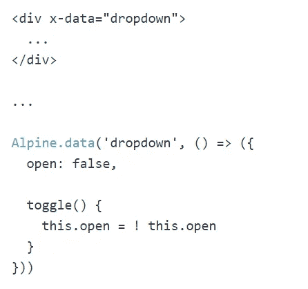
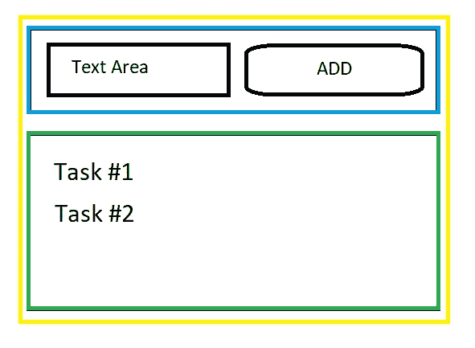
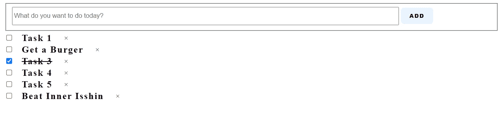

# 用 Alpine.js 创建待办事项列表

> 原文：<https://javascript.plainenglish.io/create-to-do-list-with-alpine-js-2fc15125dc74?source=collection_archive---------3----------------------->


Photo by [Eden Constantino](https://unsplash.com/@edenconstantin0?utm_source=unsplash&utm_medium=referral&utm_content=creditCopyText) on [Unsplash](https://unsplash.com/s/photos/todolist?utm_source=unsplash&utm_medium=referral&utm_content=creditCopyText)

大家好，距离我上次发帖已经有一段时间了。我不确定接下来该写些什么，而且我也忙于自己的私事。今天，我想谈谈 Alpine.js，这是一个我有机会使用过的框架，我非常喜欢它。

## 阿尔卑斯山. js

那么什么是 Alpine.js 呢？据 Alpine.js 的创建者 Caleb Porzio 称，该框架旨在填补 JavaScript/jQuery 和大型复杂框架(如 Vue.js/React.js.)之间的空白

Alpine.js 令人惊叹的地方在于，它允许开发人员以声明的方式将 JavaScript 行为添加到标记中。有人认为它是 JavaScript 的顺风。

截至本文撰写时，根据 Alpine.js 网站，它由 **15 个属性**、 **6 个属性**和 **2 个方法**组成。我确实觉得它们在文档中解释得很好，所以请随意查看网站。

## 让我们建造一些东西

介绍够了，我们现在将尝试用 alpine 构建一个简单的 Todo 应用程序来展示 Alpine 是如何工作的，希望可以帮助您入门。

我们需要从什么开始？非常简单，只要一个你选择的文本编辑器和一个浏览器。就是这样。

我们将从遵循 Alpine.js 的指南开始，我们将从 CDN 导入框架，如下所示:

我们正在使用最新的 **Alpine 版本 3.4.2** ，请注意该框架仍在快速更新中，每个版本中可能会有一些差异。运行上面的代码，您应该会在浏览器中看到以下内容。


Alpine is working!

所以现在你已经正式写出了你的第一个阿尔卑斯组件(？)app(？)，不太确定我应该如何称呼它，但是现在我们将它称为一个组件。很直接，对吧？我们初始化了一个名为 welcome message 的变量，并用 x-text 指令显示它。

接下来，我们可以在 **x-data** 中直接创建新的变量和函数，但我们不打算这样做，而是将代码分离到 JavaScript 文件中，并作为脚本导入。

另一种方法是使用 alpine 数据方法来达到同样的结果，下面的片段摘自 alpine.js 网站**【2】**。



Taken from [https://alpinejs.dev/](https://alpinejs.dev/)

你看到的应该和以前一样。现在我们有了一个合适的基础结构，让我们开始为实际的待办事项应用程序编写一些代码。在此之前，让我们先简单地勾画一下我们将拥有的组件。



Simple design sketch

1.  **Todo 容器(黄色):**包含组件的整体。
2.  **输入区(蓝色):**这是用户输入单个任务并插入列表的地方，这里有一个文本输入区和一个提交按钮。
3.  **显示区(绿色):**所有添加的任务都将显示在该区域，用户可以执行操作(编辑任务、标记为完成或删除任务)。

现在我们已经清楚地知道了我们想要做什么，我们终于可以开始编写代码了。我们将做一个简单的添加和删除功能，代码如下:

代码看起来就像普通的 html 代码，一个明显的不同是你将有一个包装器/容器 div 元素来包装你的组件。因此，div 中的所有内容都将共享相同的函数和相同的变量，这与在 React 中构建组件非常相似。

相当简单，我们有一个输入字段，当用户点击按钮时，我们将调用 **addTodo()** 函数，然后新任务将被添加到变量 ***todos*** 数组中，使用 [spread 函数](https://developer.mozilla.org/en-US/docs/Web/JavaScript/Reference/Operators/Spread_syntax)。其中 ***@click*** (第 22 行)只是 **onClick()** 事件的速记函数，你也可以写成***x-on:click = " function "***。

注意，为了检索用户在第 8 行输入的任务信息，我们使用了 ***this。$root.querySelector('。*【用户 _ 输入 _ 任务】) ***【用户 _ 输入 _ 任务】*** 选择输入字段值。实现这一点的另一种方法是像这样将 bind 与 x-model 指令一起使用:**

为了将输入数据与 x-model 绑定，我们将首先在 x-data 中创建一个变量(在我们的例子中是 task ),然后我们将在输入标签中添加 x-model="task"。把它想象成 React 中的状态循环。

```
const [ task, setTask ] = useState([]);
```

当我们打印出添加的待办事项列表时，我们将使用 **<模板>** 标签和***x-来表示*** 目录。我们本质上是借助 ***x-for*** (对于每个循环类似于 vue.js 中的 ***v-for*** 和 React 中的 ***map()*** )来创建一个 html 组件。

现在，我们希望能够编辑已经添加的任务。因此，我们添加了一个字段来跟踪任务的状态，并且我们将利用布尔变量将列表交换到一个输入字段中，供用户更新任务。要显示或隐藏字段，我们可以使用 x-show 属性，我们将使用 x-model 绑定 task.item，因为该属性将更新值，而不需要更改事件。

我们在第 23 ~ 37 行中添加了一些新代码，与以前的用法没有太大不同，所以我不再重复。在第 33、36 行，我们使用了 ***:value*** 和 ***:id*** ，这就是你在 Alpine.js 中动态分配属性的方式。你也可以使用 ***:class*** 动态分配类，这里我们还可以看到另一个使用@***click . away****的速记事件处理程序的用例。****s*etEdit()**函数基本上设置了点击时的状态和焦点字段。

## 任务的完成

所以现在我们终于到了本文的最后一部分，在这里我们将添加允许用户完成任何添加的任务的能力(当它被选择为已完成时，从列表中删除)。

这应该很容易吧？在进入代码部分之前，尝试自己动手。给你一个小提示，我们需要添加一个新的复选框字段，使用一个事件监听器(单击或更改)并调用函数来切换完成的布尔标志。

有了一些 css，我们终于用 Alpine.js 完成了一个待办事项列表。我将不会详细介绍 css，因为我们今天的重点是 Alpine.js。



Simple To-Do List with Alpine.js

请在下面找到完整的代码:

请找到 [GitHub 库](https://github.com/MingSheng92/AlpineTodo)以获得完整的代码。

我们可以通过集成可访问的富互联网应用来进一步增强用户体验。对于任何对这个话题感兴趣的人，请随意阅读 Hugo[3]的文章，他在文章中用 Alpine.js 构建了一个可访问的导航菜单。

如果你想了解更多关于 Alpine.js 的高级组件，你可以查看 Alpine 工具箱[4]。如果你想更多地了解 Alpine.js，我会在参考区留下一些额外的链接

所以今天我们完成了一个基本的任务清单，一个小小的家庭作业。尝试找出如何向组件添加键绑定。例如，用户应该能够使用回车键添加新任务，或更新现有的任务。我对这个框架相当陌生，所以我对这个框架的一些理解可能不正确，如果我在这篇文章中犯了什么错误，请随时告诉我。

# 结论

简而言之，如果你想创建一个简单的静态网站，而不需要像 React/Angular/Vue 这样复杂的大型框架。Alpine.js 应该是你下一次的目标，另一个选择可能是 jQuery，但对我个人来说，我更喜欢 Alpine.js，因为它是轻量级的，并且非常容易学习和用它构建一些东西。

因此，在今天的文章中，我们讨论了 Alpine.js，并展示了一个非常简单的示例来帮助您入门。它相对较新，我迫不及待地想看到所有基于 Alpine.js 的酷库或项目。

# 参考

[1].Alpine.js 官网— [https://alpinejs.dev](https://alpinejs.dev/) /

[2].Alpine.data()方法文档—【https://alpinejs.dev/globals/alpine-data 

[3].一个可访问的 Alpine.js 菜单开关—雨果·迪·弗朗切斯科，【https://codewithhugo.com/alpinejs-a11y-menu/ 

[4].阿尔卑斯工具箱—[https://www.alpinetoolbox.com/](https://www.alpinetoolbox.com/)

# 附加链接

[1].[https://CSS-tricks . com/alpine-js-the-JavaScript-framework-thas-use-like-jquery-written-like-vue-and-inspired-by-tailwindcss/](https://css-tricks.com/alpine-js-the-javascript-framework-thats-used-like-jquery-written-like-vue-and-inspired-by-tailwindcss/)

[2].[https://www . erwinhofman . com/blog/3-reasons-why-alpinejs-wont-beat-jquery-core-we B- vitals-included/](https://www.erwinhofman.com/blog/3-reasons-why-alpinejs-wont-beat-jquery-core-web-vitals-included/)

[3].[https://www . smashingmagazine . com/2020/03/introduction-alpine js-JavaScript-framework/](https://www.smashingmagazine.com/2020/03/introduction-alpinejs-javascript-framework/)

*更多内容看* [***说白了. io***](http://plainenglish.io)