# 根据 React 应用程序的拉式请求创建用户验收测试环境

> 原文：<https://javascript.plainenglish.io/create-user-acceptance-testing-environments-on-pull-request-for-react-apps-4c75b3fbbe18?source=collection_archive---------8----------------------->


## 处理灾难的最好方法是避免它。

让我用一个例子来解释一下。如果你在建一栋房子，发现建筑材料不合格，除了重新建造，你还可以做点什么来修复它。否则继续花血汗钱每 6 个月修理东西。

软件工程也是如此。一旦有问题的/不合格的代码被合并到您的默认分支中，处理它就成了一个大问题。在这种情况下，你可以做两件事之一

1.  你花时间重构低效的代码。如果所讨论的代码是其他特性的基础，这将变得越来越困难，并且可能会使时间表偏离轨道。
2.  第二个选择是你决定继续前进。修复 QA 报告的错误，并不断在顶部添加功能，以满足时间表。这种方法可能会在短期内帮助您满足时间表，但会导致大量的技术债务。这甚至会导致产品不稳定。

不管怎样，处理这种情况的最好方法是避免它们！

那你是怎么做到的呢？

*   把棉绒放在适当的位置。现在整个团队都遵循同样的惯例。
*   强制单元测试并设置高测试覆盖率阈值。
*   至少包含以下阶段的强大 CI 渠道

1.  检验
2.  安装依赖项
3.  线头
4.  建设
5.  试验

*   进行集成测试确实很有帮助，但是在许多情况下，时间表和业务优先级不允许这样做。

以上是减少失败概率的有效方法。然而，在处理前端应用时，美学和风格在验收标准中扮演着重要角色。即使是这种自动化也是可能的，但是你花在编写测试上的时间越多，在适应用户反馈和以真正敏捷的方式开发软件时，你的灵活性就越小。每次你基于用户研究和反馈进行迭代，你都会有一堆失败的测试，你会花时间重写/修复看似无意义的测试。

编写自动化可视化测试的另一种方法是在代码合并之前手动测试代码。从传统意义上来说，要做到这一点，评审人员/测试人员需要

1.  取出源代码
2.  确保他们的环境设置正确。
3.  在本地安装依赖项。
4.  运行应用程序
5.  手动测试应用程序。

看起来工作量很大，而且要花很多时间。所以我们自动化了步骤 1 到 4。

在本教程中，我将带您了解如何在每次为默认分支创建 PR 时为 React 应用程序创建 UAT 环境。在我的例子中，默认分支是`develop`

本教程假设您对以下内容有很好的理解:

*   [**反应过来**](https://reactjs.org/docs/getting-started.html)
*   [**Github 动作**](https://docs.github.com/en/actions)
*   [**AWS S3**](https://docs.aws.amazon.com/s3/index.html)

在本教程中，您将:

*   配置 react-router 使用相对路径而不是绝对路径。
*   设置将托管 UAT 环境的 S3 存储区。对于每个分支，我们将创建一个单独的文件夹，并将工件复制到该文件夹中。
*   创建一个工作流，在开发分支创建 PR 时处理 UAT 部署。

# 启动项目

请克隆以下存储库:[https://github.com/wednesday-solutions/react-uat-on-pr](https://github.com/wednesday-solutions/react-uat-on-pr)

创建新分支:

```
git checkout -b feat/uat
```

# 配置 react-router 以添加对相对路径的支持

将下面的代码片段复制到`utils/history.js`文件中

```
import { createBrowserHistory } from 'history';
import routeConstants from '[@utils/routeConstants](http://twitter.com/utils/routeConstants)';
const routes = Object.keys(routeConstants);
const pathname = window.location.pathname;
let baseUrl = '';
if (process.env.ENVIRONMENT_NAME === 'uat') {
  routes.forEach(routeKey => {
    const route = routeConstants[routeKey].route;
    if (pathname.includes(route)) {
      if (pathname.substring(pathname.length - route.length, pathname.length) === route) {
        baseUrl = pathname.substring(0, pathname.length - route.length);
      }
      if (pathname.substring(pathname.length - route.length, pathname.length - 1) === `${route}/`) {
        baseUrl = pathname.substring(0, pathname.length - route.length - 1);
      }
    }
  });
}const history = createBrowserHistory({ basename: baseUrl });
export default history;
```

# 在 package.json 中添加一个 UAT 构建脚本

将`build:uat`添加到 package.json 中的脚本中

```
{
  ...
  "license": "MIT",
  "scripts": {
    ...
   "build": "cross-env NODE_ENV=production webpack --config internals/webpack/webpack.config.prod.js --color --progress --stats-children --stats-error-details",
    "build:uat": "export ENVIRONMENT_NAME=uat && cross-env NODE_ENV=production webpack --config internals/webpack/webpack.config.prod.js --color --progress",
    "build:dev": "cross-env NODE_ENV=development webpack --config internals/webpack/webpack.config.dev.js --color --progress",
    ...
    }
}
```

# 添加内部实用程序

创建 internalUtils 文件。

```
touch internals/utils.js
```

将以下代码复制到新创建的文件中

```
function isUAT() {
  return process.env.ENVIRONMENT_NAME === 'uat';
}
function getBasePublicPath() {
  return isUAT() ? './' : '/';
}module.exports = { getBasePublicPath, isUAT };
```

*   `isUAT`将用于验证当前环境名是否为`uat`
*   `getBasePublicPath`如果`isUAT`返回真，该函数返回相对基本路径。

# 配置 webpack 以处理相对路径

## **第一步**

将这段代码添加到`internals/webpack/webpack.base.config.js`

```
const { getBasePublicPath } = require('../utils');
const publicPath = getBasePublicPath();
...
module.exports = options => ({
  ...,
  output: Object.assign(
    {
      // Compile into js/build.js
      path: path.resolve(process.cwd(), 'build'),
      publicPath
    },
    ...,
  ),
...
});
```

## **第二步**

将这段代码添加到`internals/webpack/webpack.prod.config.js`

确保`OfflinePlugin`配置正确，并且不会在非 uat 环境中中断。

```
...
const { getBasePublicPath, isUAT } = require('../utils');
const publicPath = getBasePublicPath();
...
module.exports = require('./webpack.config.base')({
 ...
 plugins: [
    new OfflinePlugin({
          relativePaths: isUAT(),
          publicPath,
          ...
    }),
 ...
 ],
...
});
```

## **第三步**

现在，我们将添加一条新路线，以确保一旦应用程序被挂起，路线就能正确工作。

在`app/utils/routeConstants.js`中添加新路线

```
import React from 'react';
newHomePath: {
    component: () => <h1>New Home path</h1>,
    ...routeConstants.newHomePath
  },
```

将此片段添加到`containers/App/index.js`

```
{
  ...,
  newHomePath: {
    route: '/new-home-path',
    exact: true
  },
};
```

将这段代码添加到`app/routeConfig.js`

```
...
export const routeConfig = {
  ...,
  newHomePath: {
    component: () => <h1>New Home path</h1>,
    ...routeConstants.newHomePath
  },
  ...
};
```

现在我们已经设置了新的路线，让我们添加一个按钮来导航到它。

将下面的片段添加到`app/containers/App/index.js`

```
...
export function App({ history, location }) {
  return (
    <ThemeProvider theme={theme}>
      <Header />
      <Layout.Content>
        <button
          style={{ margin: '20px' }}
          onClick={() => {
            history.push(routeConfig.newHomePath.route);
          }}
        >
          Go to the new route
        </button>
        <For
...App.propTypes = {
  location: PropTypes.object,
  history: PropTypes.object
};
```

## **第四步**

现在运行`build:uat`脚本

```
yarn build:uat
```

## **第五步**

将构建文件夹的内容复制到其中的子文件夹中。这是模拟工作流程中将要发生的事情。我们将为每个分支使用单独的目录。

```
cd build
mkdir test-relative-route
mv -v * test-relative-route/
```

现在运行应用程序

```
yarn start:prod
```

前往[http://localhost:3000/test-relative-route](http://localhost:3000/test-relative-route)

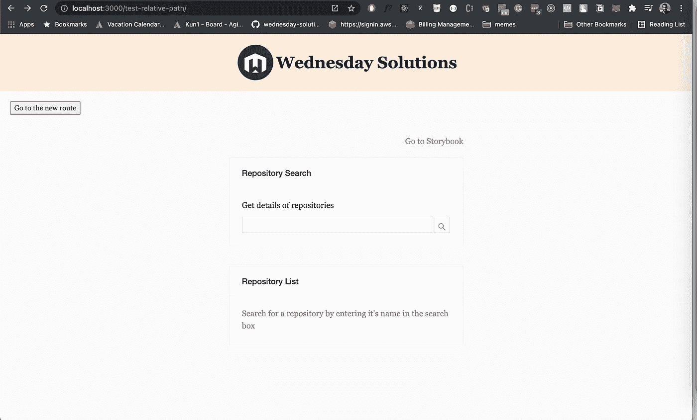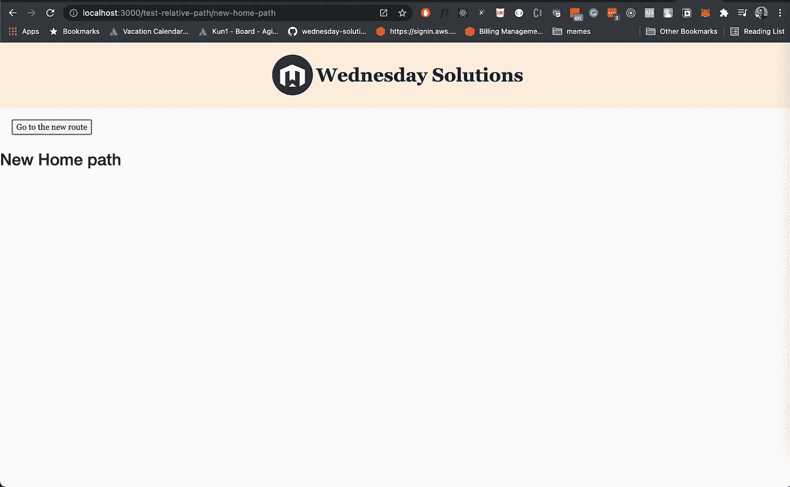

现在，我们已经验证了我们的逻辑在本地工作，让我们设置工作流来自动部署到 S3。

# 设置 S3 时段

## **第一步**

登录 AWS 控制台。[https://console.aws.amazon.com/console/home](https://console.aws.amazon.com/console/home)

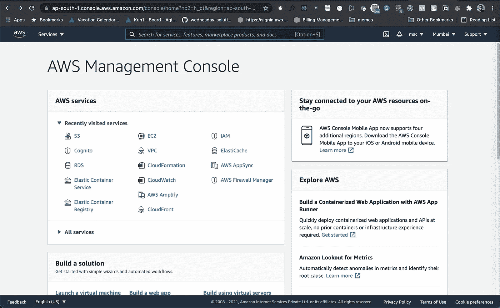

## **第二步**

去 S3。[https://s3.console.aws.amazon.com/s3/home?region=ap-south-1](https://s3.console.aws.amazon.com/s3/home?region=ap-south-1)

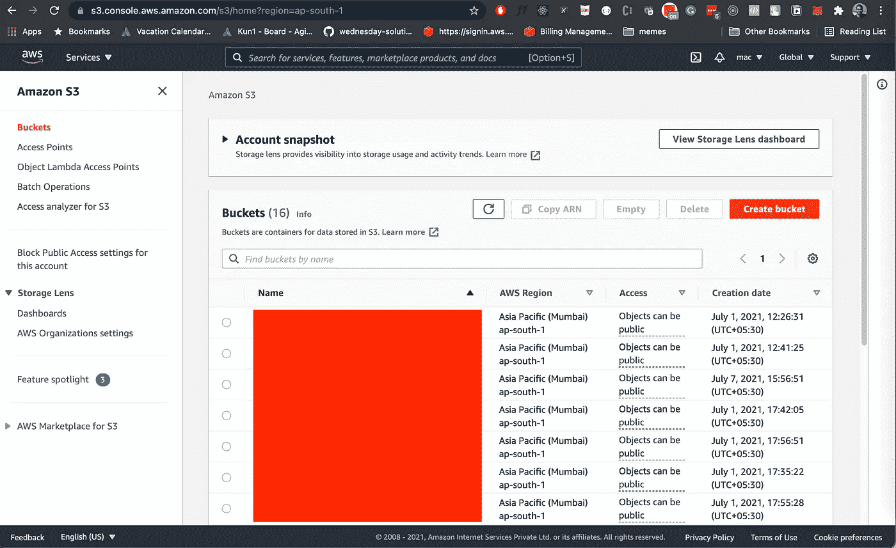

## **第三步**

创建新的存储桶。

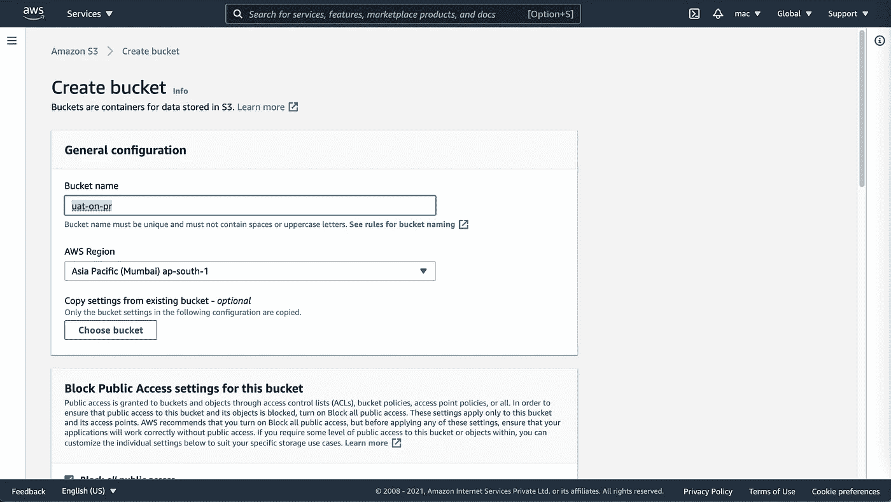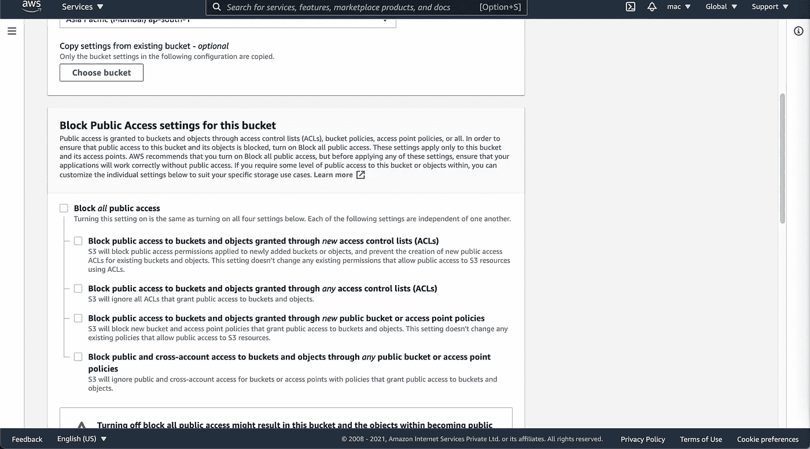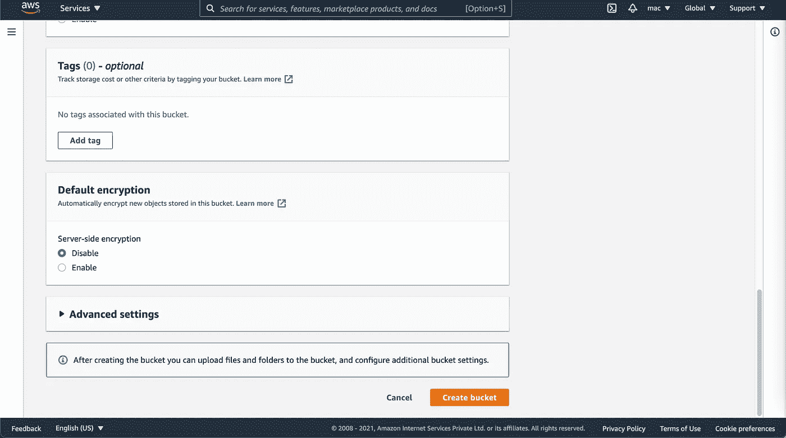

# 启用静态网站托管

## **第一步**

导航到新创建的存储桶，并转到属性选项卡

## **第二步**

在页面底部，您会看到`Static Web Hosting`选项。编辑并启用它。保存更改。

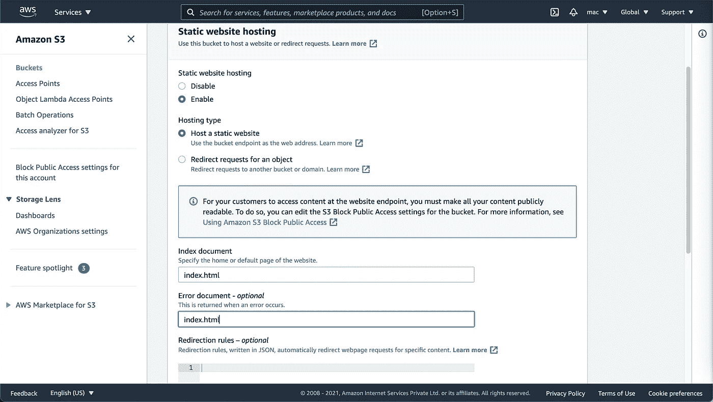

## **第三步**

保存更改后，您将看到指向存储桶的链接。把它抄下来，放在手边。几分钟后你会需要它。

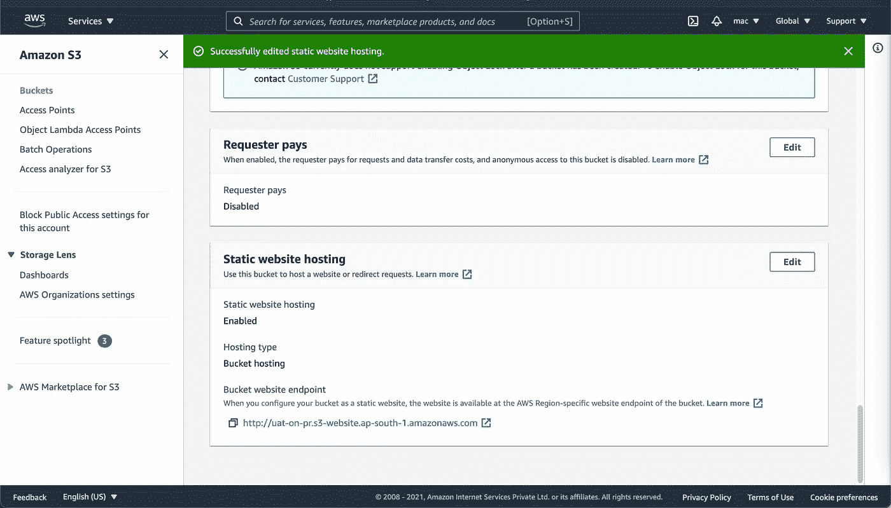

# 设置秘密

## 第一步

转到设置选项卡

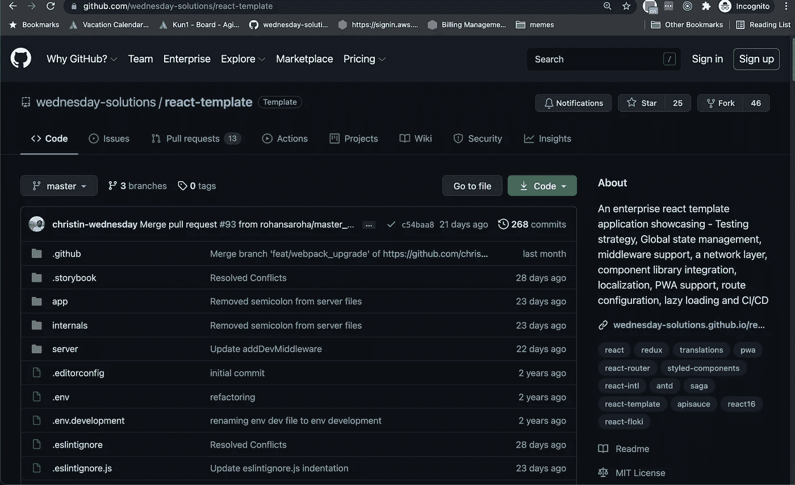

## **第二步**

转到机密部分

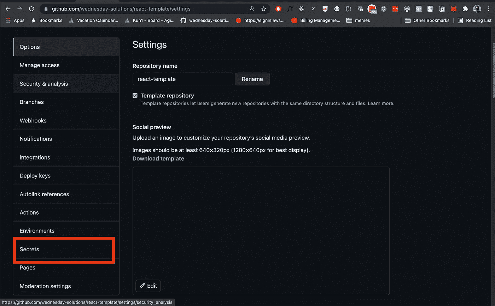

## 第三步

为 **AWS_REGION** 、 **AWS_SECRET_ACCESS_KEY** 、 **AWS_ACCESS_KEY_ID** 和 **AWS_S3_BUCKET** 添加秘密

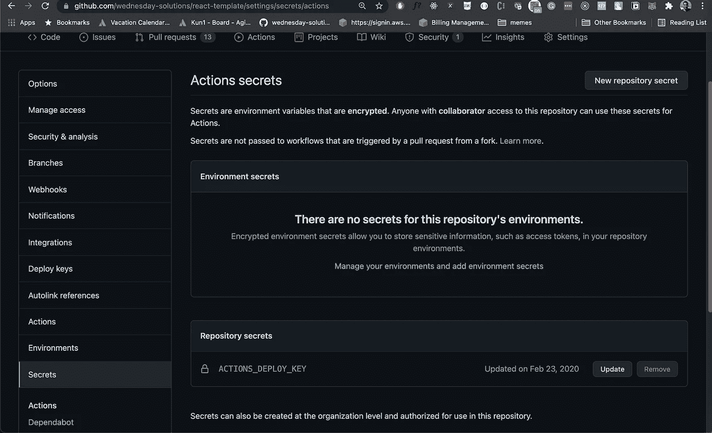

# 为 UAT 部署创建新的工作流

## **第一步**

创建新文件

```
touch .github/workflows/uat.yml
```

## **第二步**

将下面的片段复制到新创建的文件中

```
name: Continuous Deployment on PR
# 1
on:
  pull_request:
    branches:
      - developjobs:
  deploy:
    name: Deploy
    runs-on: ubuntu-latest
    strategy:
      matrix:
        node-version: [12.x]
    env: #2
      SOURCE_DIR: './build/'
      AWS_REGION: ${{ secrets.AWS_REGION }}
      AWS_ACCESS_KEY_ID: ${{ secrets.AWS_ACCESS_KEY_ID }}
      AWS_SECRET_ACCESS_KEY: ${{ secrets.AWS_SECRET_ACCESS_KEY }}
      PATHS: '/*'
      AWS_S3_BUCKET: ${{ secrets.AWS_S3_BUCKET }}
```

1.  每当为“开发”分支创建 PR 时，都会触发此工作流
2.  在 react-template 中，构建工件存储在`build`目录中。AWS_REGION、AWS_SECRET_ACCESS_KEY、AWS_ACCESS_KEY_ID 和 AWS_S3_BUCKET 使用 Github secrets 设置。

```
...
  steps:
      - uses: actions/checkout@v1 #1
      - name: Get branch name #2
        id: vars
    run: echo ::set-output name=branch::${{github.event.pull_request.head.ref}}
      - name: Install dependencies #3
        run: yarn
      - name: Build # 4
        run: export BRANCH_NAME=${{ steps.vars.outputs.branch }} && yarn build:uat
      - name: AWS Deploy #5
        uses: jakejarvis/s3-sync-action@v0.5.0
        with:
          args: --acl public-read --follow-symlinks
        env:
          DEST_DIR: ${{steps.vars.outputs.branch}}
```

1.  检查代码
2.  获取分支的名称
3.  安装所有依赖项
4.  创建 UAT 版本
5.  把藏物复制到 S3。目标目录与分支名称相同。

# 推动您的代码并创建一个公关

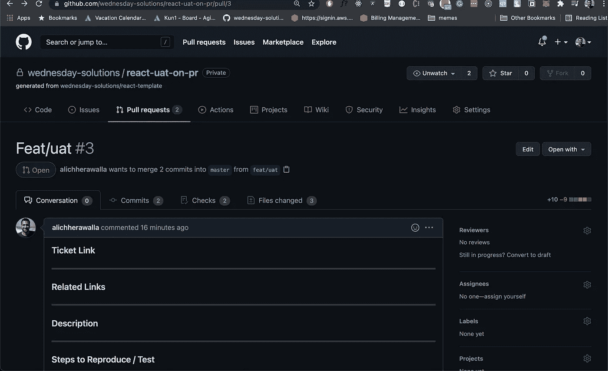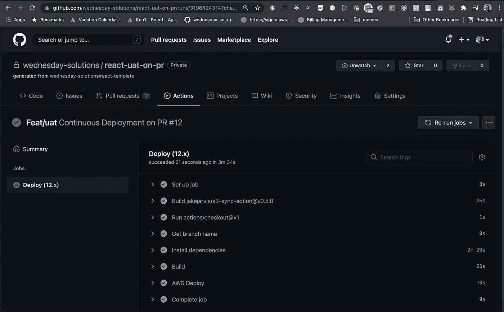

部署成功后，前往您的 S3 桶。现在，您将会看到一个与您的分支同名的文件夹。

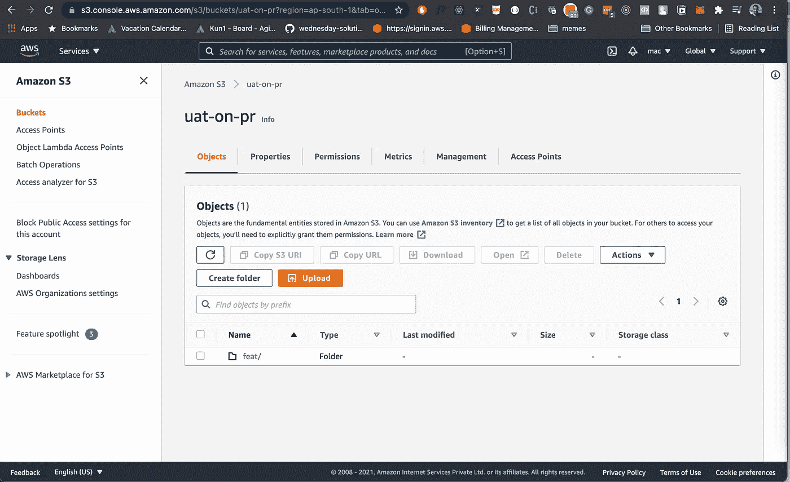

现在使用您的 S3 部署的基本链接，与您在启用静态托管后复制的链接相同。

我的是:[http://uat-on-pr.s3-website.ap-south-1.amazonaws.com/](http://uat-on-pr.s3-website.ap-south-1.amazonaws.com/)

将您的分支机构的名称添加到这个基本 URL 中，如下所示:[http://UAT-on-pr . S3-website . AP-south-1 . amazonaws . com/feat/UAT](http://uat-on-pr.s3-website.ap-south-1.amazonaws.com/feat/uat)

现在去那个链接和维奥拉！

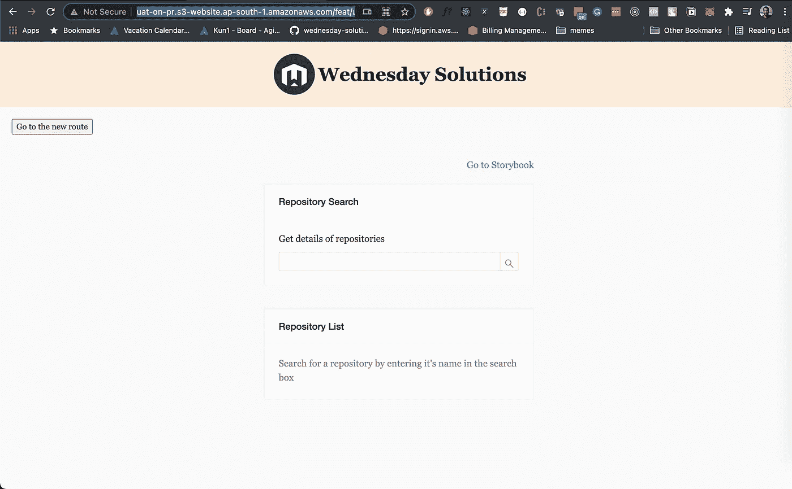

# 从这里去哪里

我希望你喜欢这篇关于如何为 UAT 创建一个 React 应用程序的 PR 环境的教程。如果您有任何问题或意见，请加入下面的论坛讨论。

我强烈建议看一看 starter 项目附带的 CI 管道

[](https://github.com/wednesday-solutions/react-uat-on-pr/blob/master/.github/workflows/ci.yml) [## react-UAT-on-pr/ci . yml at master weekly-solutions/react-UAT-on-pr

### 在 GitHub 上创建一个帐户，为周三解决方案/react-uat-on-pr 开发做出贡献。

github.com](https://github.com/wednesday-solutions/react-uat-on-pr/blob/master/.github/workflows/ci.yml) 

这篇博客最初发表在[**https://星期三。是**](https://wednesday.is/)

要了解更多关于周三工作的感受，请关注我们的
[***insta gram***](https://www.instagram.com/wednesday.sol/)***|***[***Twitter***](https://twitter.com/wednesdaysol)***|***[***LinkedIn***](https://www.linkedin.com/company/wednesday-solutions/)