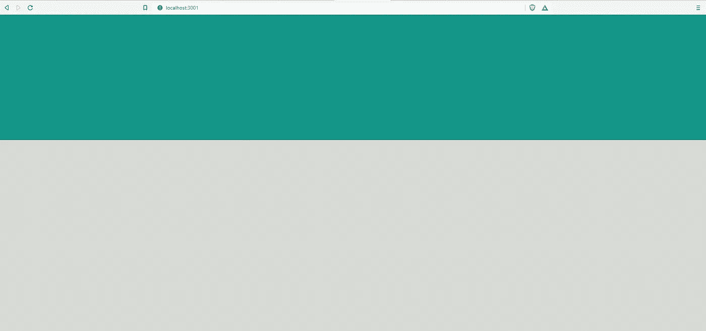
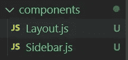
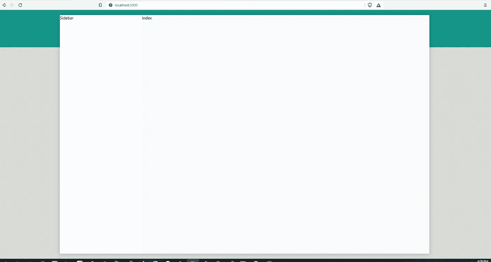

# 用 Next.js: Background Color 创建 WhatsApp 克隆

> 原文：<https://javascript.plainenglish.io/create-whatsapp-clone-with-next-js-part-1-background-color-f85b60b4d5fa?source=collection_archive---------9----------------------->

## 第 1 部分:导入样式化组件并为 Next.js 创建布局


[源代码](https://www.youtube.com/channel/UCu4-4FnutvSHVo9WHvq80Ww/join)

对于这个项目，我们需要使用样式组件。因此，我们需要使用以下命令进行安装:

```
yarn add styled-components
```

## 创建 Whatsapp 背景

删除 index.js 中所有不必要的代码

在 global.css 中，添加背景色。

```
body {padding: 0;margin: 0;font-family: -apple-system, BlinkMacSystemFont, Segoe UI, Roboto, Oxygen,Ubuntu, Cantarell, Fira Sans, Droid Sans, Helvetica Neue, sans-serif;background: rgb(0,150,136);background: linear-gradient(180deg, rgba(0,150,136,1) 0%, rgba(0,150,136,1) 15%, rgba(215,219,214,1) 15%, rgba(215,219,214,1) 130%);background-repeat: no-repeat;display:flex;justify-content: center;align-items: center;}
```

现在，我们可以得到这个 WhatsApp 背景



## 创建布局组件

然后，我们在“comp”文件夹中创建一个布局组件。



在 Layout.js 中，我们创建了一个包装器，使布局组件位于网站的中心。我们希望每个页面都有侧边栏。

```
import styled from "styled-components";import Sidebar from "./Sidebar";const Layout = ({ children })=>{return (<Wrapper><Container><Sidebar />{children}</Container></Wrapper>)}export default Layout const Wrapper = styled.div`display: flex;flex-direction: column;justify-content: center;align-items: center;height: 100vh;`const Container = styled.div`display: flex;width: 75vw;margin:auto;margin-top:20px;margin-bottom: 20px;box-shadow: 0 0 1rem 0.05rem rgba(0, 0, 0, 0.2);height: 100vh;@media  (max-width: 1440px) {width:100%;height:100vh;margin:0;}`
```

## 创建侧栏

在 Sidebar.js，我们只需输入 Sidebar this text，将高度设为 100%来填充布局的高度。

```
import styled from 'styled-components';const Sidebar = () => {return (<Container>Sidebar</Container>)}export default Sidebarconst Container = styled.div`background-color: #FFFFFF;min-width: 320px;max-width:450px;height:100%;`
```

## 使用布局组件

去 _app.js，用<layout>把所有的东西都包起来。</layout>

```
import Layout from '../components/Layout'import '../styles/globals.css'function MyApp({ Component, pageProps }) {return (<div><Layout><Component {...pageProps} /></Layout></div>)}export default MyApp
```

## 创建索引页面

我们只需键入索引这个词，并添加背景色为浅灰色，宽度和高度 100%。

```
import Head from 'next/head'import Image from 'next/image'import styled from 'styled-components';export default function Home() {return (<Container><Head><title>Create Next App</title><meta name="description" content="Generated by create next app" /><link rel="icon" href="/favicon.ico" /></Head>index</Container>)}const Container = styled.div`background-color:#f8fafc;width:100%;height:100%`
```

我们将得到下面的应用程序布局。



# 关注我们: [Gumroad 课程](https://app.gumroad.com/ckmobile)， [YouTube](https://www.youtube.com/channel/UCu4-4FnutvSHVo9WHvq80Ww?sub_confirmation=1) ， [Medium](https://ckmobile.medium.com/) ， [Udemy](https://www.udemy.com/user/cyruschan2/) ， [Linkedin](https://www.linkedin.com/company/ckmobi/) ， [Twitter](https://twitter.com/ckmobilejavasc1) ， [Instagram](https://www.instagram.com/ckmobile8050)

加入分支机构赚钱

[https://ckmobile.gumroad.com/affiliates](https://ckmobile.gumroad.com/affiliates)

*更多内容看* [***说白了***](http://plainenglish.io/)