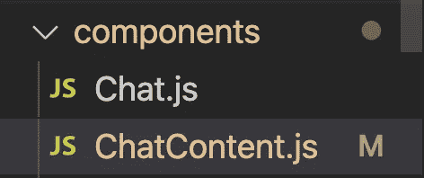
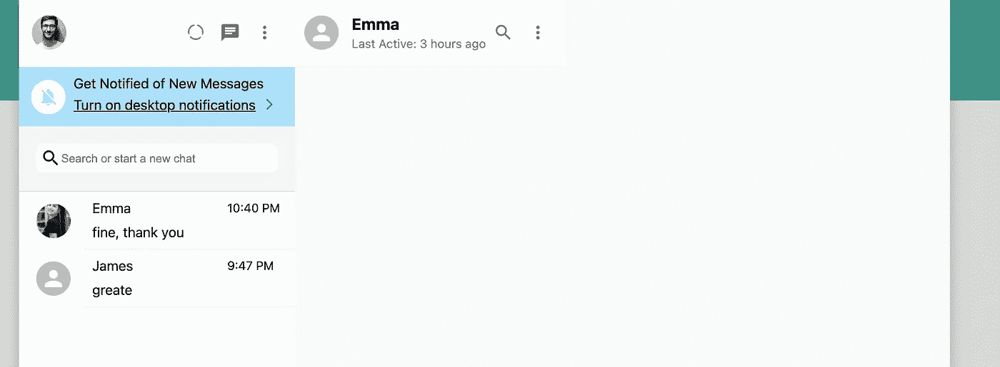
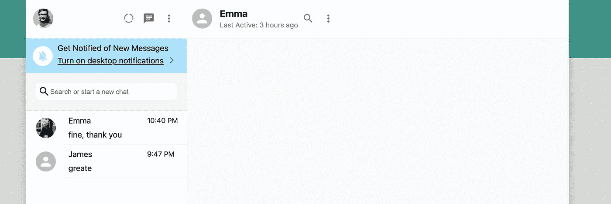
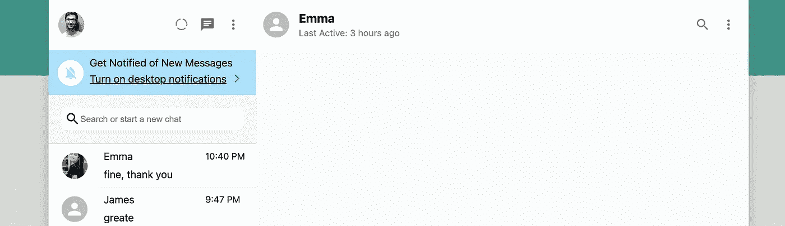

# 使用 Next.js 第 10 部分聊天页面标题创建 WhatsApp 克隆

> 原文：<https://javascript.plainenglish.io/create-whatsapp-clone-with-next-js-part-10-chat-page-header-e720482d9277?source=collection_archive---------28----------------------->

## 在这一部分，我们开始制作聊天页面的细节。

[源代码](https://www.youtube.com/channel/UCu4-4FnutvSHVo9WHvq80Ww/join)

在 components 文件夹下，添加名为“ChatContent.js”的新文件



```
import { Avatar, IconButton } from '@mui/material';import styled from 'styled-components';import MoreVertIcon from '@mui/icons-material/MoreVert';import SearchIcon from '@mui/icons-material/Search';const ChatContent = () => {return (<Container><Header><Avatar /><HeaderInfo><h3>emma@email.com</h3><div>Last Active: 3 hours ago</div></HeaderInfo><IconButton><SearchIcon /></IconButton><IconButton><MoreVertIcon /></IconButton></Header></Container>)}export default ChatContentconst Container = styled.div`display:flex;flex-direction: column;`;
```



你可以看到它并没有占据所有的空间。

这是因为<chatcontent>没有占用所有的空间，我们需要回到【id】。射流研究…</chatcontent>

添加<chatcontainer></chatcontainer>

```
const ChatContainer = styled.div`flex:1;`import styled from 'styled-components';import ChatContent from '../../components/ChatContent';const ChatBox = () => {return (<Container><ChatContainer><ChatContent /></ChatContainer></Container>)}
```



现在，白色的页眉已经延伸到整个宽度。不过，你也应该注意到<avatar>和<headerinfo>两个图标是互相贴在一起的。</headerinfo></avatar>

这是因为我们没有添加任何 justify-content 或其他 CSS 样式来将它们分开。但实际上我们只是想让<headerinfo>占据左边所有的空间，所以它会把图标推到右边。</headerinfo>

为此，我们只需要将 flex:1 添加到<headerinfo>中</headerinfo>

```
const HeaderInfo = styled.div`margin-left:15px;flex: 1;>h3{margin-bottom: 3px;}>div{font-size: 14px;color:gray;}`;
```



这看起来很适合聊天页面的标题。

## 关注我们: [Gumroad 课程](https://app.gumroad.com/ckmobile)， [YouTube](https://www.youtube.com/channel/UCu4-4FnutvSHVo9WHvq80Ww?sub_confirmation=1) ， [Medium](https://ckmobile.medium.com/) ， [Udemy](https://www.udemy.com/user/cyruschan2/) ， [Linkedin](https://www.linkedin.com/company/ckmobi/) ， [Twitter](https://twitter.com/ckmobilejavasc1) ， [Instagram](https://www.instagram.com/ckmobile8050)

*更多内容请看*[***plain English . io***](http://plainenglish.io)