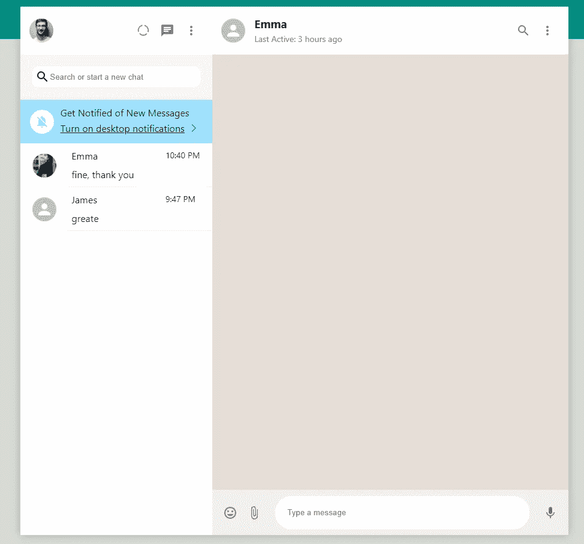

# 用 Next.js:聊天页面输入框创建一个 WhatsApp 克隆

> 原文：<https://javascript.plainenglish.io/create-whatsapp-clone-with-next-js-part-11-chat-page-input-box-a5d453e9d06a?source=collection_archive---------21----------------------->

## 第 11 部分:创建输入框。

在这一部分，我们将重点放在创建输入框。这包括<inputcontainer>、和三个<iconbutton>。</iconbutton></inputcontainer>

[源代码](https://www.youtube.com/channel/UCu4-4FnutvSHVo9WHvq80Ww/join)


## 输入容器

回到 ChatContent.js，我们将显示设置为 flex，align-items to center，因此<inputcontainer>中的每个元素都将垂直居中对齐</inputcontainer>

设置粘性和底部位置，使<inputcontainer>停留在底部。</inputcontainer>

像 header 一样设置 z-index:100，使输入不随消息滚动。

```
const InputContainer = styled.form`display:flex;align-items:center;padding:10px;position:sticky;bottom:0;background-color:#f0f0f0;z-index:100;`;
```

## 投入

将 flex 设置为 1，这样它将占用所有剩余的空间。移除轮廓和边框。给一个圆角，边界半径等于 30px。

左右两边都增加边距。

```
const Input = styled.input`flex: 1;outline:0;border:none;border-radius:30px;padding:20px;margin-left: 15px;margin-right: 15px;`;
```

## 图标按钮

我们在输入框的左边添加表情符号和附加文件图标。我们还在输入框的右侧添加了麦克风图标

```
<InputContainer>**<IconButton>****<InsertEmoticonIcon />****</IconButton>****<IconButton>****<AttachFileIcon />****</IconButton>**<Inputplaceholder="Type a message"/>**<IconButton>****<MicIcon />****</IconButton>**</InputContainer>
```


正如你所看到的，输入框并不在底部，因为消息框还没有创建来占据所有的空间。

## 消息容器

要制作一个简单的<messagescontainer>，只需创建填充等于 20px，黄棕色背景色，伸缩等于 1，以占据所有空间。</messagescontainer>

```
const MessagesContainer = styled.div`padding:20px;background-color:#e5ded8;flex:1;`;
```

我们在

和<inputcontainer>之间添加这个</inputcontainer>

```
</Header><MessagesContainer /><InputContainer>
```



# 关注我们: [Gumroad 课程](https://app.gumroad.com/ckmobile)， [YouTube](https://www.youtube.com/channel/UCu4-4FnutvSHVo9WHvq80Ww?sub_confirmation=1) ， [Medium](https://ckmobile.medium.com/) ， [Udemy](https://www.udemy.com/user/cyruschan2/) ， [Linkedin](https://www.linkedin.com/company/ckmobi/) ， [Twitter](https://twitter.com/ckmobilejavasc1) ， [Instagram](https://www.instagram.com/ckmobile8050)

加入分支机构赚钱

[https://ckmobile.gumroad.com/affiliates](https://ckmobile.gumroad.com/affiliates)

*更多内容请看*[***plain English . io***](http://plainenglish.io/)