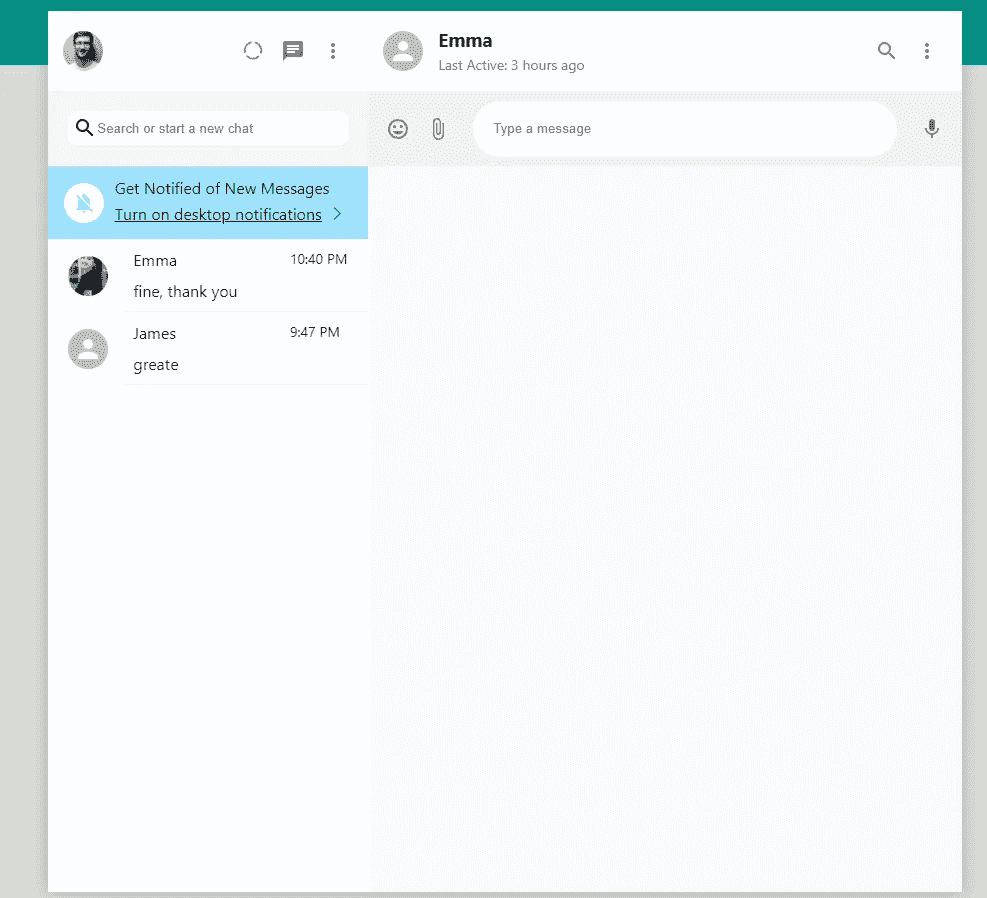
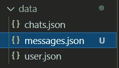
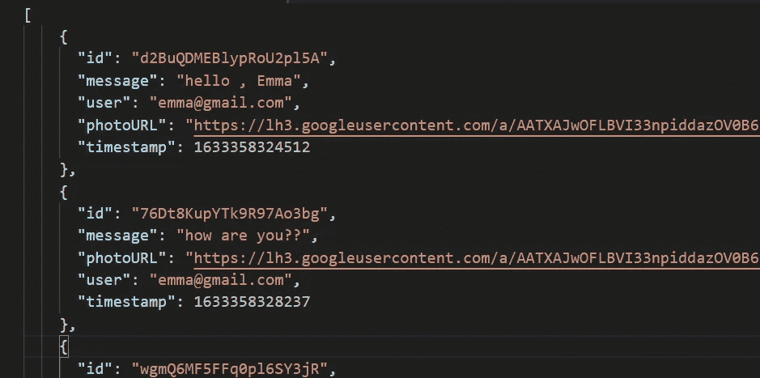
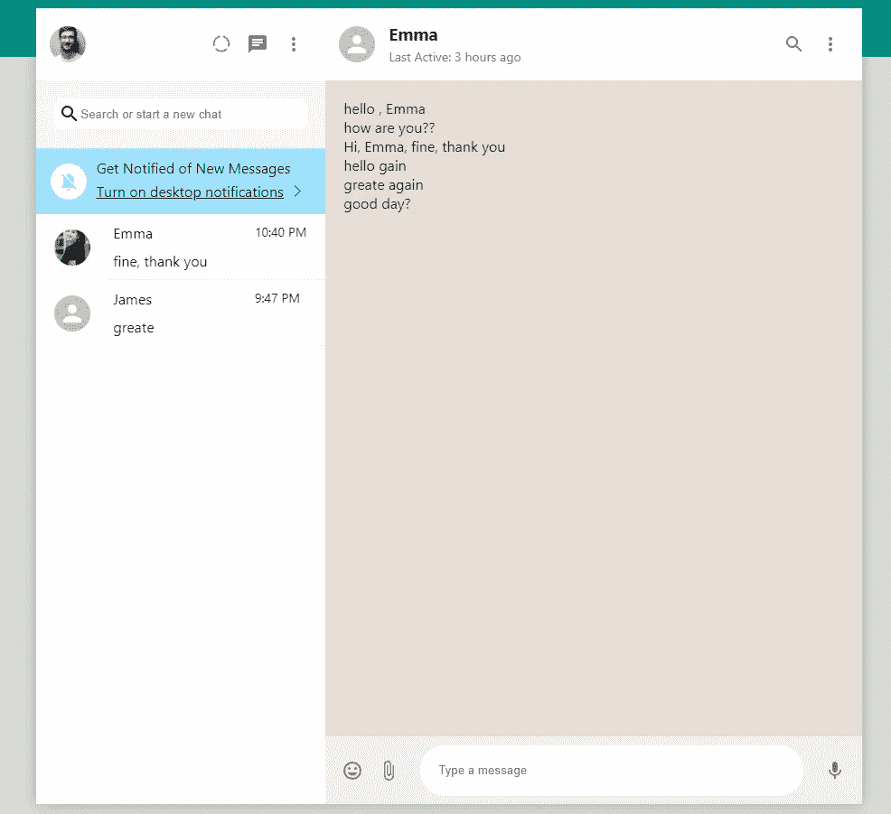

# 用 Next.js 创建 WhatsApp 克隆第 12 部分渲染消息

> 原文：<https://javascript.plainenglish.io/create-whatsapp-clone-with-next-js-part-12-render-messages-855c65085bcc?source=collection_archive---------24----------------------->

[源代码](https://www.youtube.com/channel/UCu4-4FnutvSHVo9WHvq80Ww/join)

在最后一部分，你可以看到输入框不在底部，因为消息框还没有被创建来占据所有的空间。所以在这一部分，我们将重点放在创建<messagecontainer>和渲染一些虚拟消息上。</messagecontainer>



## 消息容器

要制作一个简单的<messagescontainer>，只需创建填充等于 20px，黄棕色背景色，伸缩等于 1，以占据所有空间。</messagescontainer>

```
const MessagesContainer = styled.div`padding:20px;background-color:#e5ded8;flex:1;`;
```

我们在

和<inputcontainer>之间添加这个</inputcontainer>

```
</Header><MessagesContainer /><InputContainer>
```


## 导入虚假消息

在数据文件夹下，我们添加 messages.json。



messages.json 包含消息对象，消息对象有`id`、`message`、`user`、`photoURL`和`timestamp` 属性。

## 呈现消息

回到 ChatContent.js，从文件中导入消息。

```
import messages from '../data/messages.json';
```

中间消息容器

```
<MessagesContainer>{messages.map(message=><div key={message.id}>{message.message}</div>)}</MessagesContainer>
```



现在，您可以在 MessagesContainer 中看到呈现的消息。

## 关注我们: [Gumroad 课程](https://app.gumroad.com/ckmobile)， [YouTube](https://www.youtube.com/channel/UCu4-4FnutvSHVo9WHvq80Ww?sub_confirmation=1) ， [Medium](https://ckmobile.medium.com/) ， [Udemy](https://www.udemy.com/user/cyruschan2/) ， [Linkedin](https://www.linkedin.com/company/ckmobi/) ， [Twitter](https://twitter.com/ckmobilejavasc1) ， [Instagram](https://www.instagram.com/ckmobile8050)

*更多内容请看*[***plain English . io***](http://plainenglish.io)