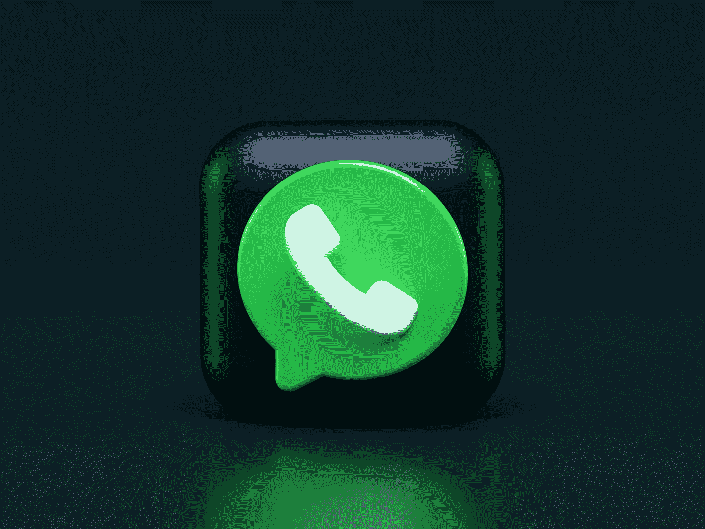

# 用 Next.js: Message 组件创建 WhatsApp 克隆

> 原文：<https://javascript.plainenglish.io/create-whatsapp-clone-with-next-js-part-13-message-component-ae856b40aece?source=collection_archive---------13----------------------->

## 第 13 部分:消息组件



Photo by [Alexander Shatov](https://unsplash.com/@alexbemore?utm_source=medium&utm_medium=referral) on [Unsplash](https://unsplash.com?utm_source=medium&utm_medium=referral)

在这一部分中，我们将创建一个消息组件，因此它将呈现为一个消息气泡，而不像以前那样只是一个文本。

[源代码](https://www.youtube.com/channel/UCu4-4FnutvSHVo9WHvq80Ww/join)


## 创建消息组件

首先，我们需要在“components”文件夹下创建 Message.js。


在 Message.js 中，创建<container>和<messagebubble>。该组件将在 props 中接收用户和消息。</messagebubble></container>

<container>只有一个 CSS 声明，display: flex，所以后来所有的元素都排成一行。</container>

```
import styled from 'styled-components';const Message = ({user,message}) => {const loginMail = "ckmobile@gmail.com"return (<Container><MessageBubble>{message}</MessageBubble></Container>)}export default Messageconst Container = styled.div`display:flex;`;const MessageBubble = styled.div`padding: 15px;padding-bottom: 26px;text-align: right;background-color:white;margin-bottom: 10px;position: relative;`;
```

## 使用 ChatContent.js 上的<message></message>

转到 ChatContent.js，导入消息组件

```
import Message from './Message';
```

使用 map 函数呈现消息，将 message.user 作为用户传递，将 message.message 作为消息传递。

```
<MessagesContainer>{messages.map(message=><Message key={message.id} user={message.user} message={message.message}/>)}</MessagesContainer>
```

现在，我们可以看到每个消息都在消息组件中。


# 关注我们: [Gumroad 课程](https://app.gumroad.com/ckmobile)， [YouTube](https://www.youtube.com/channel/UCu4-4FnutvSHVo9WHvq80Ww?sub_confirmation=1) ， [Medium](https://ckmobile.medium.com/) ， [Udemy](https://www.udemy.com/user/cyruschan2/) ， [Linkedin](https://www.linkedin.com/company/ckmobi/) ， [Twitter](https://twitter.com/ckmobilejavasc1) ， [Instagram](https://www.instagram.com/ckmobile8050)

加入分支机构赚钱

[](https://ckmobile.gumroad.com/affiliates) [## Gumroad

### 申请成为会员很容易。填写下表，让 Ckmobile 知道您将如何推广他们的…

ckmobile.gumroad.com](https://ckmobile.gumroad.com/affiliates) 

*更多内容请看*[***plain English . io***](http://plainenglish.io/)