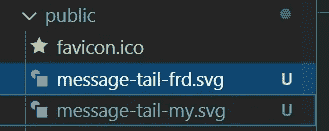

# 用 Next.js 创建 WhatsApp 克隆第 14 部分:确定消息气泡的样式

> 原文：<https://javascript.plainenglish.io/create-whatsapp-clone-with-next-js-part-14-determine-style-of-message-bubble-96b1c39b9d65?source=collection_archive---------14----------------------->

## 基于我的消息或朋友的消息的气泡样式

在真实的 WhatsApp 中，我们可以看到接收者和发送者有不同的风格


example from real WhatsApp

我们可以看到我的消息气泡是浅绿色的，消息尾部在右侧。对于消息，颜色为白色，消息尾部位于左侧。

在本文中，我们重点关注

*   确定消息是来自我自己还是来自朋友
*   添加消息尾部
*   根据消息类型更改消息气泡的颜色。
*   添加时间戳

[源代码](https://www.youtube.com/channel/UCu4-4FnutvSHVo9WHvq80Ww/join)

## 消息颜色

我们添加<mymessage>组件和<frdmessage>组件。这两个组件都是基于<messagebubble>创建的。稍后，我们将根据消息是由我本人还是由朋友发送来呈现这些内容。</messagebubble></frdmessage></mymessage>

```
const MyMessage = styled(MessageBubble)`margin-left:auto;background-color:#dcf8c6;border-radius: 8px 0px 8px 8px;`const FrdMessage = styled(MessageBubble)`background-color: white;text-align: left;border-radius: 0px 8px 8px 8px;`;
```

## 消息尾部



```
const MessageTail = styled.span`margin-top: -4px;;`
```

## 我的消息或朋友的消息

由于我们还没有任何后端，我们让登录邮箱是“ckmobile@gmail.com”

然后检查消息的所有者(用户电子邮件)是否等于 loginMail。如果是，那么这是我的消息并返回<mymessage>，否则这是朋友的消息并返回<frdmessage>。</frdmessage></mymessage>

```
import styled from 'styled-components';const Message = ({ user, message }) => {const loginMail = "ckmobile@gmail.com"const MessageType = user === loginMail ? MyMessage : FrdMessage;return (<Container>**{(user !== loginMail) && <MessageTail >********</MessageTail>}****<MessageType>****{message}****</MessageType>****{(user == loginMail) && <MessageTail >********</MessageTail>}**</Container>)}export default Message
```

我们将所有这些组合起来，如果不是我的消息，则返回指向左侧的消息尾(message-tail-frd.svg)，否则呈现指向右侧的消息尾(message-tail-my.svg)

<messagetype>将决定消息的颜色。</messagetype>

## 时间戳

创建一个样式组件<timestamp>，灰色文本颜色，9px 小字体。添加填充并将文本向右对齐。</timestamp>

```
const Timestamp = styled.span`color: gray;padding: 10px;font-size: 9px;position: absolute;bottom: 0;text-align: right;right: 0;`;
```

在{消息}后添加<timestamp></timestamp>

```
<MessageType>{message}<Timestamp>{ moment(timestamp).format('LT')}</Timestamp></MessageType>
```


## 快速修复用户界面

在 Layout.js 中，将高度设置为 90vh

```
const Container = styled.div`display: flex;min-width:75vw;margin:auto;margin-top:30px;margin-bottom: 20px;box-shadow: 0 0 1rem 0.05rem rgba(0, 0, 0, 0.2);height: 90vh;@media  (max-width: 1000px) {min-width:100vw;height:100vh;margin:0;}`
```

在[id]。js，改为 max-height 而不是 height，并添加滚动条以防止消息溢出。

```
const ChatContainer = styled.div`flex:1;overflow: scroll;**max-height: 100vh;****::-webkit-scrollbar {****display: none;****}****-ms-overflow-style: none; /* IE and Edge */****scrollbar-width: none; /* Firefox */**`
```

## 关注我们: [Gumroad 课程](https://app.gumroad.com/ckmobile)， [YouTube](https://www.youtube.com/channel/UCu4-4FnutvSHVo9WHvq80Ww?sub_confirmation=1) ， [Medium](https://ckmobile.medium.com/) ， [Udemy](https://www.udemy.com/user/cyruschan2/) ， [Linkedin](https://www.linkedin.com/company/ckmobi/) ， [Twitter](https://twitter.com/ckmobilejavasc1) ， [Instagram](https://www.instagram.com/ckmobile8050)

*更多内容请看*[***plain English . io***](http://plainenglish.io)