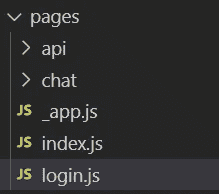
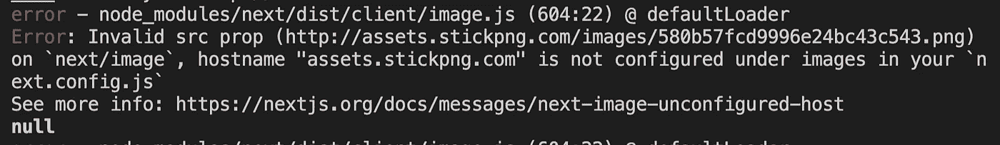
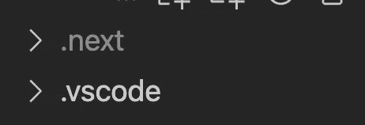
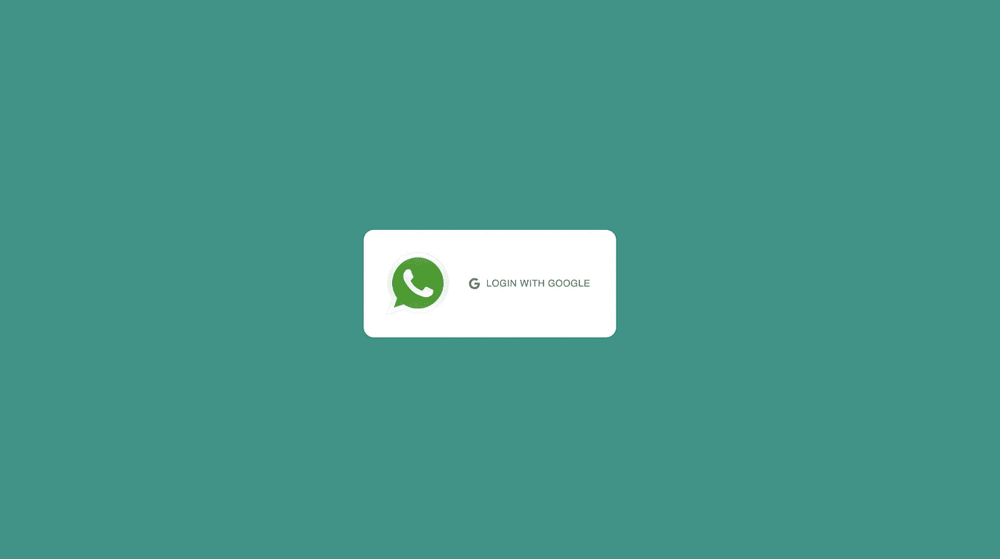

# 用 Next.js 创建 WhatsApp 克隆:登录页面

> 原文：<https://javascript.plainenglish.io/create-whatsapp-clone-with-next-js-part-15-login-page-ca454566013?source=collection_archive---------15----------------------->

## 第 15 部分:登录页面

在本文中，我们将创建一个登录页面，因此当用户没有登录时，它将显示登录页面。

[源代码](https://www.youtube.com/channel/UCu4-4FnutvSHVo9WHvq80Ww/join)

在 pages 文件夹下创建 login.js。



在 login.js 中，添加一个样式化的容器。我们将宽度和高度设置为 100%视口。将显示设置为网格，并将项目放置在中间。我们还将背景颜色设置为 WhatsApp 绿色。

```
const Container = styled.div`display:grid;place-items:center;height:100vh;width:100vw;background-color: rgb(0,150,136);;`
```

创建登录组件，它将持有的 WhatsApp 图标和登录按钮。将填充设置为 30px，显示 flex，在 flex 项目之间留出一些间隙，设置为 20px。设置背景颜色为白色，边框半径为 15px。

```
const Login = styled.div`padding:30px;display:flex;gap:20px;background-color:white;border-radius: 15px;`
```

## 导入图像、按钮和谷歌图标

因为我们将使用 Next.js 图像、材质 UI 按钮和 GoogleIcon，所以我们在顶部导入所有这些。将高度和宽度设置为 100 像素。

将图标添加到按钮的开头，并将文本颜色设置为灰色。

```
import Image from 'next/image';import { Button } from '@mui/material';import GoogleIcon from '@mui/icons-material/Google';const login = () => {return (<Container><Login><Image src="http://assets.stickpng.com/images/580b57fcd9996e24bc43c543.png"height={100}width={100}/><Button style={{ color: 'gray' }} startIcon={<GoogleIcon />} >Login with google</Button></Login></Container>)}
```

您应该会在`next.config.js`中的图像下看到主机名未配置的错误



所以我们必须转到 next.config.js

```
module.exports = {images:{domains:['assets.stickpng.com']}}
```

然后删除。下一个文件夹，用`yarn dev`再次编译



## 检查登录页面

为了直接在登录页面上查看，请转到 _app.js 并键入`return <Login/>`

```
import Login from './login';import Layout from '../components/Layout'import '../styles/globals.css'function MyApp({ Component, pageProps }) {return <Login/>
```

您应该会看到如下登录页面



# 关注我们: [Gumroad 课程](https://app.gumroad.com/ckmobile)， [YouTube](https://www.youtube.com/channel/UCu4-4FnutvSHVo9WHvq80Ww?sub_confirmation=1) ， [Medium](https://ckmobile.medium.com/) ， [Udemy](https://www.udemy.com/user/cyruschan2/) ， [Linkedin](https://www.linkedin.com/company/ckmobi/) ， [Twitter](https://twitter.com/ckmobilejavasc1) ， [Instagram](https://www.instagram.com/ckmobile8050)

加入分支机构赚钱

[](https://ckmobile.gumroad.com/affiliates) [## Gumroad

### 申请成为会员很容易。填写下表，让 Ckmobile 知道您将如何推广他们的…

ckmobile.gumroad.com](https://ckmobile.gumroad.com/affiliates) 

*更多内容看* [*说白了就是*](http://plainenglish.io/) *。报名参加我们的* [*免费周报在这里*](http://newsletter.plainenglish.io/) *。*