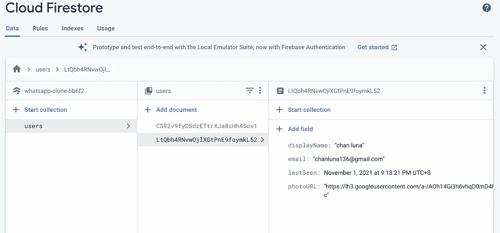
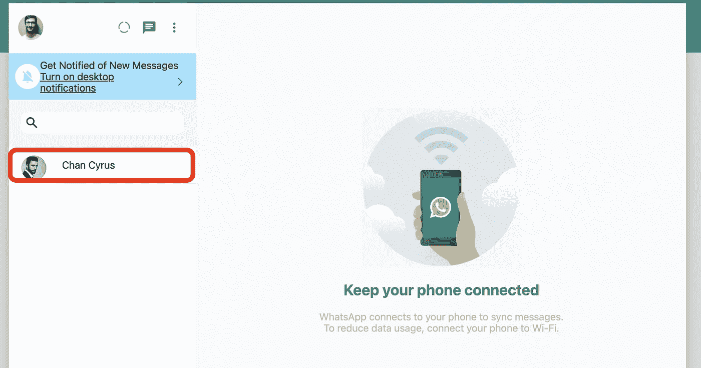

# 用 Next.js 创建 WhatsApp 克隆:从 Firebase 获取数据

> 原文：<https://javascript.plainenglish.io/create-whatsapp-clone-with-next-js-part-21-fetch-data-from-firebase-7efd31f5f245?source=collection_archive---------4----------------------->

## 第 21 部分:使用 firestore、query、collection 和 getDocs

在这篇文章中，我们将获取用户的数据，这样我们可以点击它，然后开始聊天。

[源代码](https://www.youtube.com/channel/UCu4-4FnutvSHVo9WHvq80Ww/join)

首先，在 Sidebar.js 下，我们需要导入以下内容。

```
import { useState, useEffect } from 'react';import { collection, getDocs, query, where } from "@firebase/firestore";
import { db } from '../firebase';
import { useAuth } from '../Auth';
```

接下来，我们需要通过使用 useAuth()创建状态朋友并获取 currentUser。

usersRef 指向名为“users”的集合。选择与用户电子邮件地址不同的用户。

最后，我们将 id 为的 doc.data()设置为朋友数据

```
const Sidebar = () => {const [friends, setFriends] = useState([])
const { currentUser } = useAuth();useEffect(() => {async function fetchFriends() {const usersRef = collection(db, "users");const q = query(usersRef, where("email", "!=", currentUser?.email));const querySnapshot = await getDocs(q);setFriends(querySnapshot.docs.map(doc => ({ ...doc.data(), id: doc.id })))}fetchFriends()}, [])
```



users collection

# 交朋友

为了渲染朋友，我们需要创建一个<friend>组件。我们可以从<chat>组件中复制，只需删除最新的消息和时间戳部分。准备将 photoURL 和 displayName 传递给组件。</chat></friend>

```
import { Avatar } from '@mui/material';import styled from 'styled-components';const Friend = ({ photoURL, displayName }) => {return (<Container ><FrdAvatar src={photoURL} /><ChatContainer><div style={{ gridArea: 'name' }}>{displayName}</div></ChatContainer></Container>)}export default Friendconst Container = styled.div`display:flex;align-items:center;cursor:pointer;min-height:67px;padding-left: 15px;word-break:break-word;:hover {background-color:#F5F5F5;}`const FrdAvatar = styled(Avatar)`margin:5px;margin-right:15px;`const ChatContainer = styled.div`display:grid;padding:10px;width:100%;grid-template-columns: repeat(3,1fr);border-bottom: 1px solid #ededed;gap:10px;grid-template-areas:"name name time""latest_message latest_message.";`
```

回到侧边栏，导入<friend>组件。</friend>

```
import Friend from './Friend';
```

使用地图功能渲染朋友。

```
{friends.map(friend => (<Friend key={friend.id} photoURL={friend.photoURL} displayName={friend.displayName} id={friend.id} />))}
```



Friends will be rendered at the sidebar

# 关注我们: [YouTube](https://www.youtube.com/channel/UCu4-4FnutvSHVo9WHvq80Ww?sub_confirmation=1) ， [Medium](https://ckmobile.medium.com/) ， [Udemy](https://www.udemy.com/user/cyruschan2/) ， [Linkedin](https://www.linkedin.com/company/ckmobi/) ， [Twitter](https://twitter.com/ckmobilejavasc1) ， [Instagram](https://www.instagram.com/ckmobile8050) ， [Gumroad](https://app.gumroad.com/ckmobile)

*更多内容看* [*说白了就是*](http://plainenglish.io/) *。报名参加我们的* [*免费周报在这里*](http://newsletter.plainenglish.io/) *。*