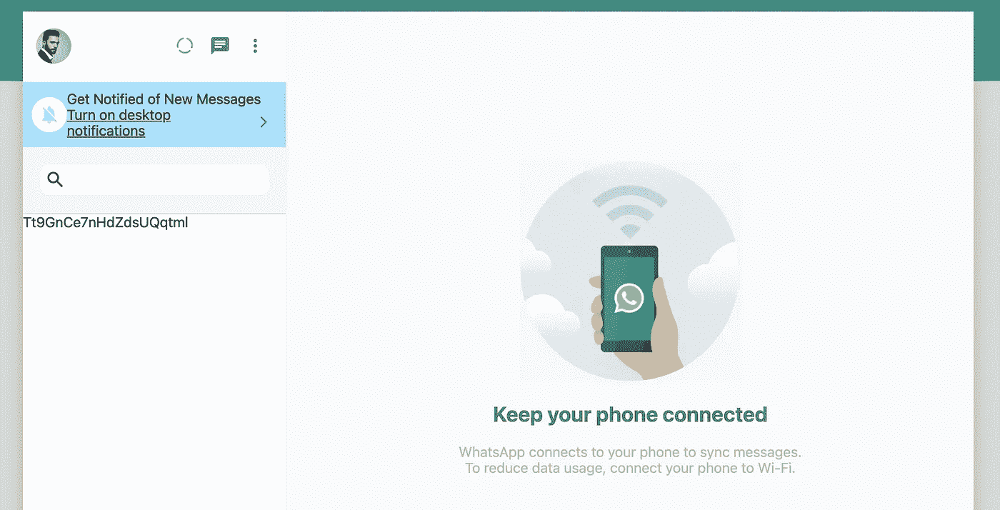

# 用 Next.js: Fetch Chat 创建 WhatsApp 克隆

> 原文：<https://javascript.plainenglish.io/create-whatsapp-clone-with-next-js-part-23-fetch-chat-db71d826a76f?source=collection_archive---------10----------------------->

## 第 23 部分:使用 Firestore onSnapshot 获取聊天记录

在本文中，我们开始使用 onSnapshot 实时获取聊天记录。相比只是抓取用户，聊天变化更频繁；它们会在创建聊天或有人发送消息后发生变化。

加入获取[源代码](https://www.youtube.com/channel/UCu4-4FnutvSHVo9WHvq80Ww/join)

进入 Sidebar.js，从 firestore 导入`onSnapshot`。

```
import { collection, getDocs, onSnapshot, query, where } from "@firebase/firestore";
```

创建状态聊天

```
const [chats, setChats] = useState([])
```

然后我们使用 useEffect，查询包含该当前用户的聊天记录。每次有变化时，我们用 doc.data()和文档 id 设置聊天。

```
useEffect(() => {const chatsRef = collection(db, "chats")const q = query(chatsRef, where("users", "array-contains", currentUser.uid));const unsubscribe = onSnapshot(q, (querySnapshot) => {setChats(querySnapshot.docs.map(doc => ({ ...doc.data(), id: doc.id })))})return unsubscribe}, [])
```

## 渲染聊天

我们已经设置了聊天。现在是渲染的时候了，但是聊天组件有更多的细节需要我们稍后添加。因此，我们只呈现一个简单的

，它显示文档 id，用于表明我们成功地获得了聊天。

```
{chats.map(chat => <div key={chat.id}>{chat.id}</div>)}
```



chat id show on the sidebar

# 关注我们: [YouTube](https://www.youtube.com/channel/UCu4-4FnutvSHVo9WHvq80Ww?sub_confirmation=1) ， [Medium](https://ckmobile.medium.com/) ， [Udemy](https://www.udemy.com/user/cyruschan2/) ， [Linkedin](https://www.linkedin.com/company/ckmobi/) ， [Twitter](https://twitter.com/ckmobilejavasc1) ， [Instagram](https://www.instagram.com/ckmobile8050) ， [Gumroad](https://app.gumroad.com/ckmobile)

*更多内容看* [***说白了。报名参加我们的***](http://plainenglish.io/) **[***免费周报在这里***](http://newsletter.plainenglish.io/) *。***