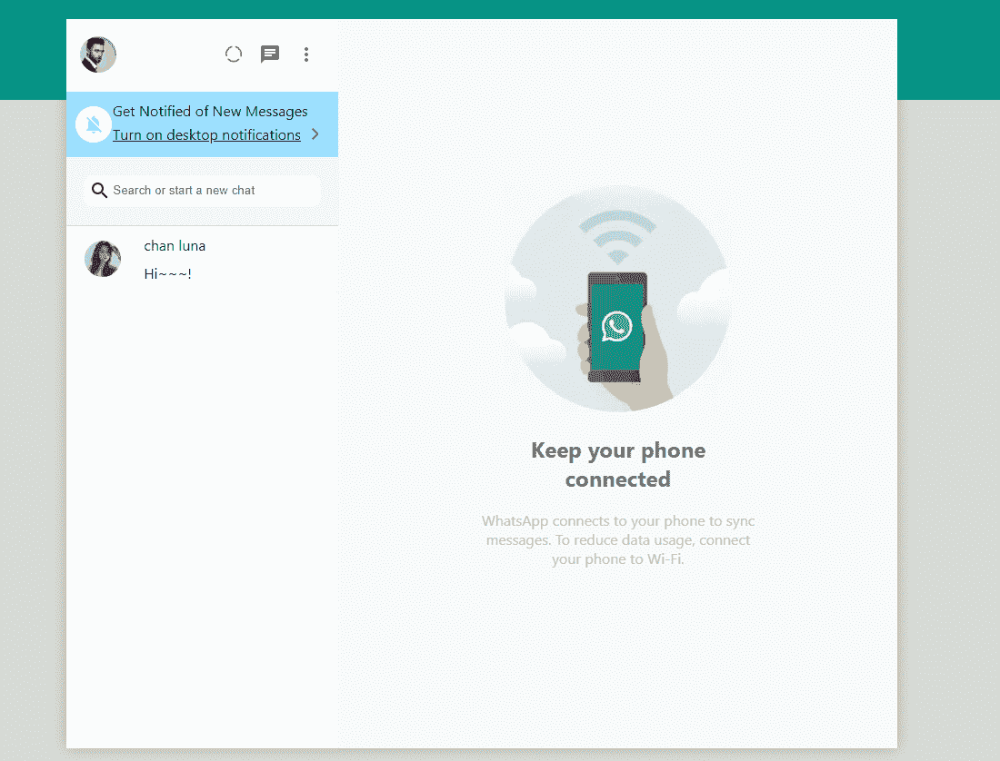

# 用 Next.js 创建一个 WhatsApp 克隆:切换到显示用户或聊天

> 原文：<https://javascript.plainenglish.io/create-whatsapp-clone-with-next-js-part-25-switch-to-showing-users-or-chats-9718796fef7c?source=collection_archive---------16----------------------->

## 第 25 部分:使用 React useRef 确定输入区域


Photo by [Rachit Tank](https://unsplash.com/@rachitank?utm_source=medium&utm_medium=referral) on [Unsplash](https://unsplash.com?utm_source=medium&utm_medium=referral)

在前面的部分中，我们已经可以获得聊天数组和用户数组。我们现在想做的是，如果用户点击搜索，侧边栏应该向用户显示，这样用户就可以点击它并创建一个新的聊天。

首先，我们需要从 React 导入 useRef，并使用 useRef 创建 inputAreaRef。

```
const inputAreaRef = useRef(null);
```

然后，我们将 inputAreaRef 放在<searchinput>组件中。</searchinput>

```
<SearchInput ref={inputAreaRef} placeholder="Search or start a new chat"/>
```

我们还需要创建一个名为“searchFriends”的状态，默认为 false，如果 searchFriends 为 true，则显示用户数组，否则显示聊天数组。

```
const [searchFriends, setSearchFriends] = useState(false);
```

添加 useEffect 检查输入区是否未被点击，设置搜索好友为 false。否则设置搜索好友为真。

```
useEffect(() => {const checkIfClickedOutside = e => {if (!inputAreaRef.current.contains(e.target)) {console.log('Outside input area');setTimeout(() => {setSearchFriends(false);}, 3000);} else {console.log('Inside input area');setSearchFriends(true);}}document.addEventListener("mousedown", checkIfClickedOutside)return () => {document.removeEventListener("mousedown", checkIfClickedOutside)}}, [])
```

在呈现部分，当 searchFriends 为 true 时，它将遍历 friends 数组。否则，它将在 chats 数组中循环。

```
{searchFriends ? <>{friends.map(friend => (<Friend key={friend.id} photoURL={friend.photoURL} displayName={friend.displayName} id={friend.id} />))}</> : <>{chats.map(chat => <Chat key={chat.id} id={chat.id} users={chat.users} latestMessage={chat.latestMessage} timestamp={chat.timestamp} />)}</>}
```



# 关注我们: [YouTube](https://www.youtube.com/channel/UCu4-4FnutvSHVo9WHvq80Ww?sub_confirmation=1) ， [Medium](https://ckmobile.medium.com/) ， [Udemy](https://www.udemy.com/user/cyruschan2/) ， [Linkedin](https://www.linkedin.com/company/ckmobi/) ， [Twitter](https://twitter.com/ckmobilejavasc1) ， [Instagram](https://www.instagram.com/ckmobile8050) ， [Gumroad](https://app.gumroad.com/ckmobile)

加入分支机构赚钱

[](https://ckmobile.gumroad.com/affiliates) [## Gumroad

### 申请成为会员很容易。填写下表，让 Ckmobile 知道您将如何推广他们的…

ckmobile.gumroad.com](https://ckmobile.gumroad.com/affiliates) 

*更多内容看* [***说白了就是***](http://plainenglish.io/) ***。*** *报名参加我们的* [***免费每周简讯这里***](http://newsletter.plainenglish.io/) ***。***