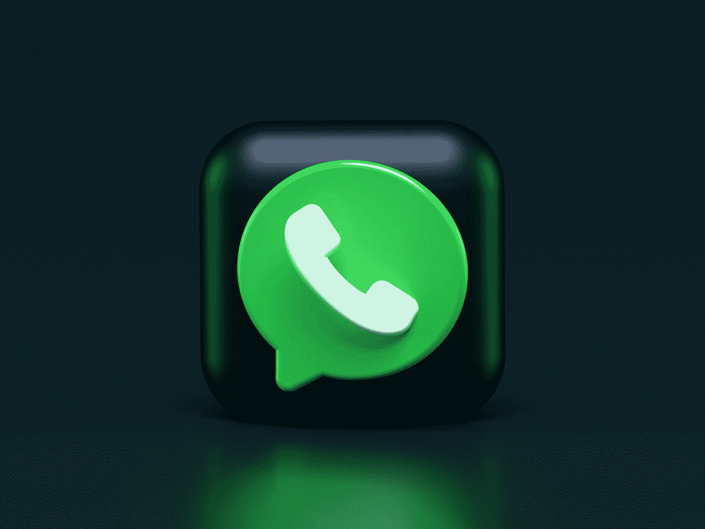
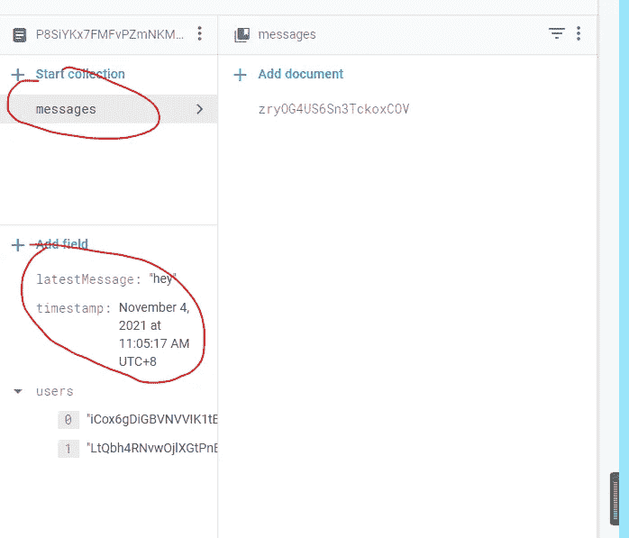
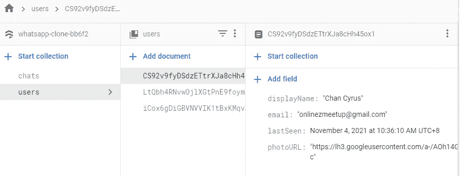

# 用 Next.js: Send Message 创建 WhatsApp 克隆

> 原文：<https://javascript.plainenglish.io/create-whatsapp-clone-with-next-js-part-27-send-message-bb3a4481dc73?source=collection_archive---------3----------------------->

## 第 27 部分:用 addDoc Firestore 函数向消息集合发送消息



Photo by [Alexander Shatov](https://unsplash.com/@alexbemore?utm_source=medium&utm_medium=referral) on [Unsplash](https://unsplash.com?utm_source=medium&utm_medium=referral)

在这一部分，我们开始添加 sendMessage 功能，这样用户就可以将消息发送给他们的朋友。

首先，我们需要添加状态输入来存储消息。

```
const [input, setInput] = useState("")
```

在输入组件中，检测值的变化，并将其设置为“输入”状态。

```
<Input onChange={e=>setInput(e.target.value)} value={input}placeholder="Type a message" />
```

## 创建 sendMessage 函数

在 sendMessage 函数中，我们主要想做三件事，一是存储用户最后一次活动的时间。第二种是发送带有时间戳和用户电子邮件以及 photoURL 的消息。第三个是存储最新聊天消息和最新消息时间戳，这样它就可以显示在侧边栏中。

*存储用户上次活动时间*

```
import { useAuth } from '../Auth';const {currentUser} = useAuth()const usersRef = doc(db, "users",currentUser.uid);setDoc(usersRef,{lastSeen:serverTimestamp()},{merge:true})
```

*发送消息*

转到聊天收藏，使用聊天 id 选择，转到收藏消息，并创建一个新文档来存储带有时间戳、消息、电子邮件和照片 URL 的消息。

```
import { addDoc, collection, doc, serverTimestamp, setDoc } from '@firebase/firestore';import { db } from '../firebase';const messagesRef = collection(db, "chats",id,"messages");await addDoc(messagesRef,{timestamp:serverTimestamp(),message:input,user:currentUser.email,photoURL:currentUser.photoURL})
```

*存储最新信息和时间*

使用 setDoc 函数在 id 为的聊天集合中选择聊天，这样它会用最新的时间戳和消息替换旧文档。

```
const chatRef = doc(db, "chats",id);setDoc(chatRef,{latestMessage:input,timestamp:serverTimestamp()}, {merge:true});
```

所有东西准备好后，通过`setInput('')`清除输入框的信息

完整代码:

```
const sendMessage= async(e)=>{e.preventDefault();const usersRef = doc(db, "users",currentUser.uid);setDoc(usersRef,{lastSeen:serverTimestamp()},{merge:true})const messagesRef = collection(db, "chats",id,"messages");await addDoc(messagesRef,{timestamp:serverTimestamp(),message:input,user:currentUser.email,photoURL:currentUser.photoURL})const chatRef = doc(db, "chats",id);setDoc(chatRef,{latestMessage:input,timestamp:serverTimestamp()}, {merge:true});setInput('')}
```

为了触发 sendMessage，我们使用一个隐藏的按钮来发送。它只有在有输入时才发送。



messages added to messages collection, latest message and timestamp added to the chat



lastSeen time is added to the user document

# 关注我们: [YouTube](https://www.youtube.com/channel/UCu4-4FnutvSHVo9WHvq80Ww?sub_confirmation=1) ， [Medium](https://ckmobile.medium.com/) ， [Udemy](https://www.udemy.com/user/cyruschan2/) ， [Linkedin](https://www.linkedin.com/company/ckmobi/) ， [Twitter](https://twitter.com/ckmobilejavasc1) ， [Instagram](https://www.instagram.com/ckmobile8050) ， [Gumroad](https://app.gumroad.com/ckmobile)

加入分支机构赚钱

【https://ckmobile.gumroad.com/affiliates】

*更多内容看* [*说白了就是*](http://plainenglish.io/) *。在这里注册我们的* [*免费周报*](http://newsletter.plainenglish.io/) *。*