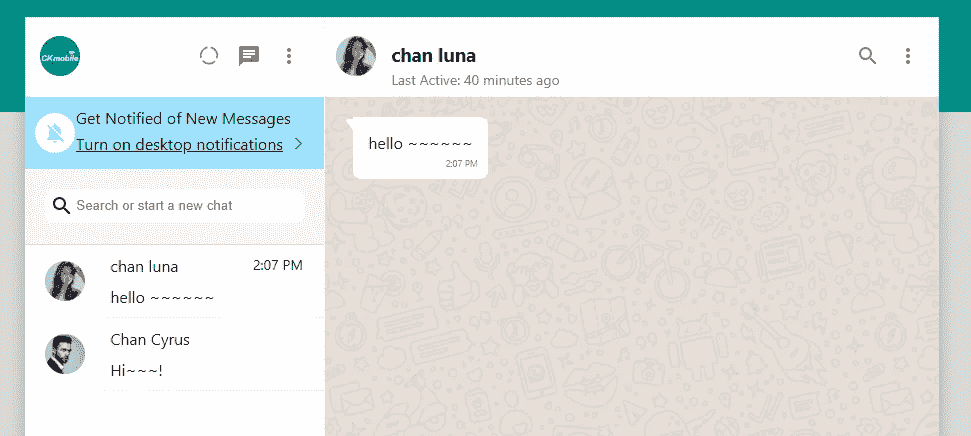
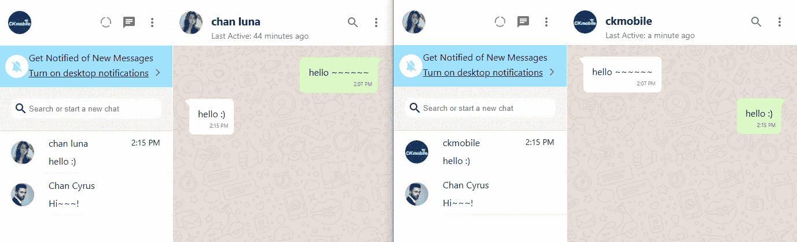

# 用 Next.js 创建一个 WhatsApp 克隆:在聊天框中呈现消息

> 原文：<https://javascript.plainenglish.io/create-whatsapp-clone-with-next-js-part-29-render-messages-at-chat-box-e5e94ad1ccf7?source=collection_archive---------14----------------------->

## 第 29 部分:以不同的气泡样式呈现消息。

要呈现消息，请访问 ChatContent.js。在 useEffect 中，使用`chat_id`选择 chats 集合，然后选择 messages 集合。

添加状态“消息”。

```
const [messages,setMessages] = useState([])
```

按时间戳以升序对消息进行排序。用 id 和时间戳设置消息。时间戳需要转换成可读的 JavaScript。

```
useEffect(() => {const messagesRef = collection(db, "chats",chat_id,"messages");const q = query(messagesRef,orderBy("timestamp","asc"))const unsubscribe = onSnapshot(q,(querySnapshot) =>{setMessages(querySnapshot.docs.map(doc=>({...doc.data(),id:doc.id,timestamp:doc.data().timestamp?.toDate().getTime()})))})return unsubscribe;}, [chat_id])
```

## 呈现消息

然后使用 map 函数呈现消息。

```
MessagesContainer>{messages.map(message => <Messagekey={message.id}user={message.user}message={message.message}timestamp={message.timestamp}/>)}</MessagesContainer>
```



## 设置朋友或用户的信息风格

回到<message>组件，将登录邮件设置为用户邮件。导入 useAuth，获取 currentUser 并将 loginMail 设置为 currentUser.email</message>

```
import { useAuth } from '../Auth';const Message = ({ user, message, timestamp }) => {const {currentUser} = useAuth()const loginMail = currentUser.email
```



# 关注我们: [YouTube](https://www.youtube.com/channel/UCu4-4FnutvSHVo9WHvq80Ww?sub_confirmation=1) ， [Medium](https://ckmobile.medium.com/) ， [Udemy](https://www.udemy.com/user/cyruschan2/) ， [Linkedin](https://www.linkedin.com/company/ckmobi/) ， [Twitter](https://twitter.com/ckmobilejavasc1) ， [Instagram](https://www.instagram.com/ckmobile8050) ， [Gumroad](https://app.gumroad.com/ckmobile)

加入分支机构赚钱

[](https://ckmobile.gumroad.com/affiliates) [## Gumroad

### 申请成为会员很容易。填写下表，让 Ckmobile 知道您将如何推广他们的…

ckmobile.gumroad.com](https://ckmobile.gumroad.com/affiliates) 

*更多内容请看* [***说白了就是***](http://plainenglish.io/) *。报名参加我们的* [***免费每周简讯这里***](http://newsletter.plainenglish.io/) *。*