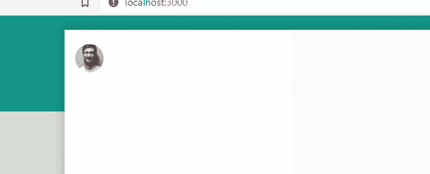

# 用 Next.js: Sidebar Avatar 创建 WhatsApp 克隆

> 原文：<https://javascript.plainenglish.io/create-whatsapp-clone-with-next-js-part-3-sidebar-avatar-d1531c96c7a4?source=collection_archive---------20----------------------->

## 第 3 部分:侧边栏头像


[源代码](https://www.youtube.com/channel/UCu4-4FnutvSHVo9WHvq80Ww/join)

安装材料用户界面

```
yarn add @mui/material @emotion/react @emotion/styled
yarn add @mui/material @mui/styled-engine-sc styled-components
```

创建背景颜色等于白色的

组件。将 display 设置为 equal to flex，然后通过将 justify-content 设置为`space-between`将个人资料图片和图标设置为两边。

In real whatsapp, there is space between profile picture and icons group

对于<useravatar>，我们增加了`cursor:pointer;`和`:hover:{opacity:0.8}`。所以当鼠标移到头像上时，它会变成更亮的颜色。</useravatar>



```
import styled from 'styled-components';import { Avatar } from '@mui/material';const Sidebar = () => {return (<Container><Header><UserAvatar src="https://images.pexels.com/photos/220453/pexels-photo-220453.jpeg?auto=compress&cs=tinysrgb&dpr=1&w=500"/></Header></Container>)}export default Sidebarconst Container = styled.div`background-color: #FFFFFF;min-width: 320px;max-width:450px;height:100%;`const Header = styled.div`display:flex;position:sticky;top:0;background-color:white;justify-content: space-between;align-items:center;padding:15px;height:80px;border-bottom: 1px solid whitesmoke;`;const UserAvatar = styled(Avatar)`cursor: pointer;:hover{opacity:0.8;}`;
```

最后，我们创造的是这样的。


# 关注我们: [Gumroad 课程](https://app.gumroad.com/ckmobile)， [YouTube](https://www.youtube.com/channel/UCu4-4FnutvSHVo9WHvq80Ww?sub_confirmation=1) ， [Medium](https://ckmobile.medium.com/) ， [Udemy](https://www.udemy.com/user/cyruschan2/) ， [Linkedin](https://www.linkedin.com/company/ckmobi/) ， [Twitter](https://twitter.com/ckmobilejavasc1) ， [Instagram](https://www.instagram.com/ckmobile8050)

加入分支机构赚钱

[](https://ckmobile.gumroad.com/affiliates) [## Gumroad

### 申请成为会员很容易。填写下表，让 Ckmobile 知道您将如何推广他们的…

ckmobile.gumroad.com](https://ckmobile.gumroad.com/affiliates) 

*更多内容尽在* [***说白了***](http://plainenglish.io/)