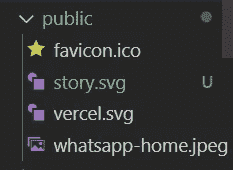
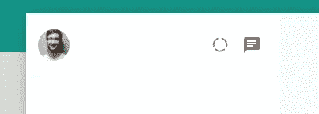
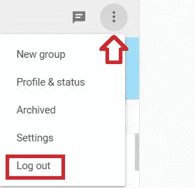

# 用 Next.js: Sidebar Icons 组创建 WhatsApp 克隆

> 原文：<https://javascript.plainenglish.io/create-whatsapp-clone-with-next-js-part-4-sidebar-icons-group-b3ec7a06502b?source=collection_archive---------27----------------------->

## 第 4 部分:侧边栏图标组


[源代码](https://www.youtube.com/channel/UCu4-4FnutvSHVo9WHvq80Ww/join)

在这一部分中，由于我们需要使用材质 UI 图标，因此，我们需要安装下面的包。

```
yarn add @mui/icons-material
```

我们添加一个样式组件

```
const IconsGroup = styled.div``;
```

这里没有样式，但这有助于使代码更清晰，也有助于在图标和个人资料图片之间留出空间。

我们通过在公共文件夹中添加一张图片来制作“故事”图标。我们需要自己制作是因为，此时此刻，在[材料 UI 主页上没有这个图标可以选择。](https://mui.com/components/material-icons/)



我们将 story.svg 添加到“public”文件夹下。

```
const Sidebar = () => {return (<Container><Header><UserAvatar src="https://images.pexels.com/photos/220453/pexels-photo-220453.jpeg?auto=compress&cs=tinysrgb&dpr=1&w=500"/>**<IconsGroup>****<IconButton>********</IconButton>****<IconButton>****<ChatIcon />****</IconButton>****</IconsGroup>**</Header></Container>)}
```

现在，侧边栏看起来应该如下所示:



Icons at the sidebar of whatsapp

在真正的 WhatsApp 中，有一个三点图标，可以触发下拉菜单，我们可以选择注销。



Real Whatspp UI — logout icon

我们可以参考[材质 UI 文档](https://mui.com/components/menus/)。我们将在下一部分继续。

# 关注我们: [Gumroad 课程](https://app.gumroad.com/ckmobile)， [YouTube](https://www.youtube.com/channel/UCu4-4FnutvSHVo9WHvq80Ww?sub_confirmation=1) ， [Medium](https://ckmobile.medium.com/) ， [Udemy](https://www.udemy.com/user/cyruschan2/) ， [Linkedin](https://www.linkedin.com/company/ckmobi/) ， [Twitter](https://twitter.com/ckmobilejavasc1) ， [Instagram](https://www.instagram.com/ckmobile8050)

加入分支机构赚钱

[](https://ckmobile.gumroad.com/affiliates) [## Gumroad

### 申请成为会员很容易。填写下表，让 Ckmobile 知道您将如何推广他们的…

ckmobile.gumroad.com](https://ckmobile.gumroad.com/affiliates) 

*更多内容尽在* [***说白了***](http://plainenglish.io/)