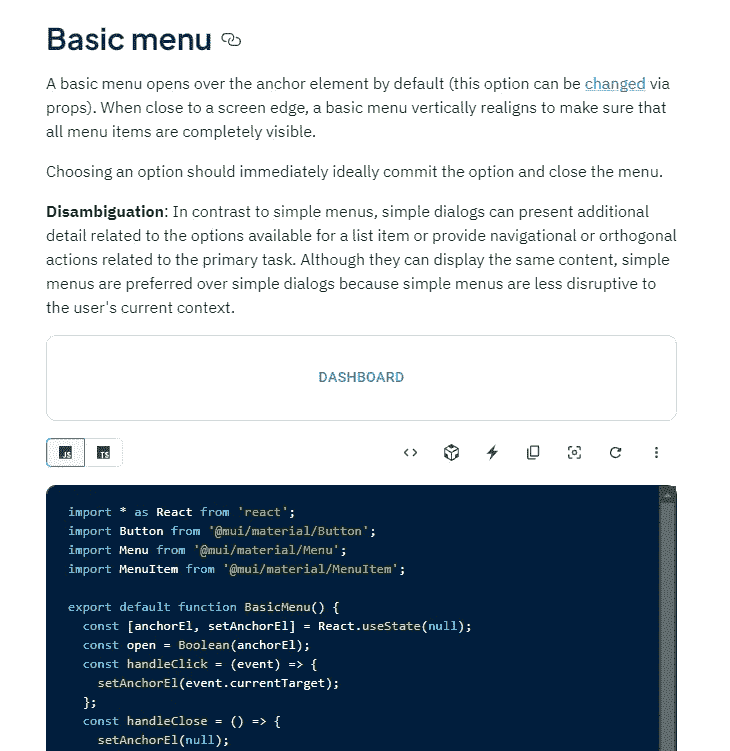
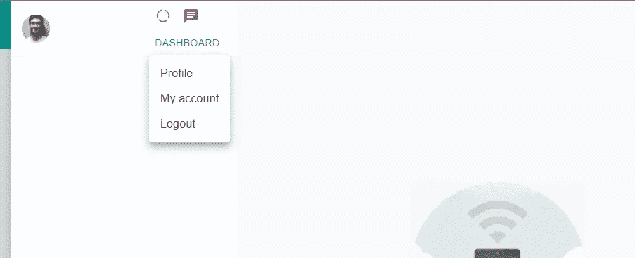
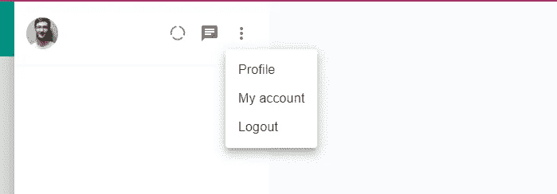
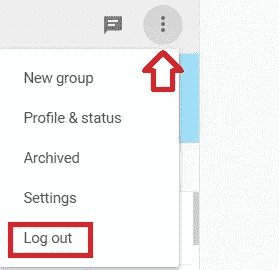
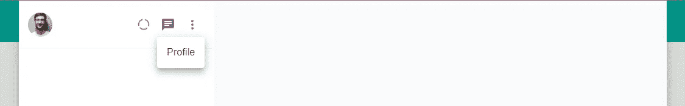
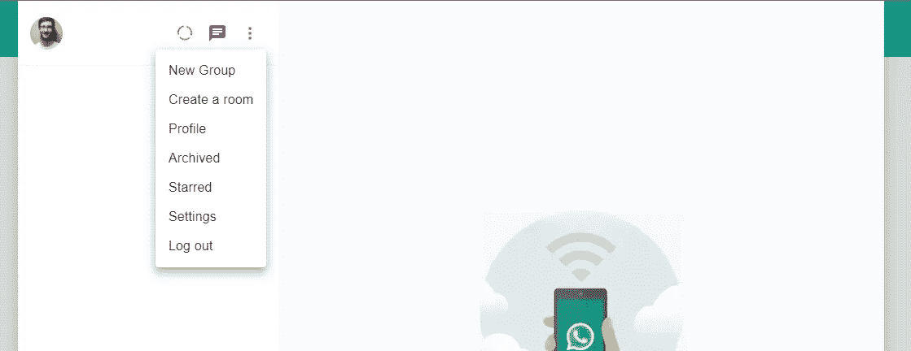

# 用 Next.js:侧边栏菜单创建一个 WhatsApp 克隆

> 原文：<https://javascript.plainenglish.io/create-whatsapp-clone-with-next-js-part-5-sidebar-menu-e988008021b7?source=collection_archive---------14----------------------->

## 第 5 部分:侧栏菜单


[源代码](https://www.youtube.com/channel/UCu4-4FnutvSHVo9WHvq80Ww/join)

为了创建侧边栏菜单，[我们可以从文档中复制代码](https://mui.com/components/menus/)。



Documentation of material ui

我们粘贴文档中的代码，并将其导入到 Sidebar.js 中。



我们需要在 CustomMoreVertical.js 内部进行更改。使用 IconButton 替换按钮组件。

```
import * as React from 'react';import Menu from '@mui/material/Menu';import MenuItem from '@mui/material/MenuItem';import MoreVertIcon from '@mui/icons-material/MoreVert';import { IconButton } from '@mui/material';export default function BasicMenu() {const [anchorEl, setAnchorEl] = React.useState(null);const open = Boolean(anchorEl);const handleClick = (event) => {setAnchorEl(event.currentTarget);};const handleClose = () => {setAnchorEl(null);};return (**<>****<IconButton onClick={handleClick}>****<MoreVertIcon/>****</IconButton>**<Menuid="basic-menu"anchorEl={anchorEl}open={open}onClose={handleClose}MenuListProps={{'aria-labelledby': 'basic-button',}}><MenuItem onClick={handleClose}>Profile</MenuItem><MenuItem onClick={handleClose}>My account</MenuItem><MenuItem onClick={handleClose}>Logout</MenuItem></Menu>**</>**);}
```



看起来更好。如果和真正的 Whatsapp 对比的话。菜单将从图标的右下角下拉。



Real WhatsApp drop down menu

要解决这个问题，我们需要转到菜单组件。将锚点原点设置为右下角，将变换原点设置为右上角。

```
<Menuid="basic-menu"anchorEl={anchorEl}open={open}onClose={handleClose}MenuListProps={{'aria-labelledby': 'basic-button',}}**anchorOrigin={{****vertical: "bottom",****horizontal: "right",****}}****transformOrigin={{****vertical: "top",****horizontal: "right",****}}**>
```

现在，菜单的位置和真正的 WhatsApp 是一样的。我们可以继续在菜单上增加更多的项目。



sidebar menu

```
<MenuItem onClick={handleClose}>New Group</MenuItem><MenuItem onClick={handleClose}>Create a room</MenuItem><MenuItem onClick={handleClose}>Profile</MenuItem><MenuItem onClick={handleClose}>Archived</MenuItem><MenuItem onClick={handleClose}>Starred</MenuItem><MenuItem onClick={handleClose}>Settings</MenuItem><MenuItem onClick={handleClose}>Log out</MenuItem>
```

现在，我们添加了所有的项目，菜单应该是这样的。



The menu items in our web

# 关注我们: [Gumroad 课程](https://app.gumroad.com/ckmobile)， [YouTube](https://www.youtube.com/channel/UCu4-4FnutvSHVo9WHvq80Ww?sub_confirmation=1) ， [Medium](https://ckmobile.medium.com/) ， [Udemy](https://www.udemy.com/user/cyruschan2/) ， [Linkedin](https://www.linkedin.com/company/ckmobi/) ， [Twitter](https://twitter.com/ckmobilejavasc1) ， [Instagram](https://www.instagram.com/ckmobile8050)

加入分支机构赚钱

[](https://ckmobile.gumroad.com/affiliates) [## Gumroad

### 申请成为会员很容易。填写下表，让 Ckmobile 知道您将如何推广他们的…

ckmobile.gumroad.com](https://ckmobile.gumroad.com/affiliates) 

*更多内容请看*[***plain English . io***](http://plainenglish.io/)