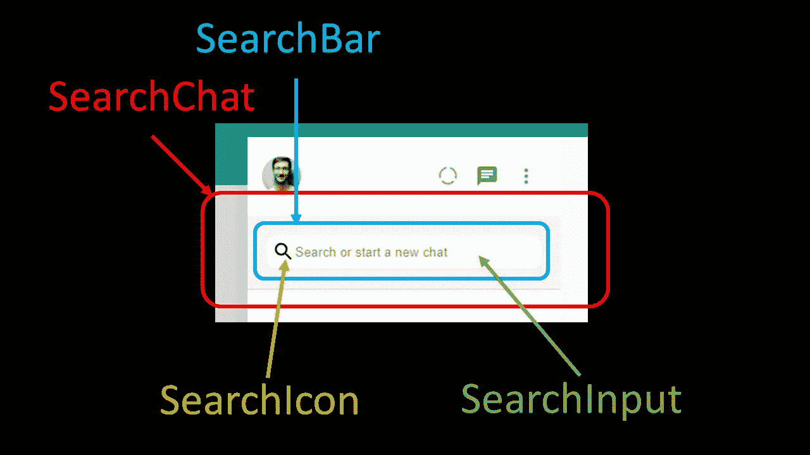
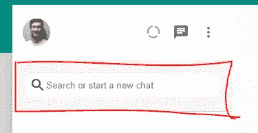

# 用 Next.js:侧边栏搜索栏创建一个 WhatsApp 克隆

> 原文：<https://javascript.plainenglish.io/create-whatsapp-clone-with-next-js-part-6-sidebar-searchbar-a5d500767dd6?source=collection_archive---------17----------------------->

## 第 6 部分:侧栏搜索栏

为了创建 WhatsApp 克隆版的搜索栏，我们将其分为四个部分。



这包括`<SearchChat>`、`<SearchBar>`、`<SearchIcon>`和`<SearchInput>`。

浅灰色区域`<SearchChat>`将包裹`<SearchBar>`组件。

`<SearchBar>`是包含搜索图标和输入字段的白色区域。

[源代码](https://www.youtube.com/channel/UCu4-4FnutvSHVo9WHvq80Ww/join)

## 搜索聊天

我们通过设置背景色为`#f6f6f6.`来给这个部分一个浅灰色

我们还在<searchchat>下面添加了一个微妙的黑色边框。我们创建了一个 20px 的填充，所以在空白和边缘之间有一些空间。</searchchat>

```
const SearchChat = styled.div`background-color: #f6f6f6;border-bottom: 1px solid rgba(0, 0, 0, 0.1);padding:20px;`
```



## 搜索栏

<searchbar>的主要用途是通过使用 flexbox 来保持图标和输入域。我们做了一个填充，这样 searchicon 和输入框就不会粘在边缘了。</searchbar>

我们给一个圆角的边界半径为 10px。我们还在红色区域的底部添加了一个边框。


但是当然，我们只是给一个薄的浅灰色边框。

最后，我们给出一个白色作为背景色。

```
const SearchBar = styled.div`display:flex;padding:5px;border-radius:10px;border-bottom: 1px solid #ededed;background: white;`;
```

## 搜索输入

对于输入字段，我们添加了无边框和 100%宽度，因此它可以使用<searchbar>中几乎所有的空间进行输入</searchbar>

```
const SearchInput = styled.input`border:none;width:100%;`;
```

## 搜索图标

搜索图标从材质用户界面导入。

```
import SearchIcon from '@mui/icons-material/Search';
```

然后，我们将所有四个组件组合在一起。

```
<SearchChat><SearchBar><SearchIcon /><SearchInputplaceholder="Search or start a new chat" /></SearchBar></SearchChat>
```


最后，你应该会看到上面的搜索栏。

# 关注我们: [Gumroad 课程](https://app.gumroad.com/ckmobile)， [YouTube](https://www.youtube.com/channel/UCu4-4FnutvSHVo9WHvq80Ww?sub_confirmation=1) ， [Medium](https://ckmobile.medium.com/) ， [Udemy](https://www.udemy.com/user/cyruschan2/) ， [Linkedin](https://www.linkedin.com/company/ckmobi/) ， [Twitter](https://twitter.com/ckmobilejavasc1) ， [Instagram](https://www.instagram.com/ckmobile8050)

加入分支机构赚钱

[](https://ckmobile.gumroad.com/affiliates) [## Gumroad

### 申请成为会员很容易。填写下表，让 Ckmobile 知道您将如何推广他们的…

ckmobile.gumroad.com](https://ckmobile.gumroad.com/affiliates) 

*更多内容看*[***plain English . io***](http://plainenglish.io/)