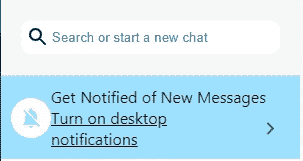
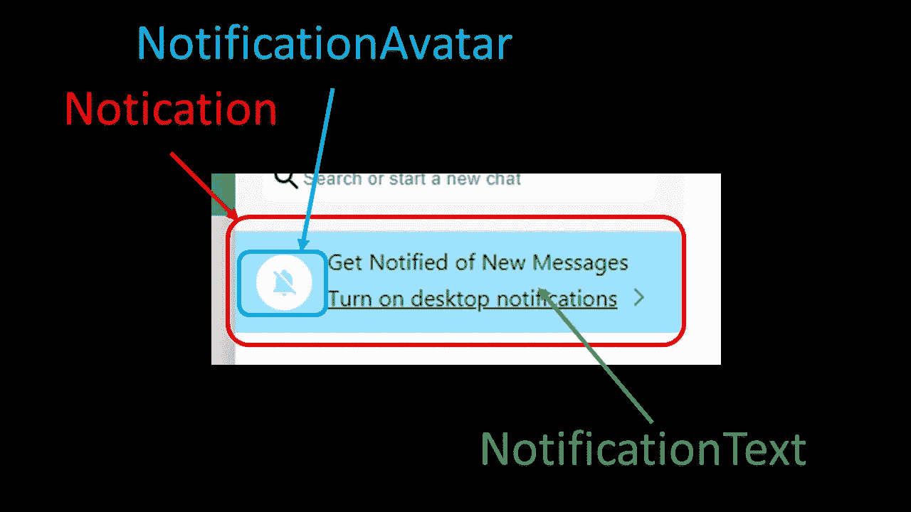

# 用 Next.js 创建 WhatsApp 克隆第 7 部分侧边栏通知

> 原文：<https://javascript.plainenglish.io/create-whatsapp-clone-with-next-js-part-7-sidebar-notification-6ec335f6de72?source=collection_archive---------25----------------------->

## 在本文中，我们将创建这个 WhatsApp 浅蓝色通知。



这部分有三个部件，<notification>、<notificationavatar>和<notificationtext>。</notificationtext></notificationavatar></notification>

[源代码](https://www.youtube.com/channel/UCu4-4FnutvSHVo9WHvq80Ww/join)

由于我们需要在这部分使用`NotificationsOffIcon`和`ArrowForwardIosIcon`，所以我们需要导入这两个。

```
import NotificationsOffIcon from '@mui/icons-material/NotificationsOff';import ArrowForwardIosIcon from '@mui/icons-material/ArrowForwardIos';
```



## 通知

通知是浅蓝色的，所以我们将背景色设置为`#9DE1FE`。在<通知头像>和<通知文本>周围留出空间。最后添加一些大约 10px 的填充。

```
const Notification = styled.div`display: flex;justify-content: space-around;align-items:center;padding:10px;background-color:#9DE1FE;`
```

## 通知头像

我们希望头像有白色的背景色。

```
const NotificationAvatar = styled(Avatar)`background-color: white !important;`
```

稍后，我们将使用它来包装 NotificationsOffIcon，我们也将赋予这个图标浅蓝色，这与<notification>相同</notification>

```
<NotificationAvatar><NotificationsOffIcon style={{ color: '#9DE1FE' }} /></NotificationAvatar>
```

## 通知文本

对于通知文本，我们只想让它显示为 flex，所以第一行是“获得通知…”下一行是“打开…”

```
const NotificationText = styled.div`display:flex;flex-direction:column;`
```

## 组合所有三个组件

我们组合了所有这三个组件，并且我们还使用了一个

来在<notificationtext>处包装和<iconbutton>。我们将其设置为“flex”显示。因此</iconbutton>和<iconbutton>并排显示。</iconbutton></notificationtext>

```
<Notification><NotificationAvatar><NotificationsOffIcon style={{ color: '#9DE1FE' }} /></NotificationAvatar><NotificationText><p style={{ margin: 0 }}>Get Notified of New Messages</p>**<div style={{ display: 'flex', alignItems: 'center', justifyContent: 'center' }}>****<a href="#"><u>Turn on desktop notifications</u></a>****<IconButton><ArrowForwardIosIcon style={{ width: 15, height: 15 }} /></IconButton>****</div>**</NotificationText></Notification>
```

## 关注我们: [Gumroad 课程](https://app.gumroad.com/ckmobile)， [YouTube](https://www.youtube.com/channel/UCu4-4FnutvSHVo9WHvq80Ww?sub_confirmation=1) ， [Medium](https://ckmobile.medium.com/) ， [Udemy](https://www.udemy.com/user/cyruschan2/) ， [Linkedin](https://www.linkedin.com/company/ckmobi/) ， [Twitter](https://twitter.com/ckmobilejavasc1) ， [Instagram](https://www.instagram.com/ckmobile8050)

*更多内容请看*[***plain English . io***](http://plainenglish.io)