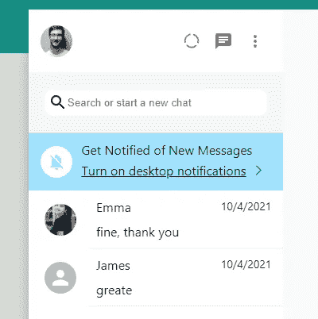
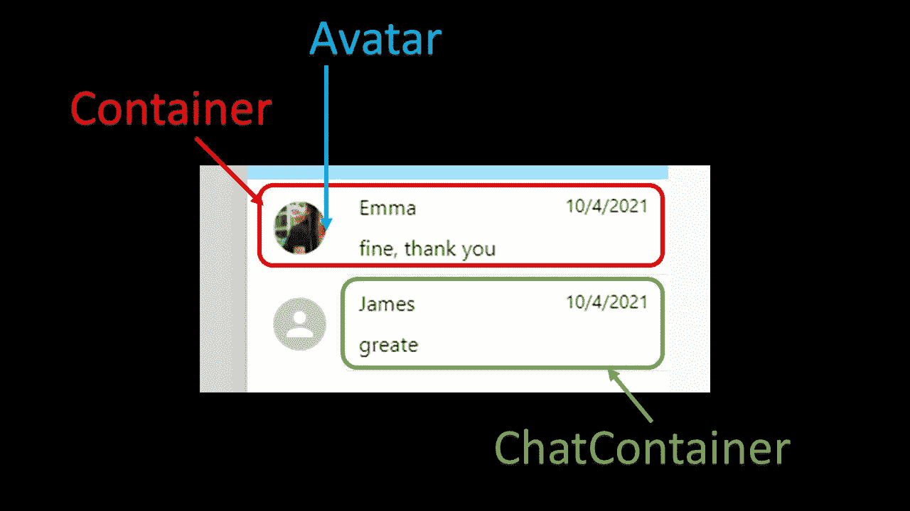
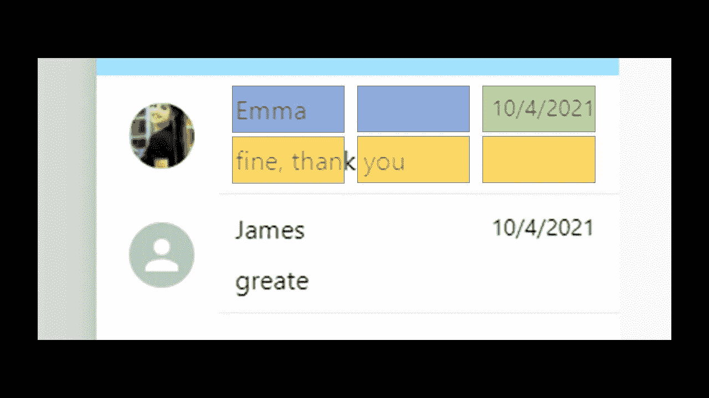

# 使用 Next.js 创建 WhatsApp 克隆第 8 部分显示聊天

> 原文：<https://javascript.plainenglish.io/create-whatsapp-clone-with-next-js-part-8-display-chats-63d714f07168?source=collection_archive---------26----------------------->

## 在这一部分，我们将在侧边栏添加聊天项目。

[源代码](https://www.youtube.com/channel/UCu4-4FnutvSHVo9WHvq80Ww/join)



每个聊天项目都是一个组件。因此，我们转到 components 文件夹，创建一个文件“Chat.js”。



Chat Component

聊天项目包含<container>、<frdavatar>和<chatcontainer>。</chatcontainer></frdavatar></container>

在这一部分，我们将显示时间，这需要`moment`包的帮助。所以我们打字

```
yarn add moment
```

## 容器

对于容器，我们将显示设置为 flex，因此默认的方向是 row。我们还将对齐项目设置为居中，因此所有项目都垂直居中对齐。

添加光标:指针和背景颜色为灰色的悬停效果。鼠标会变成一个手指，当鼠标经过它的时候颜色会变成浅灰色。

```
const Container = styled.div`display:flex;align-items:center;cursor:pointer;min-height:67px;padding-left: 15px;word-break:break-word;:hover {background-color:#F5F5F5;}
```

## FrdAvatar

对于<frdavatar>，我们只是加了 5px 的边距，右边边距到 15px。</frdavatar>

```
const FrdAvatar = styled(Avatar)`margin:5px;margin-right:15px;`
```

## 聊天容器

对于<chatcontainer>，我们将显示设置为网格。所以它创建了三列两行。我们将为不同的</chatcontainer>

设置名称。

```
const ChatContainer = styled.div`display:grid;padding:10px;width:100%;grid-template-columns: repeat(3,1fr);border-bottom: 1px solid #ededed;gap:10px;grid-template-areas:"name name time""latest_message latest_message.";`import { Avatar } from '@mui/material';import styled from 'styled-components';import moment from 'moment';const Chat = ({ photoURL, name, timestamp, latestMessage }) => {console.log('timestamp', timestamp)return (<Container >{photoURL ? <FrdAvatar src={photoURL} /> : <FrdAvatar />}<ChatContainer><div style={{ gridArea: 'name' }}>{name}</div><div style={{gridArea: 'latest_message'}}>{latestMessage}</div><div style={{ fontSize: '14px', gridArea: 'time', width: '100%' }}>{moment(timestamp.seconds * 1000).format('LT')}</div></ChatContainer></Container >)}export default Chat
```

我们将为三个

设置不同的 gridArea 名称、latest_message 和时间

通过使用网格模板区域，设置名称占用第一行的 2 个分数，时间占用第一行的 1 个分数。

最新的消息将占据第二行的整行。

我们传递 photoURL、名称、latest_message 和时间戳作为道具。

为了显示时间，我们称之为时刻(timestamp.seconds * 1000)。格式(' LT ')

## 循环浏览聊天记录

转到 SideBar.js，从 chats.json 导入聊天数据。

```
import * as chats from '../data/chats.json';
```

然后遍历聊天记录并呈现<chat>组件。</chat>

```
{chats.map(chat=>(<Chat  photoURL={chat.photoURL}  name={chat.name} latestMessage={chat.latestMessage} timestamp={chat.timestamp}/>))}
```

您应该会在边栏上看到这个聊天项目。


## 关注我们: [Gumroad 课程](https://app.gumroad.com/ckmobile)， [YouTube](https://www.youtube.com/channel/UCu4-4FnutvSHVo9WHvq80Ww?sub_confirmation=1) ， [Medium](https://ckmobile.medium.com/) ， [Udemy](https://www.udemy.com/user/cyruschan2/) ， [Linkedin](https://www.linkedin.com/company/ckmobi/) ， [Twitter](https://twitter.com/ckmobilejavasc1) ， [Instagram](https://www.instagram.com/ckmobile8050)

*更多内容请看*[***plain English . io***](http://plainenglish.io)