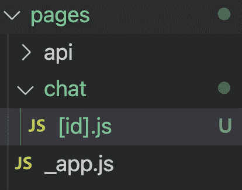
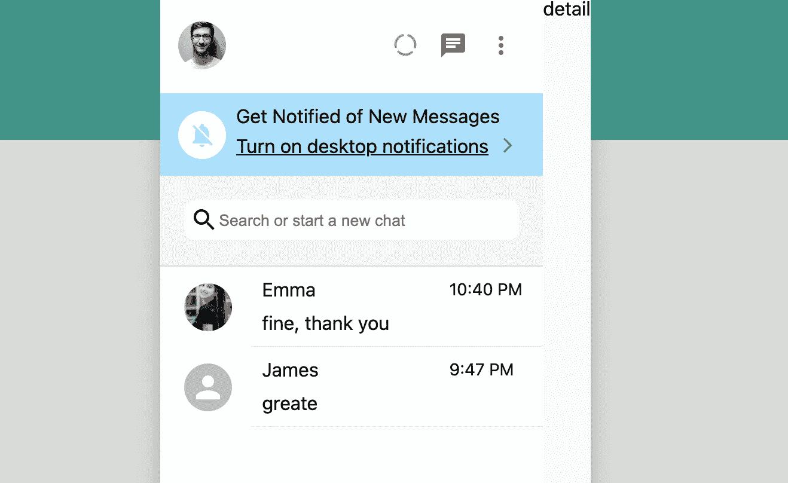
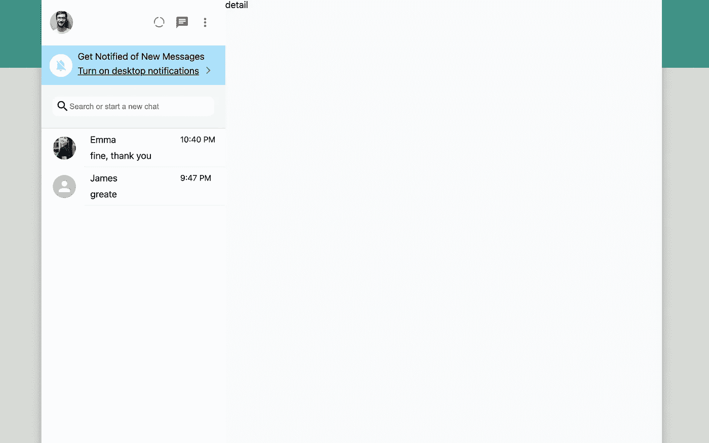

# 用 Next.js: Chat 页面创建 WhatsApp 克隆

> 原文：<https://javascript.plainenglish.io/create-whatsapp-clone-with-next-js-part-9-chat-page-6e6398da0283?source=collection_archive---------13----------------------->

## 第 9 部分:聊天页面


Photo by [Alexander Shatov](https://unsplash.com/@alexbemore?utm_source=medium&utm_medium=referral) on [Unsplash](https://unsplash.com?utm_source=medium&utm_medium=referral)

在这一部分，我们将使用 Next.js 动态路由，如果用户点击侧边栏的聊天项，它将进入聊天。

在 Next.js 中，我们可以通过向页面添加括号来创建动态路由。

顺便说一下，如果你不熟悉 Next.js，你可以参加下面的课程来快速提高你的 Next.js 技能。

[源代码](https://www.youtube.com/channel/UCu4-4FnutvSHVo9WHvq80Ww/join)

[](https://ckmobile.gumroad.com/l/create-app-with-nextjs) [## 面向初学者的 Nextjs

### 编辑描述

ckmobile.gumroad.com](https://ckmobile.gumroad.com/l/create-app-with-nextjs) 

创建[id]。js，这样以后的用户就可以使用“http://localhost:3000/chat/ <some-id>”访问聊天页面了。</some-id>

在[id]里面。js，我们只是设置 100%的宽度，设置显示为' flex '并添加背景色。

```
import styled from 'styled-components';const ChatBox = () => {return (<Container>detail</Container>)}export default ChatBoxconst Container = styled.div`display:flex;background-color:#f8fafc;width:100%;`;
```

## 创建 EnterChat 函数

要进入聊天，我们需要回到 Chat.js(聊天项目)。我们用 useRouter 创建路由器，然后通过`router.push(‘/chat/123’)`推送到聊天页面

我们此刻只是使用一个虚拟 id 123，因为我们只是想首先关注 UI。

```
import { useRouter } from 'next/router';const Chat = ({ photoURL, name, timestamp, latestMessage }) => {const router = useRouter()const enterChat = () => {router.push('/chat/123')}return (<Container onClick={enterChat}>
```



你可以看到我们已经可以进入详细的页面，但有点奇怪，因为宽度太窄。

我们必须回到<layout>，设置最小宽度为 75vw，而不是仅仅使用宽度。</layout>

```
const Container = styled.div`display: flex;/* width: 75vw; */min-width:75vw;margin:auto;margin-top:20px;margin-bottom: 20px;box-shadow: 0 0 1rem 0.05rem rgba(0, 0, 0, 0.2);height: 100vh;@media  (max-width: 1440px) {width:100%;height:100vh;margin:0;}`
```



现在你应该看到宽度恢复正常。

# 关注我们: [Gumroad 课程](https://app.gumroad.com/ckmobile)， [YouTube](https://www.youtube.com/channel/UCu4-4FnutvSHVo9WHvq80Ww?sub_confirmation=1) ， [Medium](https://ckmobile.medium.com/) ， [Udemy](https://www.udemy.com/user/cyruschan2/) ， [Linkedin](https://www.linkedin.com/company/ckmobi/) ， [Twitter](https://twitter.com/ckmobilejavasc1) ， [Instagram](https://www.instagram.com/ckmobile8050)

加入分支机构赚钱

[](https://ckmobile.gumroad.com/affiliates) [## Gumroad

### 申请成为会员很容易。填写下表，让 Ckmobile 知道您将如何推广他们的…

ckmobile.gumroad.com](https://ckmobile.gumroad.com/affiliates) 

*更多内容看* [***说白了***](http://plainenglish.io/)