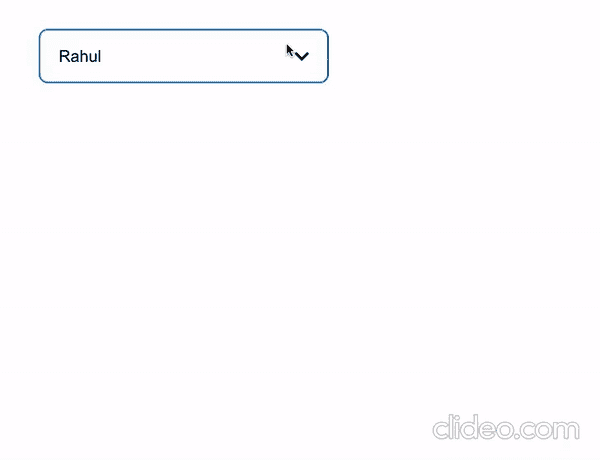
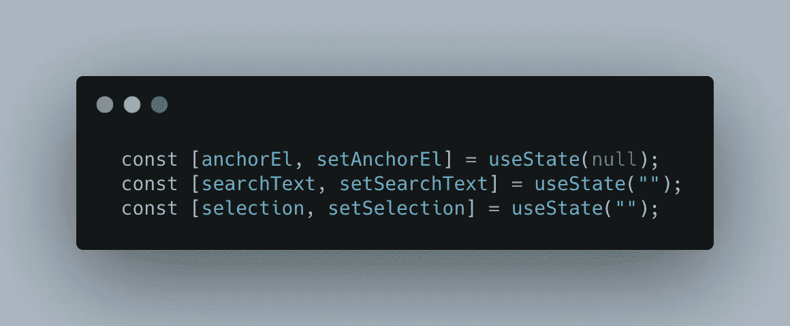
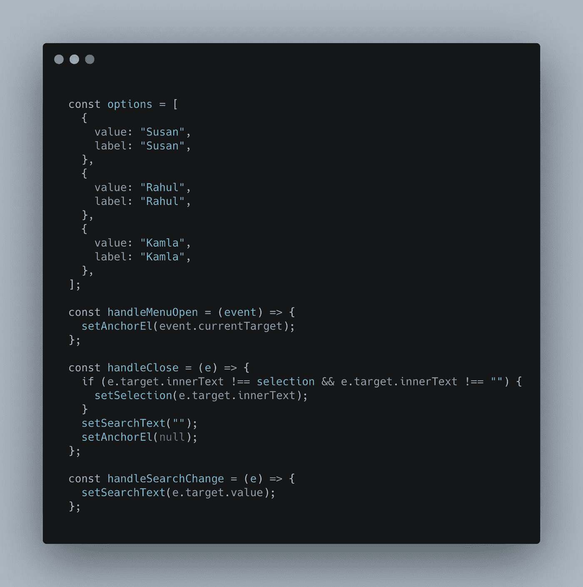
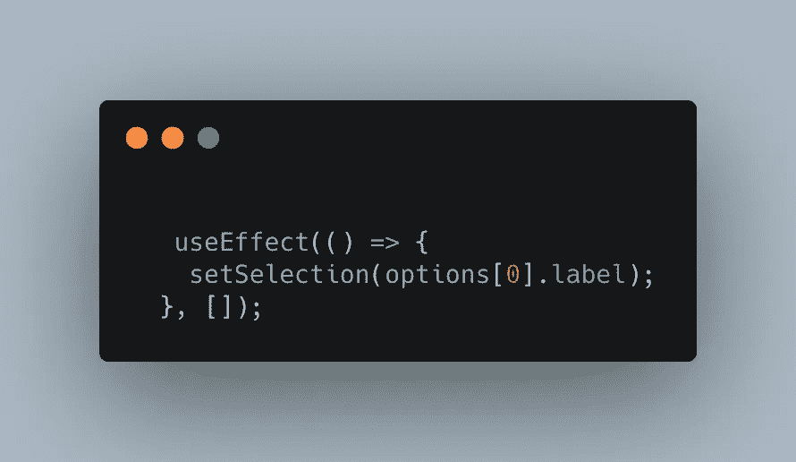
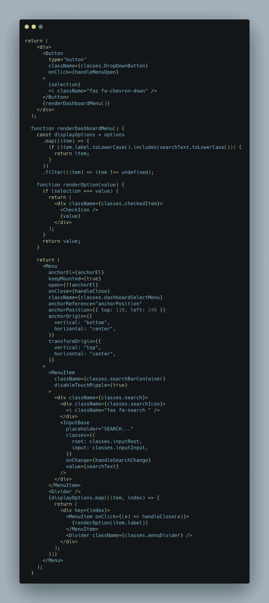

# 在 React 中创建带有搜索选项的自定义下拉菜单

> 原文：<https://javascript.plainenglish.io/create-your-custom-drop-down-menu-with-a-search-option-in-react-js-5c3e92c0ee26?source=collection_archive---------2----------------------->

有时候你需要为你的应用程序定制一个下拉菜单。人们显然可以使用 Material-UI 和 React-prime 等库中的下拉菜单。但是，大多数下拉组件并不包含用户可能需要的所有必要功能。

在本文中，我将解释如何使用现有的 React 库创建一个定制的下拉菜单，如下图所示。所以抓紧了，让我们开始吧。

Figure 1\. Custom drop-down menu

在本文中，我将介绍可以从 GitHub 库[这里](https://github.com/shaikwasef/custom_drop_down_menu)下载的功能和样式。

在我们开始之前，让我们安装必要的库—

1.reactstrap:用于按钮。
2。@material-ui/core 和@material-ui/icons:用于图标和菜单项。
3。字体真棒:搜索图标(你也可以使用材料用户界面图标)

现在我们有了库，是时候开始了。

**第一步:**

我们将首先为组件引入必要的本地状态，如下所示

Figure 2: Setting initial states

锚点是单击后出现的下拉菜单的锚点。搜索文本状态存储当前搜索文本的状态，选择状态存储当前选择的状态。

**第二步:**

我们需要介绍显示的选项和控制菜单栏的适当功能。参考下面的代码

Figure 3: options and controlling functions

options 变量包含将在下拉菜单中显示的选项。*手柄菜单打开*功能通过点击按钮打开下拉菜单。 *handleClose* 函数关闭菜单，并将搜索文本设置为任意值，为下一次搜索设置为空字符串。*手柄搜索改变*设置菜单的搜索状态。

**第三步:**

使用带有空数组依赖项的 useEffect 来设置按钮上的默认菜单选项，如上面的 gif 所示。

Figure 4\. Set default option for the drop-down — menu

**最后一步:**

现在我们已经准备好了应用程序，是时候渲染完整的 JSX 元素了。

Figure 5 : Rendering the appropriate JSX tags

下拉菜单呈现如下所示

Figure 6: Custom drop-down menu

下拉菜单的演示可以在这里找到[https://codesandbox.io/s/cocky-worker-bm33d?file=/src/App.js](https://codesandbox.io/s/cocky-worker-bm33d?file=/src/App.js)

*更多内容请看*[***plain English . io***](http://plainenglish.io/)