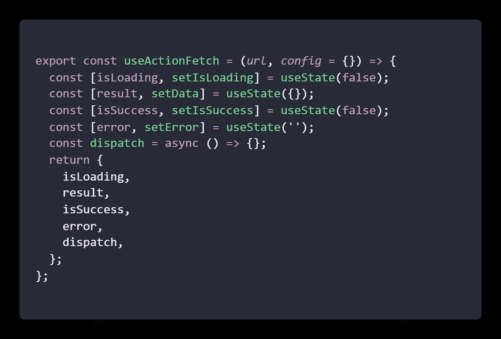
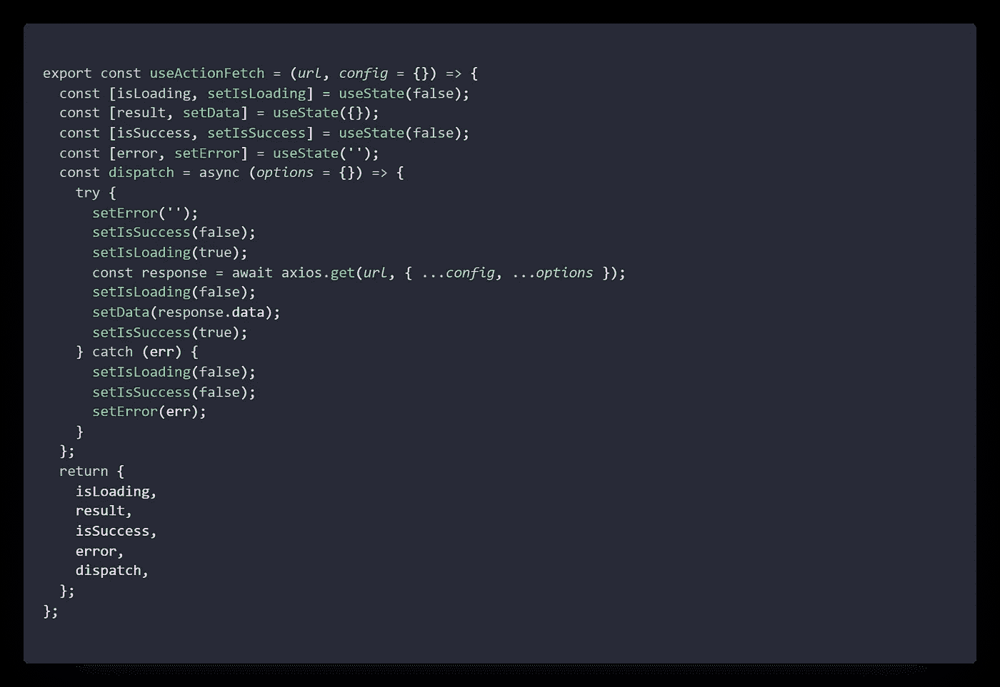

# 创建您的自定义 React 挂钩:一个简短的指南

> 原文：<https://javascript.plainenglish.io/create-your-custom-react-hook-bf087e303004?source=collection_archive---------10----------------------->


Photo by [Caspar Camille Rubin](https://unsplash.com/@casparrubin?utm_source=medium&utm_medium=referral) on [Unsplash](https://unsplash.com?utm_source=medium&utm_medium=referral)

# 介绍

嘿，今天我们要创建一个自定义的反应钩。我们将要使用的钩子使用 Axios API 调用按钮 click。我想你已经对钩子有所了解了。所以，如果你很急，那么你可以跳过这篇文章，直接从 [GitHub](https://github.com/Piyush-Use-Personal/useful-hooks) 获取代码，或者从[这里](https://www.npmjs.com/package/useful-hook)安装软件包。

# 开始

首先，您可以在任何应用程序中添加挂钩，无论是已经内置的还是新的项目。您可以将挂钩存储在项目的文件夹下。所以我跳过文件夹管理，直接创建一个名为`useActionAxios.jsx`的文件。一旦你创建了它，让我们来看看钩子的基础。

> 一个 React 钩子只是一个普通的组件，但是它不返回 JSX，而是返回状态值或者与它们一起工作

首先，我们需要将一些项目导入到文件的顶部

```
import { useState } from 'react';
```

然后，让我们决定运行钩子需要采用哪个参数。既然我们要创建 Axios 挂钩，那么我必须采取

*   URL —所请求资源的 URL
*   config—Axios 需要作为第二个参数的参数数量

让我们把它作为

```
export const useActionFetch = (*url*, *config* = {}) => {// logical code}
```

下一个任务是定义我们需要从钩子中取出哪些参数，并为它们创建一个状态。我决定作为

*   isSuccess —如果 API 调用成功
*   错误—如果 API 失败并存储了错误
*   正在加载—如果没有响应
*   result——无论我们从 API 得到什么结果

修改后的代码将如下所示:



如果你看一下代码，你会发现我在 return 语句前又添加了一行和一个方法。这是会产生奇迹的部分。将该方法附加到一个常规变量，只有在从某个地方调用该变量时，才会触发该方法。例如，点击按钮、从下拉列表中选择等等。

> 如果我们想添加一个在 componentDidMount 时运行的方法，那么我们需要添加 useEffect 来代替 function

添加一个登录，我从 Axios 创建一个常规的 fetch 方法，并根据响应更新状态变量。代码将如下所示:



你也可以在一个变量中包含所有状态，但这取决于你。我在 dispatch 中添加了一个变量，如果有人想在执行其他操作时传递其他数据。

# 让我们用我们的钩子

为了使用我们的钩子，我们可以把它作为一个普通的钩子导入到你的功能组件中。

```
const { error, isLoading, result, isSuccess, dispatch,} = useActionFetch(API_URL);
```

将 URL 传递给钩子，你的钩子就准备好了。您只需要在事件监听器中调用调度程序。

```
const onSave = () => { dispatch()}// your other code
return <Button onClick = {() => onSave()}>Save</Button>
```

在这里，你可以有多种多样的挂钩，以最适合你的项目。

希望这篇短文能抓住你的注意力，并帮助你学到一些东西。感谢您的参与，祝您好运！

*更多内容看*[***plain English . io***](http://plainenglish.io/)