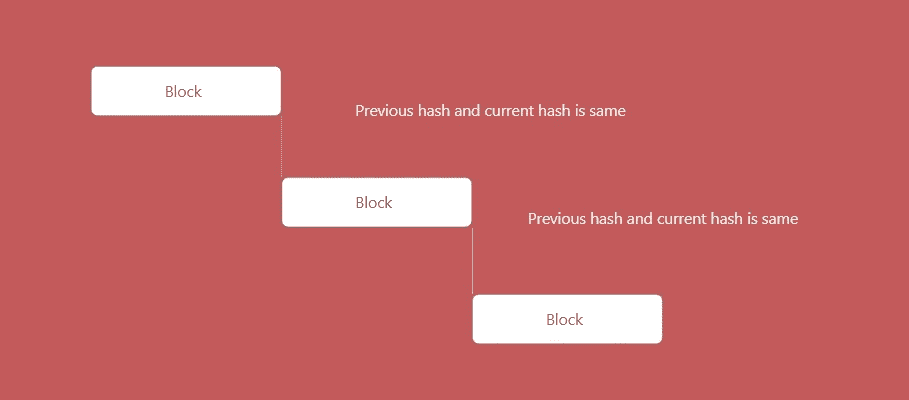
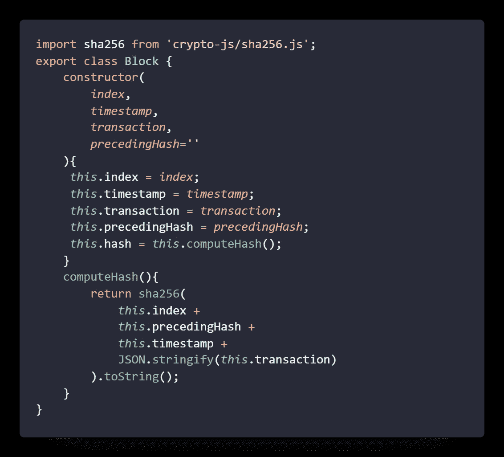
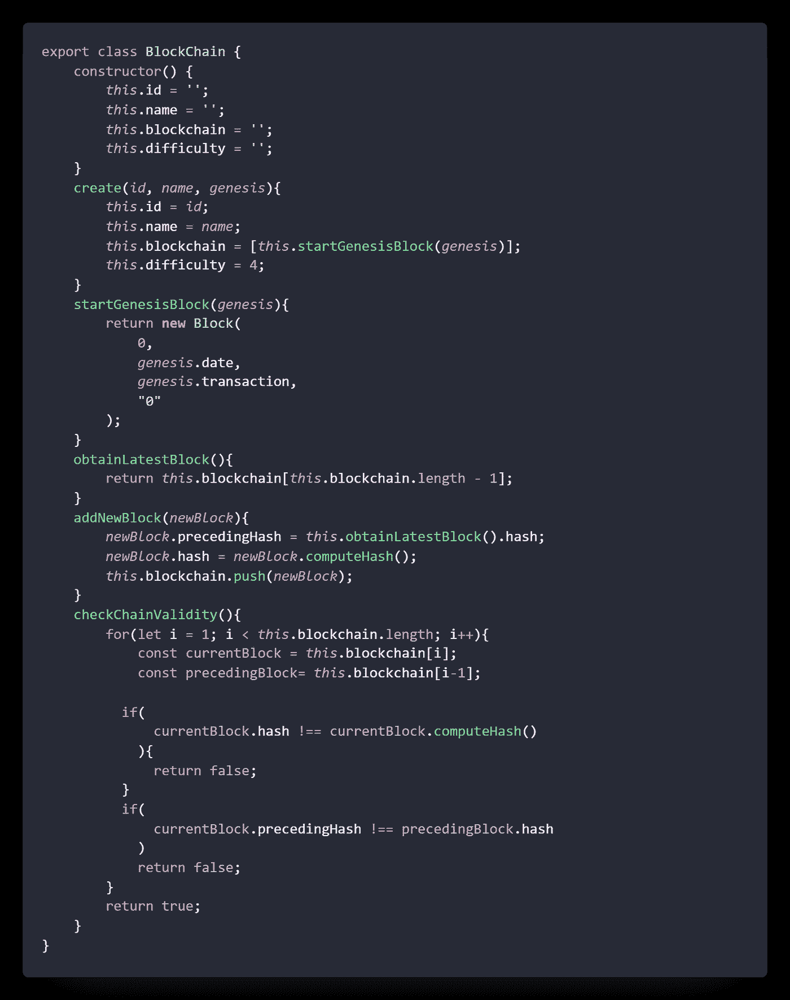
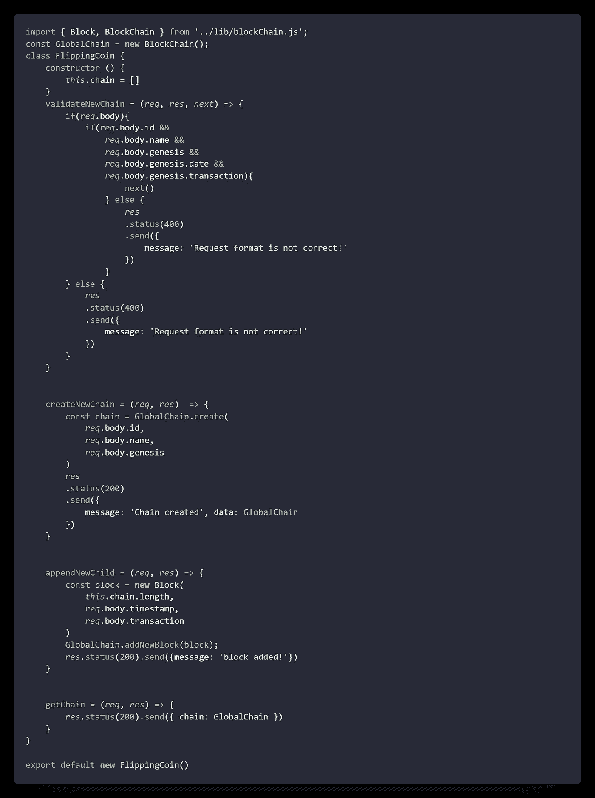
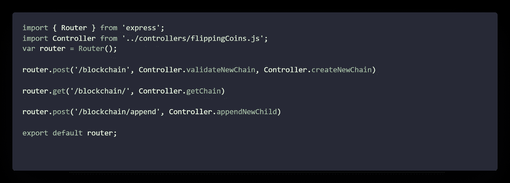
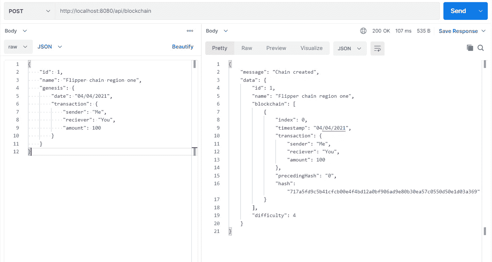
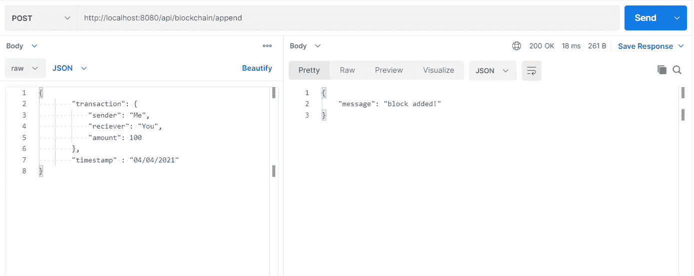
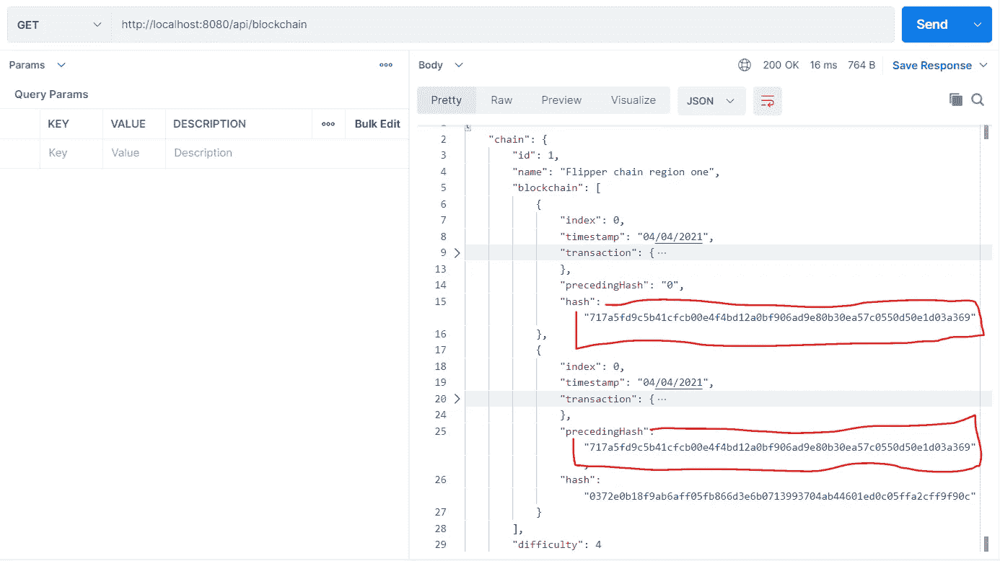

# 用 JavaScript 和 Express 创建自己的区块链

> 原文：<https://javascript.plainenglish.io/create-your-own-blockchain-in-express-4b81b50277b1?source=collection_archive---------7----------------------->


Photo by [André François McKenzie](https://unsplash.com/@silverhousehd?utm_source=medium&utm_medium=referral) on [Unsplash](https://unsplash.com?utm_source=medium&utm_medium=referral)

很少有人问我，我们是否可以用 JavaScript 来构建一个区块链应用程序，当然，有很多资源可以用来构建这样一个应用程序。现在人们在听到有人在区块链工作后变得疯狂，让我告诉你这并没有那么复杂。这就像一个普通的项目，但有更多的规则要遵循，如果你没有犯任何错误，那么瞧，你领先于区块链。

## 什么是区块链？

当组合生成关于某些交易或一系列步骤的信息时，区块链是一组链接在一起的块。例如，无论何时您进行任何银行交易，无论是存钱还是取钱，您都是在根据您在银行中的最后存款金额执行操作，当任何人将它放到网上时，它需要与之前的块有一些关系。

哦，说得太多了，但是对于任何像你我这样的开发人员来说，我们如何理解这种情况并基于此创建一个应用程序。这是一个块将如何连接的演示。



与流程图类似，我们将创建一个应用程序来演示相同的内容。

## 让我们搭一个积木吧

我们将使用与前几篇文章相同的回购协议，[这里的](https://github.com/Piyush-Use-Personal/Role-Based-Access)是回购协议的链接。你可以在分支[区块链](https://github.com/Piyush-Use-Personal/Role-Based-Access/tree/blockchain)中找到完整的代码。可以通过运行***NPM run dev/node index***打开服务器。

首先，创建一个区块链，但是要创建一个区块链，我们需要先有块，所以让我们创建一个名为*块的类。*



在第一行，我们导入一个包来为我们处理加密。下面的命令将为我们完成安装包的工作。

`npm i crypto-js`

让我们来谈谈我们创建的类，

这里，我们在构建对象时有几个参数，即索引、时间戳、事务和 precedingHash。

`index`是给一个块一个唯一的标识符，并通过索引提取我们需要的任何数据结构的块。

`timestamp`是给一个特定的块一个创建时间，因为这个块不能被更新，我们不关心更新的时间和时间戳。

`transaction`是需要阻止的实际数据。例如，雇员总数或总金额或发送者详细信息等

`precedingHash`是负责前一个块和当前块之间连接的字段，如图所示。

`hash`是将与`precedingHash`一起工作的领域，以确保我们处于正确的连接轨道上。

最后，有一个函数`computeHash`将使用 SHA256 算法为我们计算散列值。该算法将获取所有数据，以确保我们将生成的哈希代码的唯一性。

现在，我们已经创建了我们的块，让我们移动到链。

## 创建一个链

同样，我们将创建一个链类，用更多的方法激活其中的块。下面是整个类的代码。



这是一个更大的问题，但我会指引你一路走来。

首先，我们创建了一个空的构造函数来初始化几个字段，包括 id[给出一个标识符]，name[给块起一个酷名字]，区块链[处理所有块的实际字段]，以及 last difference[得到工作证明]。

在我们进入代码的另一部分之前，我们先来看看**创世纪。**对于任何区块链项目，我们需要用第一块来初始化链，因为第一块将表现得像一个构建块，并包含第一个散列，以便块的其余部分用作先前的散列。这里我们从前面的类中创建了一个 block 对象，并给它一个初始值作为参考。

然后我们创建了一个带几个参数的`create()`

`name`是从 API 中给一个名字

`id`是从 API 中给出 Id

和`genesis`给初始 genesis 一个值

然后我们有`obtainLatestBlock()`给我们进入链的最后一个块，这将帮助我们获得最后一个块的散列，我们将把它分配给链中的新元素。

而最重要的方法是`addNewBlock()`向我们的链中添加一个新的 block，该方法将 block 项作为参数。首先，我们将获得区块链的最新散列，并将其添加到它的`precedingHash`中，然后我们将创建一个新散列并将其分配给 hash，我们可以跳过这一步，因为我们已经将它添加到了 block 对象的构造函数中。但是，一旦这个方法运行，它将继续推动项目进入我们的块生态系统。

最后，我们有`checkChainValidity()`，我们不打算使用它，但它有助于块的验证。

## 添加控制器和路由

我们将增加 3 条路线，

为了创造一个区块链，

```
POST - /api/blockchain
```

为了得到区块链，

```
GET - /api/blockchain
```

要将新的子元素添加到链中，

```
POST - /api/blockchain/append
```

让我们为此创建一个控制器文件，



controller file for the blockchain

首先，我们将导入我们创建的两个类，Block 和区块链。之后，我们创建了一个名为 FlippingCoin 的控制器，您可以随意命名。但问题是我们需要关注 3 种方法:

1.  创建新链
2.  appendNewChild
3.  获取链

在此之前，我们已经创建了一个引用链的全局对象，您也可以附加一个数据库或某种数据处理程序来存储数据。现在，为了简单起见，我跳过了数据存储部分。除了这三点，我们还必须验证方法，以验证链是否有正确的数据格式来创建。

现在我们正在调用相应的方法来使事情起作用。

现在让我们添加如下所示的路线



在这里，我们确保将方法映射到正确的路线。

## 让我们测试一下

让我们去路线哨所—/API/区块链

这将为我们创造一个新的区块链，基于我们在创世纪的交易中传递的任何数据



让我们去路由 POST—/API/区块链/append



这将在传递事务数据时将块添加到链中。

最后，让我们转到路径 GET—/API/区块链/来检查数据是否得到更新。



在这里，我们看到前一个块的散列连接到下一个块的前一个散列，这最终证明了我们的第一个图位于第一个位置。

## 结论

在这里，我要结束这篇文章。我们已经讨论了基本的用法和 hash 的基本原理。您可以在这里通过添加数据库、权限角色等等来构建东西。

谢谢你一直支持我读到这里。祝你今天过得愉快。

*更多内容看*[***plain English . io***](https://plainenglish.io/)