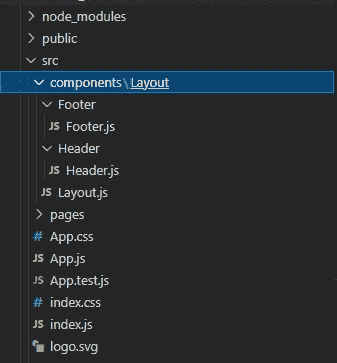

# 在 React 中创建自己的布局组件

> 原文：<https://javascript.plainenglish.io/create-your-own-layout-component-in-react-5d48f0433d9?source=collection_archive---------0----------------------->

## 关于如何创建具有页眉、页脚和内容部分的基本布局组件的指南。


Photo by [Joanna Kosinska](https://unsplash.com/@joannakosinska?utm_source=medium&utm_medium=referral) on [Unsplash](https://unsplash.com?utm_source=medium&utm_medium=referral)

# 布局组件

布局组件是用于跨多个页面共享公共部分的组件。布局组件将有一个共同的页眉和页脚部分。

*   1.创建应用程序
*   2.创建页脚和页眉组件
*   3.创建布局组件
*   4.向应用程序添加布局

## 1.创建应用程序

首先，使用`create-react-app`创建新的 React 应用程序:

```
npx create-react-app my-app
cd my-app
npm start
```

在 src 文件夹中创建零部件和布局文件夹。



folder structure

## 2.创建页脚和页眉组件

布局文件夹中有页脚和页眉组件。使用下面的代码创建页眉和页脚组件:

`src/components/Layout/Footer/Footer.js`

```
import React from "react";
class Footer extends React.Component {
  render() {
    return(
      <footer>
        Footer
      </footer>
    );
  }
}
export default Footer;
```

阅读更多关于 React 中函数组件和类组件的[区别。](https://medium.com/javascript-in-plain-english/which-is-better-class-components-or-functional-component-in-react-a417b4ef6c1a)

`src/components/Layout/Header/Header.js`

```
import React from "react";
class Header extends React.Component {
  render() {
    return(
      <header>
        Header
      </header>
    );
  }
}
export default Header;
```

[](https://balajidharma.medium.com/the-syntax-highlighting-highlight-js-is-now-available-on-medium-58f672595691) [## 用语法荧光笔尝试代码块的中等新功能

### 介质上的语法高亮显示

balajidharma.medium.com](https://balajidharma.medium.com/the-syntax-highlighting-highlight-js-is-now-available-on-medium-58f672595691) 

## 3.创建布局组件

现在我们将创建我们的`Layout`组件。

`src/components/Layout/Layout.js`

```
import React from "react"
import Header from "./Header/Header"
import Footer from "./Footer/Footer"
class Layout extends React.Component {
  render(){
    return (
      <>
        <Header />
        <main>{this.props.children}</main>
        <Footer />
      </>
    )
  }
}
export default Layout;
```

如果一个组件在使用时包含子组件或组件内部的 React 节点(例如`<Parent><Child /></Parent>`或`<Parent><span>test<span></Parent>`)，这些 React 节点或组件实例可以通过使用`this.props.children`来访问。

## 4.向应用程序添加布局

更新 App.js 并将布局包含在 index.js 中:

`src/App.js`

```
import './App.css';
function App() {
  return (
    <div className="App">
      Hello world!
    </div>
  );
}
export default App;
```

`src/index.js`

```
import React from 'react';
import ReactDOM from 'react-dom';
import './index.css';
import App from './App';
import Layout from './components/Layout/Layout';
ReactDOM.render(
  <Layout>
    <App />
  </Layout>,
  document.getElementById('root')
);
```

## **输出**


该示例代码可从[https://github . com/balajidharma/react-basic-layout/tree/master](https://github.com/balajidharma/react-basic-layout/tree/master)获得。

## **StackBlitz 应用**

我们成功地创建了自己的布局组件。这是一个基本的 React 布局组件，希望它能帮助你理解基本的布局流程。

此外，阅读[带 React 路由器的多布局组件](/create-multiple-layouts-components-with-react-router-46b57ad5a455)

## 参考

 [## 6.7 访问子组件/节点

### 如果组件在使用时包含子组件或组件内部的反应节点(例如，或测试),这些…

www.reactenlightenment.com](https://www.reactenlightenment.com/basic-react-components/6.8.html) [](https://www.gatsbyjs.com/docs/how-to/routing/layout-components/) [## 布局组件

### 在本指南中，您将学习 Gatsby 的布局方法，如何创建和使用布局组件，以及如何防止…

www.gatsbyjs.com](https://www.gatsbyjs.com/docs/how-to/routing/layout-components/) 

## 进一步阅读

[](/code-documentation-is-broken-but-i-think-swimm-may-have-fixed-it-daaa7547d834) [## 代码文档被破坏了——但是我认为 Swimm 可能已经修复了它

### 传统的文档管理系统让软件开发人员失望了，是时候来点新的了。游泳吗…

javascript.plainenglish.io](/code-documentation-is-broken-but-i-think-swimm-may-have-fixed-it-daaa7547d834) [](https://bit.cloud/blog/composable-link-component-that-works-in-any-react-meta-framework-l7i3qgmw) [## 可在任何 React 元框架中工作的可组合链接组件

### Bit 的链接组件是一个与运行环境无关的组件。您可以将此链接用于…

比特云](https://bit.cloud/blog/composable-link-component-that-works-in-any-react-meta-framework-l7i3qgmw) 

*更多内容请看*[***plain English . io***](https://plainenglish.io/)*。报名参加我们的* [***免费周报***](http://newsletter.plainenglish.io/) *。关注我们关于*[***Twitter***](https://twitter.com/inPlainEngHQ)[***LinkedIn***](https://www.linkedin.com/company/inplainenglish/)*[***YouTube***](https://www.youtube.com/channel/UCtipWUghju290NWcn8jhyAw)*[***不和***](https://discord.gg/GtDtUAvyhW) *。对增长黑客感兴趣？检查* [***电路***](https://circuit.ooo/) *。***