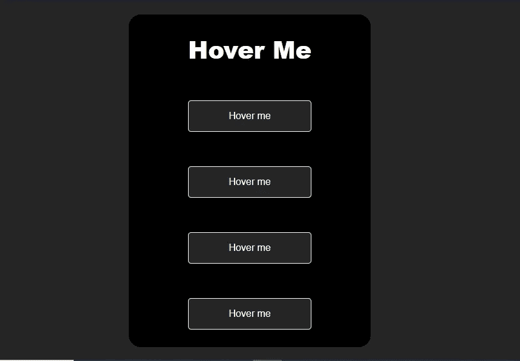

# 使用 CSS 创建 5 个可怕的按钮悬停效果

> 原文：<https://javascript.plainenglish.io/creating-5-awesome-button-hover-effects-using-css-a0556da25c4f?source=collection_archive---------6----------------------->

## 让我们使用 CSS 的魔力来创建令人敬畏的按钮悬停效果。



Image created by the author.

CSS 是一种非常重要的 web 样式表语言。它有助于设计用户界面的风格，使它们对用户更有吸引力。一个没有 CSS 的网站就像一个人不穿衣服走在大街上。

有了 CSS，当用户用他(或她)的鼠标悬停在某个东西上时，你可以显示令人敬畏的效果和动画。这些被称为悬停效果，你可以做出一些非常酷的效果，你只需要有创意就可以了。

在这篇文章中，我们将使用 CSS 制作一些很酷很神奇的按钮悬停效果。让我们开始吧。

# 1.背景向左和向右

我们将创建一个简单的按钮，当用户使用鼠标悬停在它上面时，它的背景会向左和向右移动。

为此，我们需要使用 CSS 伪元素`::before`和`::after`。

下面是按钮的 CSS 代码示例，请仔细阅读:

```
**button**{
    padding: 18px 45px;
    cursor: pointer;
    font-size: 17px;
    font-weight: bold;
    outline: none;
    border: 2px solid white;
    background: transparent;
    color: blanchedalmond;
    position: relative;
    transition: .4s ease;
}
**button::before**{
    content: '';
    width: 0;
    height: 100%;
    position: absolute;
    top: 50%;
    left: 50%;
    transform: translate(-50%,-50%);
    background: crimson;
    color: white;
    border-radius: 5px;
    transition: .3s linear all;
}
**button:hover::before**{
    width: 100%;
}
**button:hover::after**{
  content: 'Hover';
  color: white;
  z-index: 1;
  top: 50%;
  left: 50%;
  transform: translate(-50%,-50%);
  position: absolute;
  width: 100%;
}
```

请在下面的 Codepen 上查看:

Codepen by author.

# 2.背景到顶部和底部

同样，当用户悬停在按钮上时，我们可以使用 CSS 伪元素`::before`和`::after`来创建来自顶部和底部的背景。

只是不是修改宽度，我们会修改高度。看看下面的代码:

```
**button**{
    padding: 18px 45px;
    cursor: pointer;
    font-size: 17px;
    font-weight: bold;
    outline: none;
    border: 2px solid white;
    background: transparent;
    color: blanchedalmond;
    position: relative;
    transition: .4s ease;
}
**button::before**{
    content: '';
    height: 0;
    width: 100%;
    position: absolute;
    top: 50%;
    left: 50%;
    transform: translate(-50%,-50%);
    background: crimson;
    color: white;
    border-radius: 5px;
    transition: .3s linear all;
}
**button:hover::before**{
    height: 100%;
}
**button:hover::after**{
  content: 'Hover';
  color: white;
  z-index: 1;
  top: 50%;
  left: 50%;
  transform: translate(-50%,-50%);
  position: absolute;
}
```

您可以在下面的代码栏中查看它:

Codepen by author.

# 3.绘制边界

这个很酷。我们有一个带边框的按钮。因此，每当用户悬停在按钮上时，按钮的边框会自动平滑绘制。

同样，您将需要使用 CSS 伪元素来创建这种悬停效果。看看下面的 CSS:

```
**button** {
  border: 0;
  background: none;
  text-transform: uppercase;
  color: white;
  font-weight: bold;
  position: relative;
  outline: none;
  padding: 18px 40px;
  box-sizing: border-box;
}**button::before, button::after** {
  box-sizing: inherit;
  position: absolute;
  content: '';
  border: 2px solid transparent;
  width: 0;
  height: 0;
}**button::after** {
  bottom: 0;
  right: 0;
}**button::before** {
  top: 0;
  left: 0;
}**button:hover::before, button:hover::after** {
  width: 100%;
  height: 100%;
}**button:hover::before** {
  border-top-color: crimson;
  border-right-color: crimson;
  transition: width 0.3s ease-out, height 0.3s ease-out 0.3s;
}**button:hover::after** {
  border-bottom-color: crimson;
  border-left-color: crimson;
  transition: border-color 0s ease-out 0.6s, width 0.3s ease-out 0.6s, height 0.3s ease-out 1s;
}
```

在下面的代码栏中查看它:

Codepen by author.

# 4.光效应

我们可以使用 CSS 属性`box-shadow`为按钮背景创建一个灯光效果。我们将在用户悬停在按钮上时添加。

下面是 CSS 代码:

```
**button**{
    padding: 18px 45px;
    cursor: pointer;
    font-size: 17px;
    font-weight: bold;
    outline: none;
    border: 2px solid white;
    background: transparent;
    color: blanchedalmond;
    transition: .4s ease;
}
**button:hover**{
    background: crimson;
    **box-shadow: 0 0 28px 10px crimson;**
}
```

也可以在下面的 Codepen 上查看:

Codepen by author.

# 5.阴影悬停效果

我们有一个带边框的按钮。当用户悬停在它上面时，背景会发生变化，阴影效果会穿透它。

我们将使用伪元素`after`来创建阴影效果。看看下面的 CSS 代码:

```
**button** {
  border: 2px solid white;
  background: transparent;
  text-transform: uppercase;
  color: white;
  padding: 18px 50px;
  outline: none;
  overflow: hidden;
  position: relative;
  transition: .3s ease;
  cursor: pointer;
}
**button:hover**{
    background: crimson;
}**span** {
  z-index: 20;  
}**button:after** {
  content: '';
    display: block;
    position: absolute;
    top: -36px;
    left: -100px;
    background: white;
    width: 50px;
    height: 125px;
    opacity: 25%;
    transform: rotate(-45deg);
}**button:hover:after** {
  left: 120%;
  transition: all .8s cubic-bezier(0.3, 1, 0.2, 1);
   -webkit-transition: all .8s cubic-bezier(0.3, 1, 0.2, 1);
}
```

请查看以下代码栏:

Codepen by author.

# 结论

如你所见，CSS 允许你创建令人敬畏的悬停效果和动画。你只需要一点点的创造力和实践。

感谢您阅读这篇文章。希望你觉得有用。

**更多阅读**

[](/6-useful-pure-css-tips-that-you-should-know-647ccaff201e) [## 你应该知道的 6 个有用的纯 CSS 技巧

### 你可能不知道的极其有用的 CSS 技巧

javascript.plainenglish.io](/6-useful-pure-css-tips-that-you-should-know-647ccaff201e)