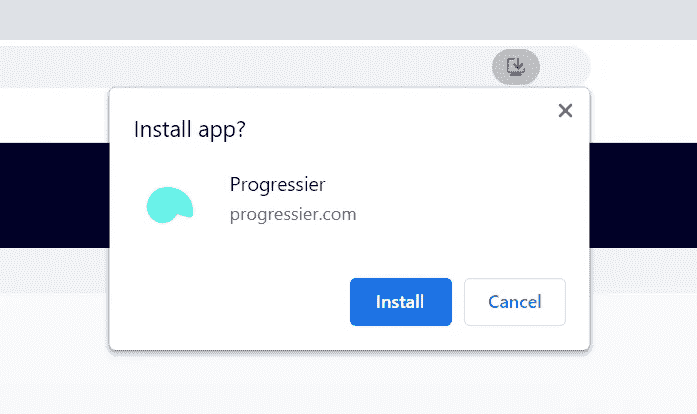

# 创建一个与浏览器无关的 PWA 安装按钮

> 原文：<https://javascript.plainenglish.io/creating-a-browser-agnostic-pwa-install-button-41039f312fbe?source=collection_archive---------0----------------------->


PWA installation on iOS (left) and Android (right)

谷歌关于 PWA 开发的最佳资源之一是[如何提供你自己的应用内安装体验](https://web.dev/customize-install/)。其中，它非常详细地解释了如何创建一个安装按钮，以及如何检测 PWA 何时被安装。

在 Chrome 上效果很好。

## 制作一个浏览器无关的安装按钮需要什么？

指望谷歌为其他浏览器编写文档是不公平的。没问题。但是由于 PWAs 的全部意义在于它们可以在任何地方工作，安装按钮应该是与浏览器无关的。

(补充说明:使用 [Progressier](https://progressier.com) ，创建一个安装按钮就像在代码中添加`<button class="progressier-install-button"></button>`一样简单，但是如果你绝对想自己构建逻辑，请继续阅读。剧透提醒:不好玩。)

## 好吧，那我们要造什么？

我们想要创建一个按钮，单击它会触发*添加到主屏幕*提示。



The “Add to Home Screen” prompt on desktop

在 iOS 上，没有提示，所以当点击按钮时，应该会显示一些说明，解释如何手动将应用程序添加到他们的主屏幕上。


Instructions on how to install a PWA on iOS

在完全不支持安装功能的浏览器上(例如 Mac OS 上的 Safari)，该按钮应该被禁用或完全隐藏。

应用程序安装后，按钮应该消失或被禁用。我们不想在用户已经安装了我们的应用程序之后，再要求他们安装。

## 首先，让我们创建一个按钮

```
let installButton = document.createElement('button');
```

## 使用 beforeinstallprompt 事件

对于可安装的域，它必须由 SSL 保护(即以[http***s***://)](/))开始)。它还必须有一个正在工作的服务工作者来监听 fetch 事件。从 2021 年 8 月起，[实际上可以离线使用](/your-pwa-is-going-to-break-in-august-2021-34982f329f40),没有任何花招。

当所有条件都满足时，会触发一个`beforeinstallprompt`事件，告诉浏览器(和您)该域满足安装的所有条件。如果你什么都不做，Chrome 会显示谷歌称之为*的迷你信息栏。*


The “mini-infobar” (left), the “install prompt” (center), and the [still-experimental “bottom sheet”](https://9to5google.com/2021/03/29/chrome-new-pwa-install/) (right).

现在，在我们的例子中，我们需要捕捉事件并将其存储在某个地方，这样当用户点击我们漂亮的`installButton`时，我们就可以调用它的提示方法。

酷毙了。此时，当用户点击我们的按钮时，它会提示用户安装 app。

## 检测应用程序安装

用户可以点击“安装”。或者他们可以忽略提示。这就是我们对这个选择的反应。

还有一个事件我们可以听。叫`appinstalled`。它在应用程序被添加到我们用户的主屏幕后触发。

很简单。当事件被触发时，我们隐藏了`installButton`，所以用户不能再点击它。不过有一点奇怪的是:`appinstalled`事件从来不会在三星互联网浏览器上触发(其他浏览器也可能如此)。

## 是否已经安装了 PWA？还是根本无法安装？

我们为什么关心？嗯，在不支持安装功能的设备上，正确的 UX 模式可以完全隐藏我们的`installButton`。或者显示它，但同时指出正在使用的浏览器不支持该功能。

安装 PWA 后，最好的 UX 模式是禁用该按钮并更改其措辞，例如从*安装*到*安装*。尽管完全隐藏它也是一个不错的选择。

现在，我们如何判断一个应用程序是已安装(因此不再可安装)还是根本不可安装？在这两种情况下，什么都不会发生(不会触发`beforeinstallprompt`或`appinstalled`事件)。

所以我们要做的就是猜测。这里有一些方法可以帮助你做到这一点:

## 1.特征检测

我们可以通过检查该功能所需的功能是否可用来检测 PWA 是否不可安装。如果没有，我们可以确定浏览器上没有 PWA 功能，并完全隐藏我们的按钮。

## 2.独立模式检测

如果应用程序在它自己的窗口中打开，我们就知道这个应用程序已经安装了，我们可以相应地更新我们的 UI。

## 3.饼干

另一个有效的选择是，每当我们检测到应用程序安装时，就在用户的设备上保存一个 cookie。我们希望我们的`installButton`的状态在会话中保持一致。请注意，如果我们再次检测到一个`beforeinstallprompt`事件，我们可能还想更新 cookie。这意味着用户已经删除了我们的应用——因此它又变成了*可安装的*。

## 4.getInstalledRelatedApps 方法

我们还可以使用 [getInstalledRelatedApps 方法](https://web.dev/get-installed-related-apps/)来检测我们的 PWA 是否已经安装。

## 5.iOS 检测

iOS 需要不同的安装提升机制。但是没有办法检测一个网页是否可以使用 iOS 的*添加到主屏幕*按钮。为了只在 iOS 上显示特定的指令，我们必须弄清楚如何检测设备是否运行 iOS。没有经得起未来考验的方法来做到这一点，但这里有一种方法:

## 结论

通过充分利用所有这些变通方法，我们可以构建一个根据浏览器的兼容性和安装状态显示或隐藏的按钮。PWAs 最大的挑战也是它最大的优势。构建一个在任何地方都能工作的应用程序也意味着你必须让它在任何地方都能工作。而且在某些情况下——比如我们的安装按钮——它可能相当乏味。

你在制作 PWA 安装按钮时遇到过问题吗？请在 kevin@progressier.com 留下您的评论或发邮件给我。