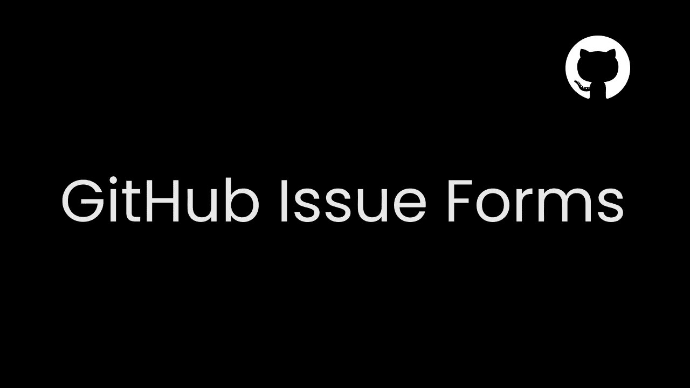
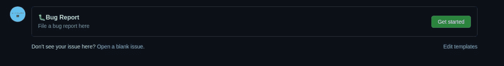
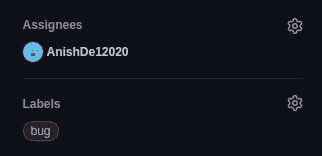
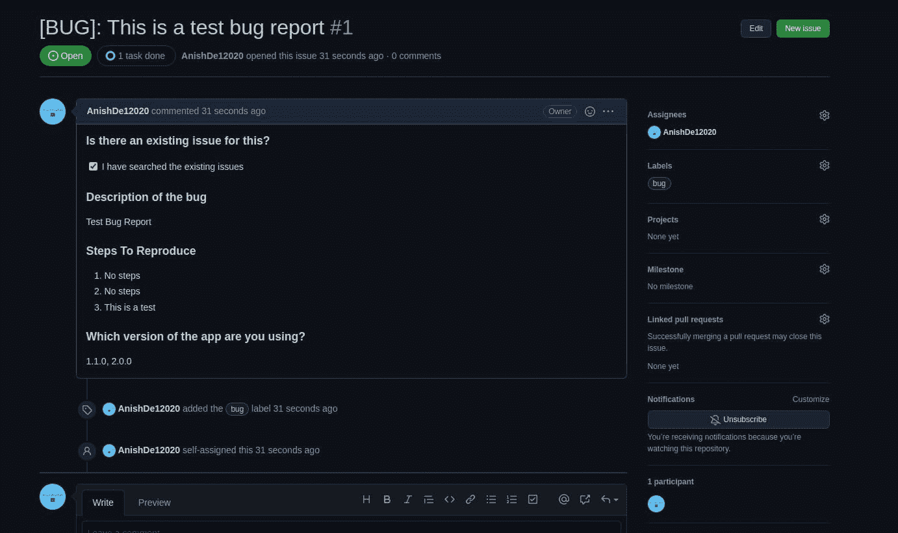

# 在 GitHub 中创建错误报告表单

> 原文：<https://javascript.plainenglish.io/creating-a-bug-report-form-in-github-eb7bf6982746?source=collection_archive---------14----------------------->

[GitHub](https://github.com/) 过去允许我们以 markdown 文件的形式制作预构建问题模板，报告 bug 的人可以填写这些模板。这比给报告错误的人一个空白的文本框要好，但有时会有点笨拙，很多人不会遵循这种格式。GitHub 现在可以选择构建一个表单，用户可以填写这个表单作为错误报告。请注意，问题表单目前处于测试阶段。

GitHub 问题表单目前只对公共存储库可用，所以我们需要一个公共存储库。

接下来，我们需要创建一个名为`.github/ISSUE_TEMPLATE`的文件夹，然后添加一个`yml`文件。让我们称之为`bug_report.yml`。我们的路会是`.github/ISSUE_TEMPLATE/bug_report.yml`。

我们将制作一个简单的表格来提交错误报告，让我们开始吧

首先，让我们添加一个名称:

我们还将添加描述、标题和一些标签

我们还可以添加一个受托人(这是可选的)

既然我们已经完成了元数据，让我们从问题的主体开始-

让我们从添加一小段文字开始-

我们不希望用户提交错误报告，如果该错误的报告已经存在，那么让我们添加一个复选框

这里我们将`type`指定为一个复选框，并添加了`label`参数和`description`属性。然后，我们在复选框中添加了一个`label`参数，并使其成为必填字段，因为我们总是希望它被用户选中。

现在让我们向用户询问关于这个 bug 的描述

注意我们是如何添加一个`id`到这个字段的(这是可选的),我们还添加了一个`description`属性。我们还可以添加一个`placeholder`属性，但是让我们把它留给这个。我们还通过在`validations`部分将`required`参数设置为`true`来制作必填字段。`label`属性是唯一必需的参数。

我们也可以要求他们说出重现 bug 的步骤

这类似于`bug-report`字段，但我们这次增加了一个`placeholder`。

现在让我们看看如何添加一个下拉列表。假设我们有 5 个版本的应用程序，希望用户告诉我们哪个版本的应用程序出现了问题。我们还将为他们提供选择多个版本的选项，以防问题出现在多个版本上

最后，这就是我们的`bug_report.yml`应该看起来的样子-

现在您应该提交文件。

如果我们试图制造一个问题，我们会看到这个页面-

如果我们制作更多的模板，我们会看到多个选项，但我们现在只有一个，所以让我们看看它是否可行

请注意标签和受让人是如何添加的-

在提交问题时，它将像其他问题一样被创建-

你可以在这里看到这个教程的库

你也可以在这里看到 GitHub 发布表单的模式

*原发布于*[*https://blog . anishde . dev*](https://blog.anishde.dev/creating-a-bug-report-form-in-github)*。*

*更多内容请看*[***plain English . io***](http://plainenglish.io/)