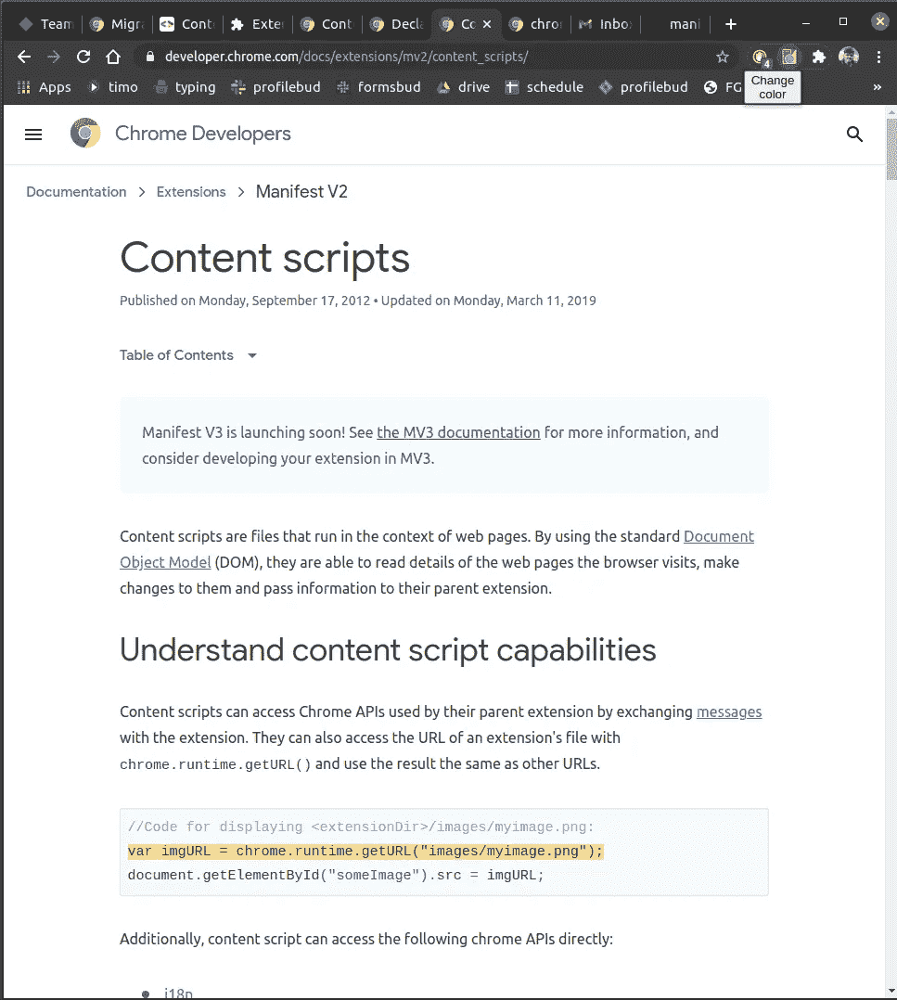

# 用 React 创建 Chrome 扩展

> 原文：<https://javascript.plainenglish.io/creating-a-chrome-extension-with-react-d92db20550cb?source=collection_archive---------0----------------------->

上周，我开始为一个产品构建 Chrome 扩展。该扩展是用 React 作为视图引擎构建的，用于呈现弹出窗口。所以我想把它记录下来，让所有开始做这件事的人都能相处得更好。

在这篇博客中，我们将介绍使用 React 构建 Chrome 扩展的过程。在此之后，您可以非常方便地添加更多的功能。

Github 库的链接:[https://github.com/onlyoneaman/chrome-extension-react](https://github.com/onlyoneaman/chrome-extension-react)

所以让我们开始吧。

# 扩展的特性

这个扩展可以访问你的活动标签并改变页面的背景颜色。



Before


After

## 扩展基本

在深入细节之前，让我们先看一下基于 chromium 的浏览器的一个扩展的基本结构。

这个扩展结构可以在 Chrome、Edge 和 Brave 上工作，也许还可以在其他我不知道的基于 Chrome 的浏览器上工作。

扩展有几个关键部分:


Structure of a Chrome extension

# 显示

清单描述了源包中的内容。它指定了浏览器在哪里可以找到背景，内容脚本，弹出和选项页面。它还描述了扩展所需的权限。

# 背景

当扩展启动时启动的一段代码，直到扩展被移除或浏览器关闭才会终止。

后台代码可以访问所有 Chrome APIs，其他部分受限。但是后台没有 UI，不能访问 DOM。

# 弹出

当用户点击浏览器地址栏右边的扩展图标按钮“浏览器操作”时，弹出用户界面。

大多数扩展需要一个弹出窗口作为入口。

# 选择

这是扩展的可选部分。并非所有扩展都有选项页。它被用作扩展的配置 UI。您的扩展必须为它提供一个条目。

如果你有一些复杂的东西要配置，你需要这个。

# 内容脚本

内容脚本是一段 JavaScript，它在一个带有特定 URL 的选项卡中运行。URL 模式在 manifest.json 中定义，如果在 manifest.json 中指定了与之匹配的 URL，浏览器将启动内容脚本。当 URL 改变或标签关闭时，它将被终止。

如果你想操作 DOM，你需要内容脚本。

所以你应该已经知道这些部分现在在做什么了。

# 这个扩展涉及到哪些部分？

背景:本教程中没有，但是回购中有一个空的 **background.js** 供将来使用。

弹出窗口:是。这是本文的重点。我将向你展示如何在 React 中编写一个弹出窗口。

选项:否。

内容脚本:没有。

# 我们开始吧

## **第一步。为扩展**创建一个目录

```
mkdir chrome-extension-example
cd chrome-extension-example
```

## **第二步。在目录**中创建一个 React 应用

```
npx create-react-app extension
```

*我假设你已经在你的机器上安装了* ***节点*** *和****NPM****。*

这将创建一个常规的 React 应用程序。

## **第三步。创建 manifest.json**

在扩展的根目录下创建 manifest.json 文件

```
touch manifest.json
```

## **第四步。修改 man feist . JSON**

现在，在您选择的代码编辑器中打开扩展并更新 manifest.json:

manifest.json

## 第五步。徽标图像

下载徽标的 zip 文件并解压到扩展名
的根目录[下载链接](https://www.filehosting.org/file/details/921341/images.zip):

## 第六步。在 package.json 中添加脚本

在扩展的 package.json 文件中，在脚本中添加以下内容:

```
"move": "yarn build && rm -rf ../static && mv build/static ../static
```

我们将使用这个脚本来构建我们的应用程序。此外，因为像图像和文件这样的所有资源都需要位于扩展的根目录，而不是 react 应用程序，所以我们将 build 中的静态文件夹移动到扩展的根目录。

## 第七步。更新 React 应用程序中的代码

在我们的应用程序中，当点击一个功能`changeColor`时，我们需要一个按钮。

App.js

接下来在 src/react app 中创建一个函数 main.js，内容如下。这里，我们有一个函数`changeColor`在调用改变颜色按钮时被调用。它在 Chrome 存储器中设置绿色，并获取当前活动的选项卡，并在该选项卡上执行脚本。

main.js

*注意这个文件上面的* `*/*global chrome*/*` *。这是为了避免与 Eslint 的林挺问题。如果您错过了这一点，您的 react 应用程序将返回错误。*

## 第八步。添加脚本以更改背景颜色

在扩展名的根目录下创建一个脚本文件夹，并创建一个包含以下内容的文件`changeBgColor.js`

```
chrome.storage.sync.get("color", ({ color }) => {
  document.body.style.backgroundColor = color;
});
```

这在 react 应用程序中已经足够了，我们不会在这里触及 css，如果你愿意，你可以玩它。

## 第九步。构建并加载到 Chrome 中

在(React 应用程序的)扩展目录中，运行

```
npm run move 
```

现在在`chrome://extensions`中加载 Chrome 扩展目录作为解压后的扩展。

*如果您的开发者模式开启，则这些选项可用。*

点击改变按钮颜色，并检查它是否工作。如果扩展正常工作。你会看到:


Working Version of extension

如果你看不到以上内容，那么代码或执行中有一些错误，请检查 Chrome 扩展的错误。


如果您看到如下错误:

```
Refused to execute inline script because it violates the following Content Security Policy directive: "script-src 'self' blob: filesystem:".
```

检查下一个处理修复这个问题的步骤。否则，会有一些错误，试着调试一下，不会很难。

其他一些可能的错误包括:

*   文件夹或文件不在适当的位置。
*   您的系统或代码编辑器默认设置或 linter 可能与代码有关。

## 第九步。为安全性添加 sha 密钥

你应该仔细关注这一步的两个原因。

您的扩展显示`security policy directive`错误，点击扩展后，您会看到如下屏幕。


Extension not working

你可能会在未来面对这个错误，并因此可以看到如何解决这个问题。

所以，Chrome 不允许你执行内联 javascript 代码。认为你没有添加任何内联代码？记住 React 生成的构建已经为你准备好了。因此，我们必须配置扩展以允许内联执行。

这可以通过在 manifest.json 的`content_security_policy`头中添加一个特定的关键字来实现。

这将是 chrome 生成的内联函数的 sha-key，你可以在错误本身中找到它。


因此，复制这个散列并粘贴到`content security policy`头中，如下所示:

```
'content_security_policy': "script-src 'self' 'sha256-fdAfMKZtCTRPKMRznGwonJHC++vCCrQS7XFnVrzSXAE=';"
```

这将解决问题。如果有更多这样的错误，你将不得不为每个函数添加 sha 键。

尝试在`chrome://extensions`中重新加载扩展，扩展现在可以工作了。

React 扩展运行良好。😃

## 结论

我们做到了！我们已经创建了自己的(基本的)Chrome 扩展。现在，您有希望拥有创建一个基础所需的工具，您可以在此基础上进行构建。

更新 08/03/2021:最近，Chrome 不赞成在低于 3 的清单版本中使用`action`。以前，建议只在清单 v3 中使用 action，这不是必须的。由于 v3 中的 CSP 问题，我们仍然将 repo 保留在清单 v2 中，并且将`action`更改为`browserAction`将单独工作。
如果您遇到问题，只需将清单中的`action`更改为`browserAction` 即可使扩展工作。

🙋🏽‍♂️ **让我们成为朋友吧！**在 [Twitter](https://twitter.com/onlyoneaman) 上关注我，在 [LinkedIn](https://www.linkedin.com/in/onlyoneaman) 上与我联系。别忘了在 [Medium](https://onlyoneaman.medium.com) 上关注我，获取更多精彩内容。

*   如果你想评论/分享想法/观点，请说吧！
*   你喜欢这个博客吗？考虑到 [*请我喝杯咖啡*](https://www.buymeacoffee.com/onlyoneaman) *💻☕️.*