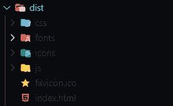

# 用 Vue.js 和 Node.js 创建 Chrome 扩展

> 原文：<https://javascript.plainenglish.io/creating-a-chrome-extension-with-vue-js-and-node-13ddafcf0d84?source=collection_archive---------3----------------------->

半影是 chrome 的一个新标签，以扩展的形式出现。它覆盖了现有的新标签，提供了一些非常小的附加组件或功能。

我对默认新标签的主要问题是它太简单了。它限制用户只能使用八个快捷方式，并使用这些网站的收藏夹图标进行预览。收藏夹图标通常很小(16×16px ),当它们被用在除了标签以外的任何地方时，它们看起来很模糊。这个恼人的问题迫使我创建了自己的 Chrome 扩展，带有我喜欢的微妙特征。

有太多新的替换标签了。但是它们要么试图拥有多产的特性，以至于用起来很讨厌，要么太少，以至于我开始怀疑这有什么意义。

# 项目结构

现在我们来谈谈这个扩展是如何工作的。像大多数网络应用一样，半影有两个部分——前端和后端。前端是用户可以与扩展和后端发送高质量的网站图标互动。

在客户端，我使用 VueJs 创建 UI。VueJs 是一个 JavaScript 框架，用于为 web 创建反应式和模块化的 ui。

半影的用户界面很小，类似于默认界面，很少有例外。它可以让你添加网站(超过 8 个)，它显示天气和每个请求的随机报价。如果你愿意，你也可以改变背景颜色。

在后端，我使用 Node with express 创建 API 端点和一个抓取徽标的 NPM 包来获取网站的图标。Node 是一个 JavaScript 运行时，允许您在系统上执行 JavaScript，而不是在浏览器中执行。ExpressJs 让您可以轻松地创建 API 端点。您也可以用 vanilla Node 创建 API 端点，但是它的 HTTP 模块使用起来有点难看。使用快递可以节省很多时间。

# 后端

半影的后端非常简单。我正在创建一个 API 端点，用户可以发送他/她想要添加的网站的 URL。然后有一个 NPM 包 [**的图标抓取**](https://www.npmjs.com/package/logo-scrape) ，它抓取该网站的图标，并返回包含图像地址的对象数组。我还创建了一个 JSON 文件，其中包含一些流行网站的图片地址。然后我合并两个数组——一个来自 JSON 文件，另一个使用 logo-scrape 包获取，并发送回客户端。

在导入必要的包之后，我创建了一个端口常量，它存储了系统中可用的端口值，如果没有，则为 3000。在大多数情况下，主机提供商系统为我们的应用程序提供了一个存储在端口环境变量中的端口，我们可以使用该端口连接到互联网。

然后我将创建一个新的 express 实例，并将其存储在 app constant 中。紧接着是三个 app.use()函数。这些函数允许我们在接收每个请求之后和发送每个响应之前运行一些函数。这些在每个请求后运行的功能被称为中间件。所以有三个中间件功能在每个请求后执行。第一个是 cors()。这是一个处理 CORS 政策的 NPM 方案。它基本上允许与 REST 进行跨域信息交换。有关 CORS 的更多信息，请访问 [MDN docs](https://developer.mozilla.org/en-US/docs/Web/HTTP/CORS) 。第二个和第三个中间件处理 REST 请求的解析体。

app.get()接受两个参数，第一个是路径，第二个是回调函数，它将在每个 get 请求命中所提供的路径时执行。

在我们的例子中，第一个参数是一个“/”，表示根域。因此，如果这个网站是托管在 www.example.com，那么我们作为第二个参数提供的回调函数将在用户每次访问这个页面时运行。

我们的回调函数有两个参数——req 和 res。第一个参数是一个对象，它包含关于特定请求的所有信息。标题细节，如果是 post 请求的话还有正文等等。第二个参数也是一个对象，它包含处理向用户发送响应的方法。在这里，我们使用 res.send()方法，并在其中发送一个 HTML 元素。

app.post()是我们获取图像的主要目标被执行的地方。像 app.get()方法一样，它有两个参数，一个是路径，另一个是回调函数。在这种情况下，路径是“/url”，所以它将产生 www.example.com/url.，回调函数将在此路径上的每个 post 请求上执行。在我们的回调函数中有一个异步生命(立即调用的函数表达式)。生命只是一个被立即调用/执行的函数的花哨名字。你只需将整个函数声明放在括号内，后面跟着另一组括号。在我们的异步函数中，我们存储从客户端发送的 url。然后我们使用 LogoScrape.getLogos()函数并传递 URL，之后我们得到一个包含图像地址的对象数组，我们将它存储在 Logos 中。

有一个 if 块将 JSON 文件(hdLogo)中的图像地址添加到 logos 数组的第一个索引中。最后，我们发送包含图像地址的徽标数组，从最相关到最不相关。为了将数组发送回用户，我们使用 res.send()方法。

app.listen()是我们正在使用的最后一个方法。这个函数是不言自明的。这里我们监听端口并执行一个回调函数。这个函数基本上启动了我们的服务器。

# 前端

客户端 UI 非常简单。我们在左上角有一个天气通知。中间有一个随机引用，下面是你的网站快捷方式。右下角有一个锁定按钮，可以锁定/解锁所有设置，如悬停在卡片上时提示使用网站删除，将温度单位从摄氏温度改为华氏温度，反之亦然，还可以改变背景颜色。底部还有一个容器，当你悬停在它附近时会出现，它包含几个主题，你可以从中选择。

让我们将每个 UI 特性分散到单独的组件中。

## 成分

**天气** —在我们的主 App.vue 中，我们有一个天气组件。我在这里使用一个 IP 地址 API 来获取用户的位置。我本可以使用内置在地理定位 web API 中的 JavaScript 来获取用户的位置，这样会更准确、更快速，但这会打开一个提示，要求用户必须给出使用地理定位的权限。这将增加另一层用户交互。所以我选择用 IP 地址 API 获取用户地址，并使用该位置从天气 API 获取天气数据。这稍微慢了一点，因为我们背靠背地使用了两个 API，但是好的一面是用户不需要做任何事情。天气将会显示，用户不必点击任何地方。

在这个组件中，我们有一个适当的**类型**，它决定用户是否能够改变温度单位。那么我们在这个局域态中有两个变量。 **weatherData** 和 **showMetric** ，weatherData 将用于存储天气数据，showMetric 将确定单元的类型。

我们没有使用任何数据库来存储用户的偏好，而是使用了 **localStorage** 。因此，在创建的钩子中，我们检查是否有用户偏好存储在 localStorage 中，如果有，则使用公制单位。

然后，当我们的组件被安装时，我们正在执行 **fetchWeather** 函数。这个函数首先从 IP 地址 API 中获取用户的位置，然后我使用这些数据来获取天气信息，并存储在 weatherData 变量中。

我们还有一个 **changeMetric** 函数，每次用户单击天气组件时都会执行这个函数。它更改 showMetric 变量并将新变量存储在 localStorage 中。

**信息—** 这是另一个简单的组件，显示每个请求的新报价。

这里我们在本地状态中有三个变量— **qod，author** 和 **showAuthor** 。qod 是我存储随机引用的地方，author 存储作者姓名，showAuthor 是决定是否显示作者的布尔值。

在内部安装的钩子中，我们获取最大长度为 80 的随机报价。

**WebsiteModule —** 该组件负责向用户显示网站，并允许用户删除、更改图标、刷新等。

该组件接收**网站对象**作为道具，包括网站名称和用户可以切换的图标数组。如果锁的属性为真，它将阻止任何改变，否则它将发出删除，改变图标等事件。然后在**app . vue**中处理这些事件

还有一些其他组件，如 BackgroundColor、Lock 等。还有一个组件**input mode**，我在其中创建 POST 请求，以从我们创建的后端获取高清图标。

**fetchIconsFromAPI** 创建一个 post 请求，其中包含用户输入的 URL(经过验证)。然后，当收到新图标时，我会发出一个事件。

然后在 App.vue 中，我捕捉到了那个发射器，并执行了一个函数**addmoreonicons**，将从 post 请求中收到的图标作为参数。在执行过程中，它将新图标存储在**初始网站**数组中。这个数组包含了用户添加的网站对象，如果在里面做了任何改变，就把它们存储在 localStorage 中。

# 在 Chrome 网络商店上发布

为了在 chrome 的网络商店上发布它，首先我们需要在我们的新标签中做一些改变。目前，它只是一个网站，而不是扩展。要使成为扩展，我们需要在构建的根目录中有一个 **manifest.json** 文件。

首先，我们需要构建我们的 vue 应用程序，为此我们需要运行 ***npm run build。*** 它会构建我们的 app，给我们一个 dist 文件夹。

在这个 dist 文件夹中，我们将创建我们的清单文件。这个清单文件将告诉 chrome 我们的扩展。

在这里，我们将给出我们的扩展名，版本，描述等。对于我们的扩展来说，两个重要的东西是 **chrome_url_overrides** 和**图标。chrome_url_overrides 是一个覆盖现有 url 的对象，在我们的例子中，它是一个新标签，应该指向我们的主索引文件。**

icons 也是一个对象，这里我们声明了我们扩展的不同大小的图标。

不同类型的扩展要求清单中有不同的参数。你可以在这里看官方[文档。](https://developer.chrome.com/docs/extensions/mv3/manifest/)

现在，要进行托管，你必须去 [Chrome 开发者控制台](https://chrome.google.com/webstore/devconsole/)并支付 5 美元的一次性费用。完成后，点击添加项目，并在此处附加 dist 文件夹的 zip 文件。然后你需要提交一些关于你的扩展和发布的细节。审查需要一些时间，一段时间后你的扩展将被部署给其他人使用。

# 结论

半影是一个小项目，我创建了一个新的标签为我工作。构建这个新选项卡的整个过程非常简单，我没有尝试做任何极端的事情。但这并不意味着我没有学到新的东西。我知道了如何创建 API 端点，以及在创建时会出现什么问题。在前端，我试图保持整个结构干燥和简单。最后，学习了 chrome 扩展如何真正工作，并使用 manifest 利用 chrome 特性。将来我会构建一些更复杂的扩展。你可以在[这里](https://chrome.google.com/webstore/detail/penumbra-newtab-minified/gfcknafpdhcijijjbkekflmpfagdcdgd?utm_source=chrome-ntp-icon)亲自尝试这个扩展，或者在 [GitHub repo](https://github.com/ayushman-git/newtab) 中查看代码。

*更多内容请看*[***plain English . io***](https://plainenglish.io/)