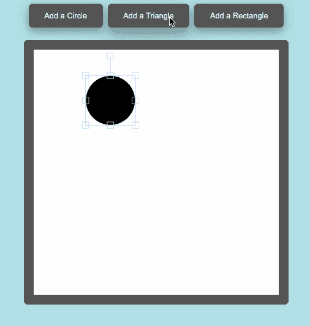
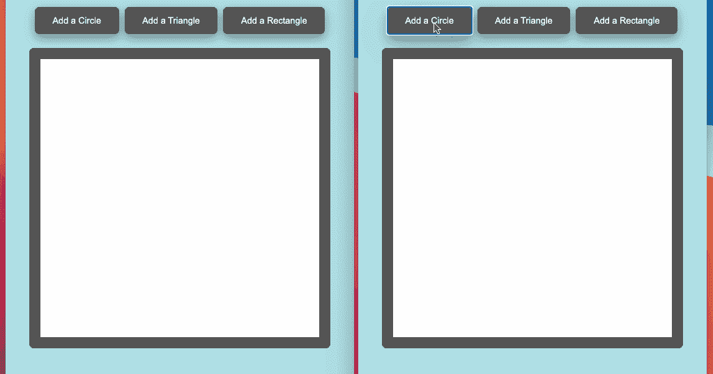

# 用 Fabric.js 和 Socket 创建协作画布。超正析象管(Image Orthicon)

> 原文：<https://javascript.plainenglish.io/creating-a-collaborative-canvas-with-fabric-js-and-socket-io-c60668e4099b?source=collection_archive---------0----------------------->

# 介绍

Fabric.js 是目前最强大的 JavaScript 库之一，它为经典的 HTML5 画布添加了一个交互层，允许从绘图工具到动画的一切简化实现。

最近想把 Fabric.js 的强大和 Socket 的强大结合起来。IO，一个用于实时通信的 JavaScript 框架，创建一个多个用户可以一起交互的画布。

我没有找到关于这种组合的太多信息，所以我决定记录我创建一个简单协作画布的过程。

我将在前端使用 React，在服务器端使用 Express，但是这段代码可以适用于其他框架。

# 第 1 部分:Fabric.js

我们将从设置我们的 Fabric canvas 开始—您需要安装 Fabric.js。

```
npm install fabric
```

一旦安装了结构模块，就将其导入到您的应用程序组件中。另外，从 React 导入 useState 和 useEffect 挂钩——这将使我们更容易设置画布，以及稍后在画布之间同步。

准备好画布需要几个步骤。

1.  声明一个名为“canvas”的状态变量:

```
const [canvas, setCanvas] = useState('');
```

2.我们还需要一个 HTML 画布元素来包裹我们的织物画布:

```
<canvas id='canv' />
```

3.现在，我们可以编写一个函数来初始化我们的 Fabric canvas，通过其 id 来标识要使用的 canvas 元素:

```
const initCanvas = () => {   
   // Fabric will create a wrapper around the html canvas element with the id 'canv'
   new fabric.Canvas('canv', {      
     height: 500,      
     width: 500,      
     backgroundColor: 'white',    
   });
```

4.在 App 组件最初呈现 canvas 元素之后，我们可以使用 [useEffect 钩子](https://reactjs.org/docs/hooks-effect.html)调用 initCanvas 函数，并将 Fabric canvas 存储在我们的状态变量中。

```
useEffect(() => {
    setCanvas(initCanvas());
  }, []);
```

画布本身并不令人兴奋——我们想添加一些功能！

Fabric 有大量有趣的方式与画布互动——你可以查看他们的[演示](http://fabricjs.com/demos/)以获得一些很酷的想法——但我们很高兴进入协作部分，所以我们现在将保持简单。

## 让我们添加一些形状！

在我们的 canvas 元素之上，添加三个按钮。我们将使用 onClick 事件来触发一个名为“addShape”的函数

根据点击的按钮，addShape 将在画布上呈现圆形、三角形或矩形。

```
<button type='button' name='rectangle' onClick={addShape}>    
   Add a Rectangle  
</button>
```

在 useEffect 下面，我们将编写 addShape 函数。我们检查被单击的按钮的 name 属性，以确定要添加哪种类型的形状，然后使用内置的 Fabric 方法创建它，将其添加到画布，并呈现更新后的画布。

我们还在创建对象时添加了一个 id 属性。这不是 Fabric 对象的内置属性，但是我们以后开始修改对象时会用到它。我正在使用 [uuid](https://www.npmjs.com/package/uuid) 来轻松创建唯一的 id。

```
const addShape = (e) => {
   let type = e.target.name;
   let object

   // determine the type of the object to create based on the name attribute from the button that was clicked
   if (type === 'rectangle') {
      object = new fabric.Rect({
      height: 75,
      width: 150,
   }); // set an id property on the object
   object.set({id: uuid()})
   // add the object to the canvas
   canvas.add(object);
   // re-render the canvas
   canvas.renderAll();
}
```

这是我们目前为止的应用组件:

经过一点点的造型，这就是我们最终得到的结果:



更多关于 Fabric.js 特性的信息，请查看他们的[教程](http://fabricjs.com/articles/)。

# 第二部分:插座。IO(服务器)

现在我们已经准备好集成 Socket.IO 了。我将 Express 用于我的服务器，所以我将继续在其上连接我的 Socket 服务器。

```
// be sure to require socket.io
const express = require('express')
const app = express()
const socketio = require('socket.io') const server = app.listen(8080) // after we start listening to our server, we can set up and attach our socket.io server
const io = socketio(server)// in a separate file we'll get more specific about the events we want our socket server to listen for and broadcast
require('./socket')(io)
```

在每个套接字连接中，我们希望监听两个事件——“对象添加”或“对象修改”当我们与画布交互时，我们将从客户端发出这些事件。

当服务器听到这些事件之一时，我们将让它广播数据和相应的事件。通过广播，我们将事件发送给除原始发送者之外的所有套接字连接。

这将让所有其他套接字连接知道添加或修改对象，但不会导致原始套接字复制事件。

```
module.exports = (io) => {  
   io.on('connection', socket => {        socket.on('object-added', data => {         
      socket.broadcast.emit('new-add', data);    
   })     

   socket.on('object-modified', data => {    
      socket.broadcast.emit('new-modification', data);    
   })      
})}
```

你可以找到更多关于 Socket 的信息。IO 服务器初始化这里:【https://socket.io/docs/v3/server-initialization/ 

# 第三部分:插座。IO(客户端)

最后，我们准备在客户端完成套接字的设置。

首先，建立一个新的。js 文件，它将包含我们所有的套接字侦听器和发射器。你可以阅读更多关于 Socket 的内容。IO 客户端初始化这里:【https://socket.io/docs/v3/client-initialization/ 

```
import io from 'socket.io-client'
import {fabric} from 'fabric' const socket = io(window.location.origin) 
```

我们需要两个发射器，一个在添加对象时使用，一个在修改对象时使用——确保导出它们，因为我们稍后将在应用程序组件中使用它们:

```
export const emitAdd = obj => {
  // we include the name of the event we're emitting, and a data object
  socket.emit('object-added', data)
}export const emitModify = (obj) => {
  socket.emit('object-modified', obj)
}
```

我们还需要两个侦听器，一个用于当服务器广播另一个套接字已经添加了一个对象时:

```
export const addObj = canvas => {
   // we call socket.off first in case the socket connection has been restarted - this will remove any previous assignments of this method and prevent duplicate add events
  socket.off('new-add') // listens for the socket server to broadcast a 'new-add' event
  socket.on('new-add', data => { // we'll pull out the object and id from the data object the socket emitted
    const { obj, id } = data
    let object // check the type of the obj we received and create an object of that type
    if (obj.type === 'rect') {
      object = new fabric.Rect({
        height: obj.height,
        width: obj.width,
      })
    } else if (obj.type === 'circle') {
      object = new fabric.Circle({
        radius: obj.radius,
      })
    } else if (obj.type === 'triangle') {
      object = new fabric.Triangle({
        width: obj.width,
        height: obj.height,
      })
    } // set the new object's id to the id we received
    object.set({id: id})
    // add the object to the canvas
    canvas.add(object)
    canvas.renderAll()
  })
}
```

一个用于当套接字服务器广播另一个套接字已经修改了对象时:

```
export const modifyObj = canvas => { // listens for the socket server to broadcast a 'new-modification' event
   socket.on('new-modification', data => {
   const { obj, id } = data // check the objects on our canvas for one with a matching id
    canvas.getObjects().forEach(object => {
      if (object.id === id) { // set the object on the canvas to the object we received from the socket server
        object.set(obj) // calling setCoords ensures that the canvas recognizes the object in its new position
        object.setCoords()
        canvas.renderAll()
      }
    })
  })
}
```

以下是完整的代码:

接下来，我们需要向我们的应用程序组件添加一些东西。我们需要刚刚定义的发射器和监听器，所以一定要导入它们:

```
import { emitModify, emitAdd, modifyObj, addObj } from './socket'
```

我们将创建第二个 [useEffect 钩子](https://reactjs.org/docs/hooks-effect.html)，并将包含状态变量‘canvas’的数组作为第二个参数传递。在钩子中，我们将检查这个变量中是否有值:

```
useEffect(
    () => {
      if (canvas) {
        // listeners will go here
      },
    [canvas]
  )
```

如果这样做，我们将添加两个画布监听器——它们将监听画布修改或对象移动。如果我们听到其中一个事件，我们将把它发送到套接字服务器:

```
canvas.on('object:modified', function (options) {
          if (options.target) {
            const modifiedObj = {
              obj: options.target,
              id: options.target.id,
            }
            emitModify(modifiedObj)
          }
        })canvas.on('object:moving', function (options) {
          if (options.target) {
            const modifiedObj = {
              obj: options.target,
              id: options.target.id,
            }
            emitModify(modifiedObj)
          }
        })
```

您可能已经注意到，我们正在创建一个新的对象，将 Fabric 对象及其 id 作为单独的属性。这是由于 Fabric 的序列化方法—序列化对象时只包括 Fabric 对象的标准属性。

为了抵消这一点，我们可以在发出事件时单独传递 id。

在我们的 if 语句中，我们还可以调用我们的套接字侦听器，来捕获套接字服务器广播的任何事件:

```
modifyObj(canvas)
addObj(canvas)
```

我们还想在 addShape 函数中添加一个发射器。在这里，我们还将创建一个新对象来分隔 id:

```
emitAdd({obj: object, id: object.id})
```

这是我们协作画布的点睛之笔，这是我们最终的应用组件:

这是我们正在使用的画布:



# 结论

既然你已经建立了一个简单的协作画布，我建议你探索一下 [Fabric.js](http://fabricjs.com/) 的许多特性——你可以添加更多的工具，从绘图到滤镜再到上传图像。

要获得更多灵感，请查看[Collaballage](https://collaballage.herokuapp.com/)——这是一个团队最近创建的协作画布网络应用。

感谢您的阅读——如有任何问题、建议或更正，请随时联系我们！