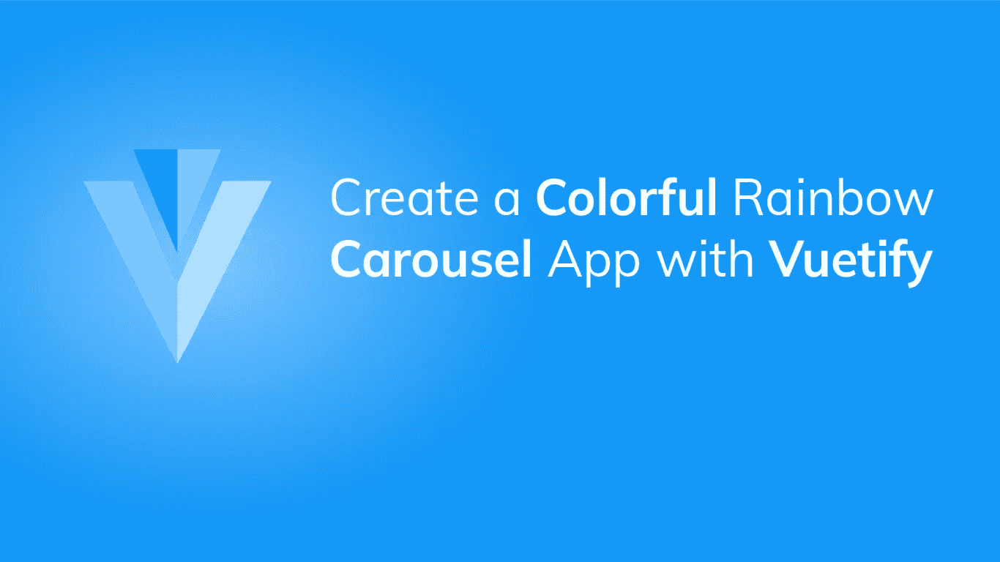
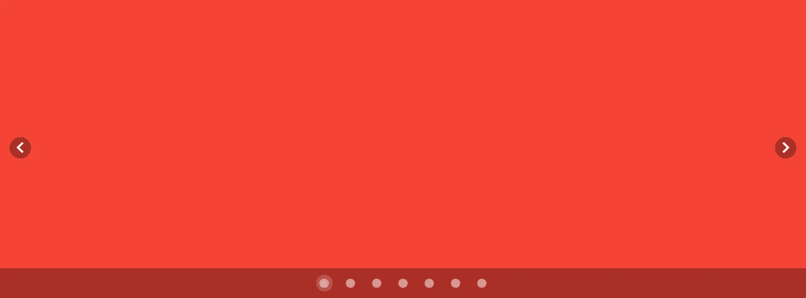
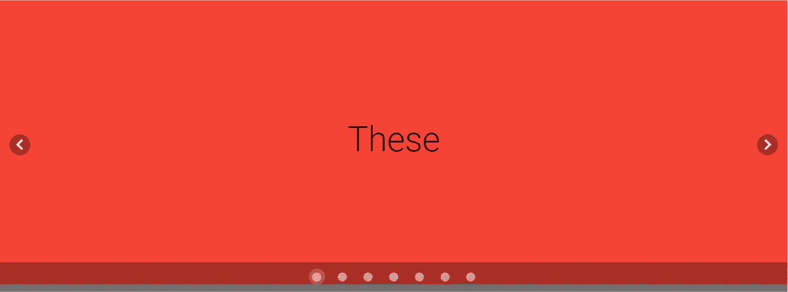
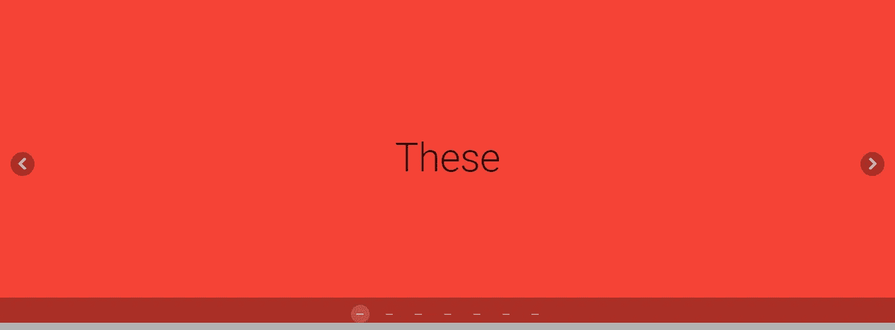
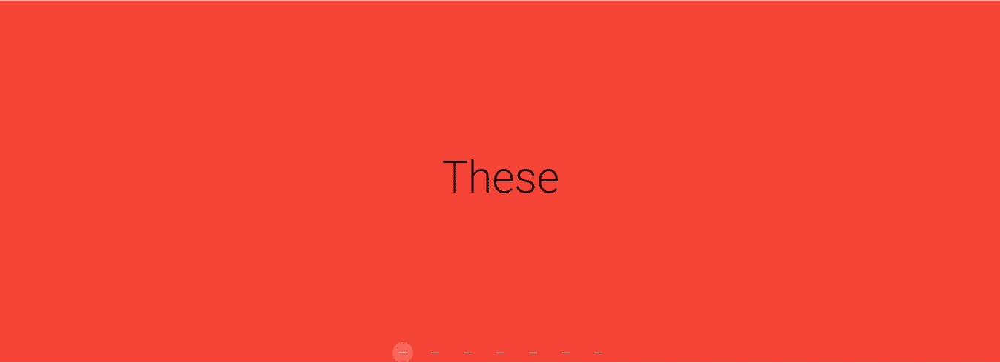

# 使用 Vuetify 创建一个多彩的彩虹旋转木马应用程序

> 原文：<https://javascript.plainenglish.io/creating-a-colourful-rainbow-app-using-carousels-in-vuetify-cf0ded93b655?source=collection_archive---------18----------------------->



这是我们今天要创造的:


您将看到使用 Vuetify 的强大功能构建这样的东西是多么容易。

刚开始使用 Vuetify？查看这篇文章。

# 显示颜色

首先，我们将显示颜色。我们将创建一个`colors`变量，初始化为彩虹所有颜色的数组——红色、橙色、黄色、绿色、蓝色、靛蓝色和紫色。

为了创建传送带，我们将使用`v-carousel`组件。我们将使用`v-carousel-item`向旋转木马添加一个幻灯片。使用`v-for`指令，我们遍历`colors`中的每种颜色，并向传送带添加一个项目来显示它。我们将通过创建一个`v-sheet`组件并设置其`color`属性来做到这一点。

```
**src/App.vue**<template>
  <v-app>
    <v-carousel>
      <v-carousel-item v-for="color in colors" :key="color">
        <v-sheet :color="color" height="100%" tile>
        </v-sheet>
      </v-carousel-item>
    </v-carousel>
  </v-app>
</template><script>
export default {
  name: 'App',
  data: () => ({
    carousel: 0,
    colors: ['red', 'orange', 'yellow', 'green', 'blue', 'indigo', '#7f00ff'],
  }),
};
</script>
```



# 显示单词

现在让我们展示这个句子。这是一个 7 个单词的句子，所以每个单词都显示在一张幻灯片中。我们将使用`v-row`将单词定位在幻灯片的垂直和水平中心。使用 JavaScript string `split()`方法，我们将句子分成 7 个单词的数组。

```
**src/App.vue**<template>
  <v-app>
    <v-carousel>
      <v-carousel-item v-for="**(color, i)** in colors" :key="color">
        <v-sheet :color="color" height="100%" tile>
 **<v-row class="fill-height" align="center" justify="center">
            <div class="text-h2">
              {{ words[i] }}
            </div>
          </v-row>**
        </v-sheet>
      </v-carousel-item>
    </v-carousel>
  </v-app>
</template><script>
export default {
  name: 'App',
  data: () => ({
    carousel: 0,
    colors: ['red', 'orange', 'yellow', 'green', 'blue', 'indigo', '#7f00ff'],
    **words: 'These are the colours of the rainbow'.split(' ')**,
  }),
};
</script>
```



# 用美化来美化

使用 Vuetify 材料设计框架创建优雅 web 应用程序的完整指南。


在这里 免费获得一份 [**。**](https://mailchi.mp/583226ee0d7b/beautify-with-vuetify)

## 更改分隔符图标

查看表示每张幻灯片的图标。它们是圆的。让我们通过将 carousel 的`delimiter-icon`属性更改为`mdi-minus`，将它们分别更改为短矩形:

```
**src/App.vue**<template>
  <v-app>
    <v-carousel **delimiter-icon="mdi-minus"**>
      <v-carousel-item v-for="(color, i) in colors" :key="color">
        <v-sheet :color="color" height="100%" tile>
          <v-row class="fill-height" align="center" justify="center">
            <div class="text-h2">
              {{ words[i] }}
            </div>
          </v-row>
        </v-sheet>
      </v-carousel-item>
    </v-carousel>
  </v-app>
</template>
...
```



## 悬停时显示箭头

目前，传送带箭头始终显示。让我们让它们只在用户用鼠标悬停在它们上面时才可见:

```
**src/App.vue**<template>
  <v-app>
    <v-carousel delimiter-icon="mdi-minus" **show-arrows-on-hover**>
      <v-carousel-item v-for="(color, i) in colors" :key="color">
        <v-sheet :color="color" height="100%" tile>
          <v-row class="fill-height" align="center" justify="center">
            <div class="text-h2">
              {{ words[i] }}
            </div>
          </v-row>
        </v-sheet>
      </v-carousel-item>
    </v-carousel>
  </v-app>
</template>
...
```


## 隐藏分隔符背景

你可以看到在转盘的底部有一个灰色的矩形。这是分隔符的背景。我们不想看到这个矩形，所以让我们设置`hide-delimiter-background`属性来隐藏它:

```
**src/App.vue**<template>
  <v-app>
    <v-carousel
      delimiter-icon="mdi-minus"
      show-arrows-on-hover
      **hide-delimiter-background**
    >
      <v-carousel-item v-for="(color, i) in colors" :key="color">
        <v-sheet :color="color" height="100%" tile>
          <v-row class="fill-height" align="center" justify="center">
            <div class="text-h2">
              {{ words[i] }}
            </div>
          </v-row>
        </v-sheet>
      </v-carousel-item>
    </v-carousel>
  </v-app>
</template>
...
```



## 设置自动过渡

要使转盘自动转换到下一张幻灯片，而不必单击右箭头，让我们设置`cycle`属性。`interval`决定转盘在移动到下一个项目之前停留在其中一个项目上的时间。这里我们设置间隔为 1 秒。

```
<template>
  <v-app>
    <v-carousel
      delimiter-icon="mdi-minus"
      show-arrows-on-hover
      hide-delimiter-background
      **cycle
      interval="1000"**
    >
      <v-carousel-item v-for="(color, i) in colors" :key="color">
        <v-sheet :color="color" height="100%" tile>
          <v-row class="fill-height" align="center" justify="center">
            <div class="text-h2">
              {{ words[i] }}
            </div>
          </v-row>
        </v-sheet>
      </v-carousel-item>
    </v-carousel>
  </v-app>
</template>
...
```


## 改变过渡

我们还可以改变 carousel 在切换当前显示的项目时使用的动画。默认情况下，当前项目向左滑出，同时下一个项目滑入。让我们让当前项目淡出，而传入的项目淡入。这是我们设置为`v-carousel-item`的转换属性的`fade-transition`。我们还将对反向过渡进行同样的操作—当前幻灯片将随着上一张幻灯片的淡入而淡出。

```
<template>
  <v-app>
    <v-carousel
      delimiter-icon="mdi-minus"
      show-arrows-on-hover
      hide-delimiter-background
      cycle
      interval="1000"
    >
      <v-carousel-item
        v-for="(color, i) in colors"
        :key="color"
 **transition="fade-transition"
        reverse-transition="fade-transition"**
      >
        <v-sheet :color="color" height="100%" tile>
          <v-row class="fill-height" align="center" justify="center">
            <div class="text-h2">
              {{ words[i] }}
            </div>
          </v-row>
        </v-sheet>
      </v-carousel-item>
    </v-carousel>
  </v-app>
</template>
...
```

就这样，我们用 Vuetify 为自己制作了一个漂亮的彩虹转盘应用程序！

*更多内容看* [***说白了. io***](http://plainenglish.io/) ***。*** *报名参加我们的**[***免费每周简讯***](http://newsletter.plainenglish.io/) ***。*** *在我们的**[***社区不和谐***](https://discord.gg/GtDtUAvyhW) ***中获得独家写作机会和建议。*****