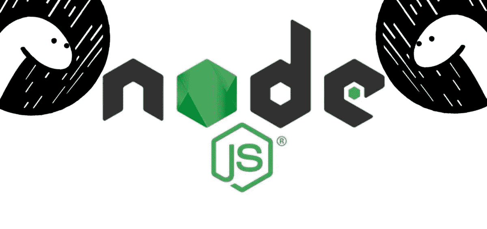
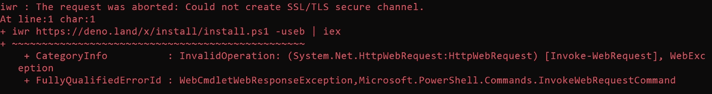
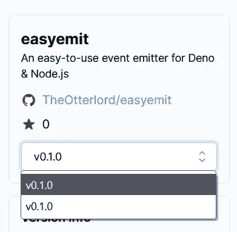

# 如何创建 Deno/Node.js 包

> 原文：<https://javascript.plainenglish.io/creating-a-deno-node-js-package-83c43e5e1d9f?source=collection_archive---------2----------------------->



Is Deno a Dinosaur or a Sock Puppet?

自从去年 5 月 1.0.0 发布后，我就没再看过 Deno。从那时起，它已经发展成为一个成熟的 JavaScript 和 TypeScript 运行时。但是，尽管已经取得了进展，生态系统仍然缺乏。大多数 JavaScript 项目仍然是为 Node.js 创建的，因此很难或不可能支持 Deno。但这并不意味着我们不能改变事情。Node.js 不会因为 Deno 而消失，Deno 也不会失败。这两者将会并存，所以库的维护者应该考虑适应这种变化并同时支持这两者。

今天，我将在 TypeScript 中实现一个基本的事件发射器，并为 Node.js 和 Deno 配置部署。在这篇文章之前，我没有怎么用过 Deno，所以我会边学边学。在本文的最后，我将分享我对同时支持 Deno 和 Node.js 的想法，包括在什么情况下它可能是不可能的。我还将分享我为想要创建自己的双运行时包的人创建的模板库。

# 安装 Deno

当我坐在我的 Windows 笔记本电脑上阅读安装指南时，我注意到在 Windows 上安装的三种方法中有两种使用了我没有安装的软件包管理器。因此，我没有安装另一个包管理器，而是尝试了第三个选项。PowerShell 脚本。我得到了一个奇怪的错误阻止安装，因为一个“不安全的 TLS 通道”或什么的。



Deno fails to install in PoweShell

我懒得去处理 PowerShell 错误，所以我通过 WSL2 启动了我的 Debian 安装，并安装在那里。通过 WSL 使用 Deno 的一个缺点是我不能使用官方的 Visual Studio 代码插件。但现在，我已经处理好了，继续前进。

# **写库**

我决定创建一个事件发射器，它模仿 Node.js 事件发射器的基本特性，但使用 0 依赖项，因此它也可以在浏览器& Deno 中工作，并使用 TypeScript 进行类型定义。我不会说太多细节，因为这不是这篇文章的内容，但如果你想了解一下，你可以在这里找到。

编码相当简单，因为它是一个相当小的项目，我没有任何依赖。尽管我在 TypeScript 中遇到了奇怪的错误，因为 Deno 默认使用严格模式，并且它改变了一些默认的 TypeScript 行为。默认情况下，我不使用严格模式，所以在第一次测试后，我不得不修复六个错误。

# 添加测试

我本来可以使用 Jest 或 Mocha 添加测试，但是因为我是 Deno 新手，所以我决定使用已经提供的内置测试模块。本质上，对于每个文件，您添加第二个文件`[name]_test.js`或`[name]_test.ts`，并且该文件包含所有的测试。然后在`mod_test.js`中导入所有这些测试，并在那里运行测试。您可以从测试库中导入断言方法，测试库是标准库的一部分。

所有这些都让我想起了很多 Rust，尤其是切入点是`mod.js`或者`mod.ts`。

# **出版**

现在我有了一个库，我的(很少的)测试也写好了，我可以把它发布到 NPM 的 Deno，并分享一个 CDN 链接，直接用作脚本标签。每当我创建一个新版本时，我都使用 GitHub 工作流发布到 NPM。

对于 Deno，我可以使用[https://deno.land/x](https://deno.land/x)，因为我的库是公开的。我所要做的就是在我的 GitHub 库中添加一个 webhook，然后我就完成了。这真是一次美好的经历，从现在开始，每当我创建一个标签，一个新的版本就会被注册到[https://deno.land/x.](https://deno.land/x.)

然而，在我第一次创建一个版本时，我确实遇到了一个问题。Deno 似乎在整整 10 分钟内都没有注册发布，所以因为我的 NPM 脚本也被破坏了，没有创建发布，所以我再次创建了发布。然而 Deno 确实收到了这两个请求，现在我的包中有两个 v0.1.0 版本。好吧，至少我知道下次。



Double trouble

# **什么时候我们应该支持两种运行时？**

正如我所说，Deno 不会取代 Node.js，但它是一个越来越受欢迎的重要工具，因此，我认为我们应该尽可能支持它。但是说到这个，我们什么时候不应该在一个包里同时支持 Deno 和 Node.js 呢？

1.  任何使用两种运行时都不支持的内置 API 的东西。

我知道这很多，但是 Deno 和 Node.js 之间的 API 是不同的。使您的库与 Deno 兼容模式更加兼容可能允许您构建一个跨两者工作的 Node.js 库，但是这并不总是可能的，所以请提前检查哪些库已经被聚合填充。

2.任何需要 Node.js 插件的东西。

Deno 不支持 Node.js 插件，就这么简单。我以前从未听说过这些，但我在 Deno 文档中发现它不受支持。

# 结论

与 Deno 一起工作非常棒，尽管我没有在这个项目中使用所有的功能，但我在其他一些项目中做了实验。哦，最终我在 Windows 上安装了 Deno。问题是 PowerShell 默认使用旧版本的安全协议。如果其他人有同样的问题，使用这一行来更改协议版本允许我运行安装脚本。

```
[Net.ServicePointManager]::SecurityProtocol = [Net.SecurityProtocolType]::Tls12
```

现在，我终于可以将 Deno 扩展的全部功能用于 Visual Studio 代码，而不必处理堵塞我的测试文件的 Node.js 错误了！

正如我之前承诺的，我已经用我学到的知识创建了一个模板。我相信它还有改进的空间，所以请在评论中或 GitHub 上分享您的想法。我还添加了一些我使用过的其他资源，以及一个指向我创建的库的链接，这样你就可以看到它的运行了。我真的不打算继续维护它，因为有许多事件库，但我会修复两个运行时之间的任何兼容性问题。

希望以后的库中有更多的人考虑支持 Deno 和 Node.js。很明显，两者都不会很快消失。

# 资源

## Deno + Node.js 模板

*   [https://github.com/TheOtterlord/denode](https://github.com/TheOtterlord/denode)

## 德诺

*   【https://deno.land/manual 号
*   【https://deno.land/x 

## **我的双运行时事件库**

*   [https://github.com/TheOtterlord/easyemit](https://github.com/TheOtterlord/easyemit)
*   [https://deno.land/x/easyemit@v0.1.0](https://deno.land/x/easyemit@v0.1.0)
*   [https://www.npmjs.com/package/easyemit](https://www.npmjs.com/package/easyemit)

*更多内容看* [***说白了就是***](http://plainenglish.io/) ***。*** *报名参加我们的* [***免费每周简讯这里***](http://newsletter.plainenglish.io/) ***。***