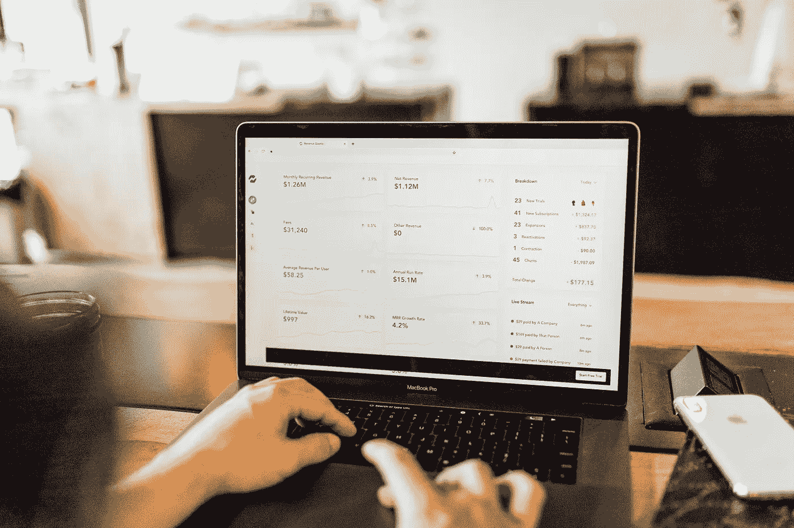
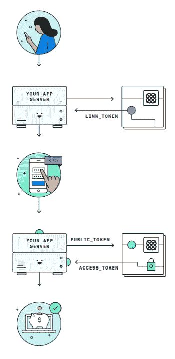
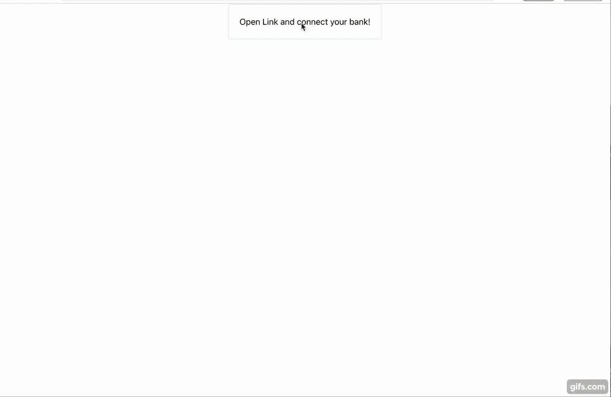
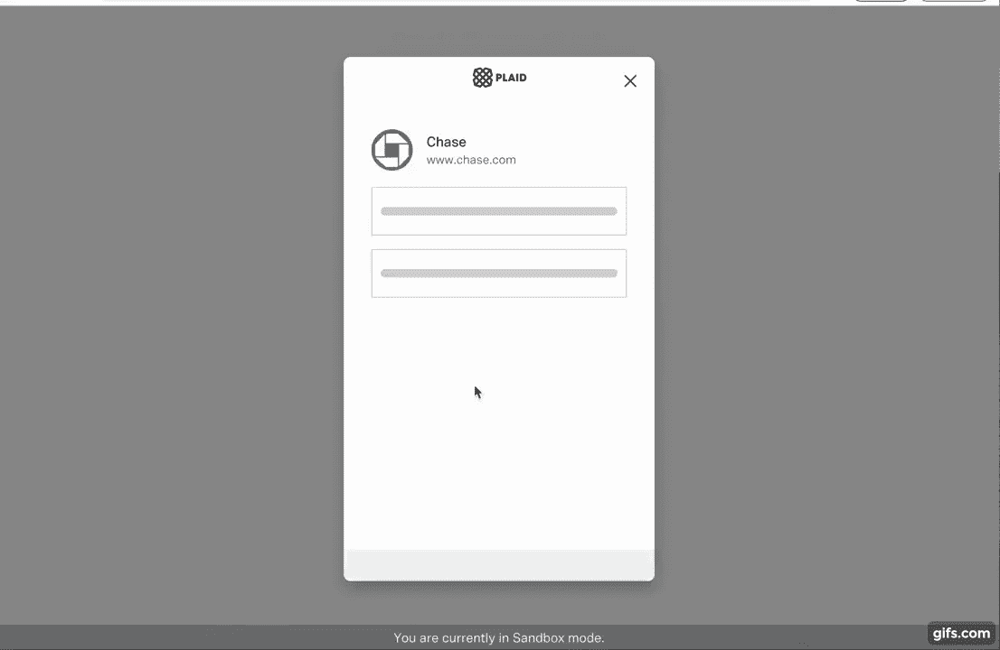

# 用格子 API、Node.js/Express,和 React 创建一个金融应用

> 原文：<https://javascript.plainenglish.io/creating-a-financial-app-with-the-plaid-api-nodejs-express-and-react-4e142066eb6c?source=collection_archive---------1----------------------->



Photo by [Austin Distel](https://unsplash.com/@austindistel?utm_source=unsplash&utm_medium=referral&utm_content=creditCopyText) on [Unsplash](https://unsplash.com/s/photos/financial-app?utm_source=unsplash&utm_medium=referral&utm_content=creditCopyText)

我为 Flatiron 做的最后一个项目是一个预算工具，用户可以按类别和月份创建预算，并根据他们的支出进行分析。我更喜欢使用 [Plaid API](https://plaid.com/) 在实时事务中实现这一点，但不幸的是，我使用的后端 Ruby on Rails 没有太多的文档。用 1.5 周的时间完成这个项目，我最终创建了自己的交易清单。

毕业后决心搞清楚格子 API。我必须决定我是想让 API 与 Rails 一起工作(使用 Plaid 的 Sinatra 文档应该是可能的)，还是想学习另一种语言，在那里他们有更充分的文档。我最终决定学习 Node.js，因为我已经知道了 Javascript。

在尝试了 Node/Express 之后，我重新开始使用 Plaid，后端变得更容易理解了，但是他们的 Quickstart 使用了 jQuery。Plaid React 链接文档很棒，我发现其他人也有很棒的资源，他们成功地构建了一个具有 Node/Express 后端和 React 前端的 Plaid 应用程序，包括这里的[和这里的](https://blog.bitsrc.io/build-a-full-stack-banking-web-app-with-plaid-the-mern-stack-508914ce5694)和[和](https://medium.com/@dereksams/building-a-react-app-with-the-plaid-api-93e45ae61b58)。然而，博客文章要求你注意你的`public_key`，格子从 2020 年 7 月起停止提供。通过修改后的流程，应用服务器请求 Plaid 生成一个临时的`link_token`(而不是预先用`secret_key`和`client_key`提供的`public_key`)。然后`link_token`被发送回应用服务器和客户端。

剩下的过程与之前类似——Plaid 用`public_token`响应初始化的`link_token`,它被发送回应用服务器以交换一个永久的`access_token`。



The Plaid Flow per the Quickstart docs [https://plaid.com/docs/quickstart/](https://plaid.com/docs/quickstart/)

更简洁地总结一下:

1.  应用服务器发出临时请求`link_token`
2.  `link_token`被发送到客户端，用户可以在那里初始化链接
3.  如果链接成功初始化，则生成一个`public_token`并发送给应用服务器
4.  应用服务器请求 Plaid 将`public_token`换成永久的`access_token`

如果我们在这个例子中使用数据库，我们会将`access_token`存储到用户中，这样他们就不需要在每次登录时进行身份验证。理解这一点的一个好方法是以 Venmo 这样的金融 app 为例:你只需要对你的银行账户进行一次认证，因为 Plaid 的访问令牌是存储到你的账户中的。但是，你仍然需要登录和退出 Venmo 来发送或接收金钱，你只是因为你的`access_token`而不必每次都使用 Plaid 来认证你的帐户。

在以后的例子中，我将使用一个登录和数据库，但是今天，我想展示 Node/Express、React 和 Plaid 之间的流程，以便从 Plaid 生成一个事务列表。这篇博文假设您对 Node/Express 和 React 有一定的了解。最终结果看起来会像这样:



**入门**

为了节省设置文件结构和分别安装依赖项的时间，您可以在这里克隆框架[，并一次安装所有的依赖项:](https://github.com/catd825/plaid_project_no_db)

```
cd server && npm install
cd client && npm install
```

注意——服务器中的`package.json`被配置为使用`npm run dev`同时运行后端和前端。

你还需要创建一个免费的格子账户来获得钥匙，你可以在这里做[。一旦有了密钥，就需要创建密钥文件。下`server`、`cd config`，再下`touch keys.js`。](https://dashboard.plaid.com/signup)

在文件中，添加以下内容:

```
module.exports = {
    PLAID_CLIENT_ID: 'ADD CLIENT KEY',
    PLAID_SECRET: 'ADD SANDBOX SECRET KEY'
};
```

可选:如果你想把你的工作推给 Github，记得通过以下操作隐藏你的密钥:

在`server`中，在您的终端中输入`touch .gitignore`。在`.gitignore`文件中，添加`keys.js`并保存。

**设置后端**

在服务器目录中，导航到`index.js`文件。增加以下要求。

```
const express = require('express');
const bodyParser = require('body-parser');
const keys = require('./config/keys');
const cors = require('cors');
const plaid = require('plaid');const app = express();
app.use(cors())
app.use(bodyParser.json());//add code hereconst PORT = 5000;app.listen(PORT, () => console.log(`listening on port ${PORT}!`));
```

要确认服务器正在运行，请在您的终端中运行`npm run dev`。确保我们的控制台确认它运行在端口 5000 上。如果在更新代码时不想让服务器运行，可以用`ctrl c`终止它。

您将通过添加以下代码来初始化一个 Plaid 客户机的实例。

```
const client = new plaid.Client({
    clientID: keys.PLAID_CLIENT_ID,
    secret: keys.PLAID_SECRET,
    env: plaid.environments.sandbox
  });
```

我强烈建议通过在这段代码后添加`console.log(client)`来确认您的键正在工作，否则下一步将无法工作。如果运行`npm run dev`，客户端对象带有 API 键。(如果服务器已经在运行，您可能需要重新启动它。)

**创建链接令牌**

为了创建临时的`link_token`，应用服务器需要向 Plaid 发出请求。下面的示例使用了示例用户凭证，如果您使用数据库，则需要更新这些凭证。

添加下面的代码来获得关于您刚刚[创建的](https://plaid.com/docs/api/tokens/#linktokenget)的`link_token`的信息。

**在客户端处理链接令牌**

接下来，导航到客户端文件夹中的`App.js`。为 App 类添加以下代码。这将获取您的应用服务器从 Plaid 中获取的`link_token`,并确保客户端可以在页面加载时访问它。

导航到 src 文件夹中的`Link.js`文件，并使用以下代码进行更新(基于[链接](https://github.com/plaid/react-plaid-link/blob/master/examples/hoc.js)文档。)我们从`App`传递道具，以确保组件可以访问`link_token`。

此时，您现在可以在您的终端中运行`npm run dev`来初始化 Link！如果您点击按钮，您可以输入测试凭证`user_good`和`pass_good`并开始 Plaid 认证过程。然而，这不是整个认证过程，您还不能访问数据。这就是`public_token`和`access_token`出现的原因。

**用公共令牌交换访问令牌**

当用户凭证在 Link 中提交后，我们通过`onSuccess`回调得到一个`public_token`。我们需要把这个换成永久的`access_token`。在`Link.js`文件中，用以下代码更新功能组件:

在`App.js`文件中，更新代码如下。这会将 Plaid 生成的`public_token`从客户端发送到应用服务器。确保你更新了传递`.getAccessToken`功能的道具。

用下面的代码更新服务器中的`index.js`。这将触发服务器将`public_token`换成格子里的`access_token`。

你现在应该完全连接了！现在，让我们让一些交易出现…

**创建交易**

因为这篇文章更多的是关于 Plaid、应用服务器和客户端之间的流程，而不是 React，所以我提供了一些代码来展示我们现在可以呈现事务了。

先把这个加到`index.js`上。第 14 行的控制台日志将在控制台上显示完整的 JSON 对象，如果您想调整任何数据，这将非常有用。注意—如果您得到一个空数组但没有错误，您可能需要将日期范围调整为过去 30 天内的某个时间。

要将事务呈现到前端，您需要将下面的代码片段添加到`App.js`。同样，剩下的代码已经在我设置的模板中了。

至此，您应该能够完成整个链接过程并看到交易了！(提醒—这是一个示例帐户，不是我的交易:)



现在你知道了！如您所见，对于看似简单的身份验证过程，有相当多的工作要做，但结果是值得的。一旦你连接到格子，有很多金融应用程序可以建立。同样，这是没有数据库，但我希望这能帮助你开始！