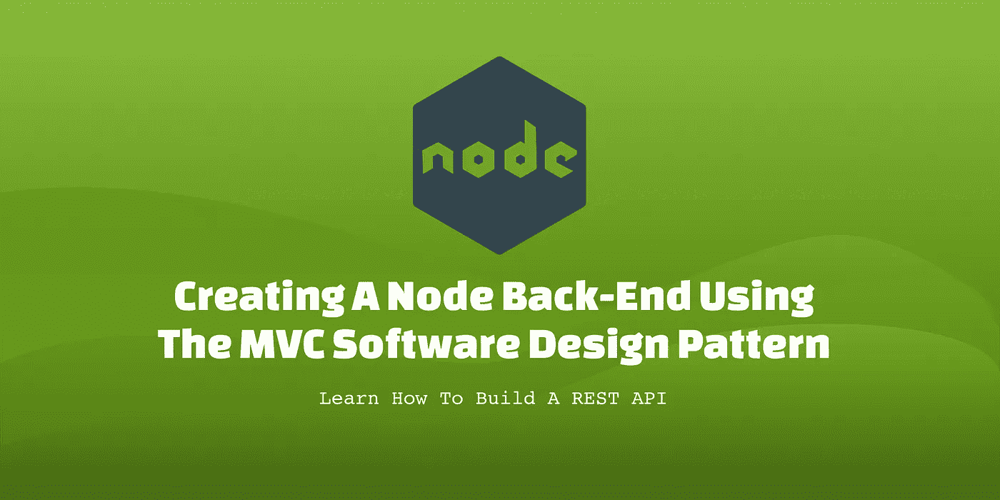

# 如何使用 MVC 软件设计模式创建 Node.js 后端

> 原文：<https://javascript.plainenglish.io/creating-a-node-back-end-using-the-mvc-software-design-pattern-dc32cfe870fd?source=collection_archive---------6----------------------->



在本教程中，您将学习如何使用模型-视图-控制器(MVC)软件设计模式创建 Node.js 后端。这种设计模式使您能够将用户界面分成三个不同的元素。业务逻辑是分离的，这样数据、用户界面和用户输入就不会混合在一起。这允许一个更干净的架构，因为不同的层是解耦的，允许更快更容易地完成更改。

然而，这里要提到的一个重要的警告是，这些天来，这个软件设计模式的**视图**部分不再像几年前那样相关。这是因为我们现在有前端框架，如 React、Vue.js、Angular 和 Svelte，它们用于构建应用程序的前端。尽管如此，了解这些概念仍然很有用，因为当后端开发人员构建返回某种数据的 REST 和 GraphQL APIs 时，今天仍然在使用**模型**和**控制器**。像 JavaScript Object Notation (JSON)这样的数据在 API 中使用，并使用 fetch 或 Axios API 进行检索。

# 先决条件

确保您已经安装了下面的工具和软件包

*   [Node.js 和 npm](https://nodejs.org/en/)
*   [快递](https://expressjs.com/)
*   [节点门](https://nodemon.io/)
*   [EJS](https://ejs.co/)

# 设计模式

# 模型

模型是这种设计模式的主要组成部分。它负责处理结构内部的所有数据。这是定义所有数据、业务逻辑和原则的地方。

# 视角

本质上，视图是用户界面。这是用户将要看到的应用程序的一部分。基本上设计的前端。在 React、Vue.js、Angular 和 Svelte 等前端框架出现之前，后端开发人员使用的是 EJS、PUG 和 Handlebars 等模板语言。

# 控制器

控制器可以被认为是应用程序的大脑。它接受用户请求的任何输入，然后将它们转换成模型和视图可以解释的命令。

# 设置项目

在桌面或目录下创建一个名为**my-app _ _ 的文件夹，然后将 __cd** 放入其中。另外，在代码编辑器中打开该文件夹。确保您位于 **my-app** 文件夹中，然后在您的终端应用中运行以下命令。

```
mkdir backend
cd backend
npm init -y
npm i express nodemon ejs
mkdir controllers models public routes src  
mkdir src/pages
touch index.js
```

这将为我们的项目创建基本的设置。现在让我们创建一个简单的 express 服务器。将以下代码复制并粘贴到`index.js`文件中。

```
const express = require('express');const app = express();app.get('/', (req, res) => res.send('Home Route'));const port = process.env.PORT || 5000;app.listen(port, () => console.log(`Server running on port ${port}, [http://localhost:${port}`));](http://localhost:${port}`));)
```

现在将这些运行脚本添加到`package.json`文件中。

```
"scripts": {
        "start": "node index.js",
        "dev": "nodemon index.js"
    },
```

在您的终端应用程序中运行以下任一运行代码，查看应用程序在您的 web 浏览器中的运行情况。第一次运行的代码使用 Node，这意味着如果您想看到更改，需要重新启动服务器。第二次运行的代码使用 Nodemon，它执行热重载，这意味着您只需要重载 web 浏览器就可以看到新的更改。

```
npm run startnpm run dev
```

# 创建 MVC 控制器

是时候创建一些控制器了。创建两个名为`admin.js`的文件，一个放在**控制器**文件夹中，另一个放在**路径**文件夹中。接下来，创建一个`AnimeData.json`文件，并把它放在**模型**文件夹中。现在创建一个`index.ejs`文件，并把它放在 **src/pages** 文件夹中。将下面的代码添加到`index.ejs`文件中。

```
<!DOCTYPE html>
<html lang="en">
    <head>
        <meta charset="UTF-8" />
        <meta http-equiv="X-UA-Compatible" content="IE=edge" />
        <meta name="viewport" content="width=device-width, initial-scale=1.0" />
        <title>Home Route</title>
    </head>
    <body>
        <h1>Home Route</h1>
    </body>
</html>
```

将下面的代码放到`AnimeData.json`文件中。

```
[
    {
        "id": "1",
        "type": "Anime",
        "name": "Boku no Hero Academia"
    },
    {
        "id": "2",
        "type": "Anime",
        "name": "Jujutsu Kaisen"
    },
    {
        "id": "3",
        "type": "Anime",
        "name": "Shingeki no Kyojin"
    }
]
```

将以下代码添加到**控制器**文件夹内的`admin.js`文件中。

```
const AnimeData = require('../models/AnimeData.json');exports.getIndex = (req, res) => {
    res.render('index');
};exports.getAnime = (req, res) => {
    res.json(AnimeData);
};
```

接下来将下面的代码添加到 **routes** 文件夹中的`admin.js`文件中。

```
const express = require('express');
const adminController = require('../controllers/admin');const router = express.Router();router.get('/', adminController.getIndex);router.get('/anime', adminController.getAnime);module.exports = router;
```

最后，用下面的代码更新根文件夹中的`index.js`文件。

```
const express = require('express');
const path = require('path');
const adminRoute = require('./routes/admin');const app = express();// EJS template engine setup
app.set('view engine', 'ejs');
app.set('views', './src/pages');// Setting up the directory on the server for CSS, JavaScript and media files
app.use('/static', express.static(path.join(__dirname + '/public')));// Configuring the server to work with form submissions and json files
app.use(express.urlencoded({ extended: false }));
app.use(express.json());// Connecting all of the routes
app.use('/', adminRoute);const port = process.env.PORT || 5000;app.listen(port, () => console.log(`Server running on port ${port}, [http://localhost:${port}`));](http://localhost:${port}`));)
```

您需要重新加载页面或重启服务器。现在，如果您转到 home route[http://localhost:5000](http://localhost:5000/)，它应该会加载`index.ejs`文件。如果你访问 http://localhost:5000/anime，你应该会在浏览器中看到返回的 JSON 文件中的数据。

# 将 CSS 和 JavaScript 文件连接到前端

最后一步是将 CSS 样式表和 JavaScript 文件连接到`index.ejs`文件。在**公共**文件夹中创建两个文件夹。一个叫 **css** 另一个叫 **js** 。现在用下面的代码创建一个`styles.css`文件并把它放在 **css** 文件夹中。

```
body {
    background: #bada55;
}
```

接下来创建一个`scripts.js`文件，用下面的代码把它放在 **js** 文件夹中。

```
console.log('Hello World');
```

最后，用下面的代码更新`index.ejs`文件，现在它有了 CSS 和 JavaScript 文件的链接。

```
<!DOCTYPE html>
<html lang="en">
    <head>
        <meta charset="UTF-8" />
        <meta http-equiv="X-UA-Compatible" content="IE=edge" />
        <meta name="viewport" content="width=device-width, initial-scale=1.0" />
        <title>Home Route</title>
        <link rel="stylesheet" href="http://localhost:5000/static/css/styles.css" />
    </head>
    <body>
        <h1>Home Route</h1> <script src="http://localhost:5000/static/js/scripts.js"></script>
    </body>
</html>
```

重新加载浏览器或重启服务器。如果你去回家的路线，你应该看到一个绿色的背景，如果你去浏览器控制台，你应该看到代码 **Hello World** 。这些是使用 MVC 软件设计模式创建 Node.js 后端服务器的基础。如果你计划将后端连接到 React 这样的框架，你就不需要 **src** 文件夹。相反，您可以使用**模型**文件夹以 JSON 的形式返回数据。 **models** 文件夹也是创建编程逻辑的地方，该逻辑用于将后端连接到 MongoDB、Postgre、SQL 和 HarperDB 等数据库。

# 最后的想法

我真的希望你喜欢阅读这篇文章，并从中学到一些东西。作为一名内容创作者和技术作家，我热衷于分享我的知识并帮助其他人实现他们的目标。让我们通过社交媒体联系起来。你可以在 [Linktree](https://linktr.ee/andrewbaisden) 上找到我所有的社交媒体资料和博客。

和平！

*更多内容请看*[*plain English . io*](http://plainenglish.io/)