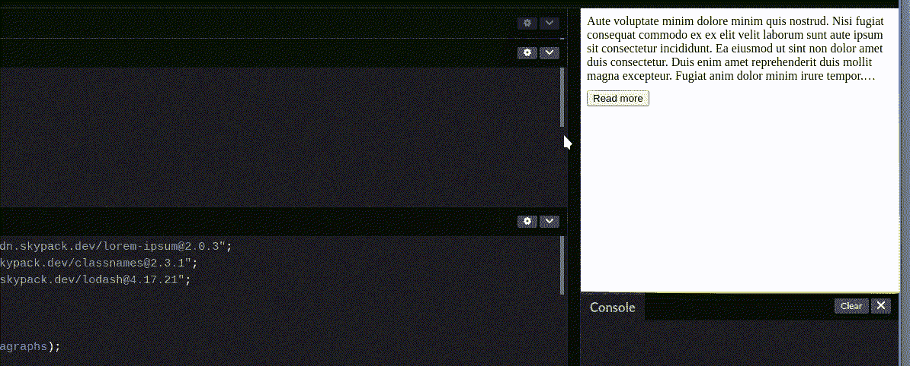

# 如何在 React 中创建“阅读更多”可折叠组件

> 原文：<https://javascript.plainenglish.io/creating-a-read-more-collapsible-component-in-reactjs-6d55fbc4ff0f?source=collection_archive---------1----------------------->

## WebKit-线夹方式

Photo by [Jamie Street](https://unsplash.com/@jamie452?utm_source=medium&utm_medium=referral) on [Unsplash](https://unsplash.com?utm_source=medium&utm_medium=referral)

在过去，为了确定单行文本的高度/宽度，您必须做各种各样的工作(在您的字体大小中，根据您的字体类型，给出容器的宽度)。您可以在 JavaScript 代码中创建一个 canvas 元素，呈现文本并从中进行测量。如今，尽管仍然以厂商为前缀，`line-clamp`提供了一个更加优雅的 CSS 驱动的解决方案——样式表完成了所有繁重的工作，我们所需要做的就是指定我们想要显示的行数。我将尝试在 React 应用程序的上下文中传达我实现它的方式。如果您想跳过这一步查看完整的解决方案(只是复制粘贴)，欢迎您基于这个[模板](https://codepen.io/sinia-nimevi/pen/mdwLJXp?editors=1111)进行工作。如果你不确定是否应该使用线夹，这些可以帮助你决定:

*   [我可以用](https://caniuse.com/?search=line-clamp) `line-clamp`吗？
*   [我可以用](https://caniuse.com/?search=box-orient)T2 吗？

我认为[can use](https://caniuse.com/)stats 还不错(现在是 2021 年 9 月)，但这完全取决于你的用例。不管怎样，让我们开始吧。

# 造型

简单的部分是造型。Mozzila 有一个很好的[指南](https://developer.mozilla.org/en-US/docs/Web/CSS/-webkit-line-clamp)详细介绍，但是出于我们这篇文章的目的，我将只分享下面的片段。

我们将有条件地将这个 CSS 类应用于我们的元素，因为我们希望我们的组件能够在“多读”和“少读”状态之间切换。

# 该组件

我们希望组件能够:

*   显示文本
*   将文本限制在特定的行数
*   点击“阅读更多”时显示整个文本
*   点击“少读”时再次显示删节版
*   *不*当文本长度不需要箝位时，渲染多读/少读按钮

该组件需要两个内部状态，`clamped`，这将决定文本当前是否被截断(这将决定按钮是“多读”还是“少读”，以及是否应用了`.clamp` CSS，以及`showButton`，这将根据是否有必要来有条件地呈现按钮(这由动态文本长度和容器的流体大小决定)。

一个简单的点击处理程序可以翻转`clamped`状态:

`const handleClick = () => setClamped(!clamped);`

这个状态将反过来控制我们是否应用`.clamp`类

`
`

像这样。

**注意:** *我喜欢用* `[*classnames*](https://www.npmjs.com/package/classnames)` *包作为条件 CSS 类的简写(关于它的*[*bundle phobia report*](https://bundlephobia.com/package/classnames@2.3.1)*是亲切的，我倾向于在不止一个地方使用它)。*

我们在组件结构中或多或少地涵盖了以下内容:

当我们想要:

*   *不*当文本长度不需要箝位时呈现按钮
*   检查是否在调整窗口大小时呈现按钮(如果文本的容器是可变宽度的，调整窗口大小时可能会改变给定文本呈现的有效行数)

我们可以用一个`useEffect`钩子来实现。我们希望能够与包含文本的元素的 DOM 实例进行交互。我们想要比较元素的`clientHeight`和`scrollHeight`。这是检查一个元素是否应用了 CSS 箝位的“聪明”方法。为了与元素的 DOM 实例交互并读取这些值，我们用一个`ref` prop 设置元素，并为它分配一个对我们的`useRef` hook 结果的引用。

所以我们定义了一个类似于`const containerRef = useRef(null);`的`containerRef`常量，并将文本容器元素的`ref`属性设置为`ref={containerRef}`。鉴于这种设置，我们的`useEffect`钩子将如下所示:

*   我们根据对元素执行的检查来检查按钮是否可用——这就是`hasClamping`函数。因此，如果一个元件应用了夹紧(如果是这种情况，则`clientHeight`和`scrollHeight`不同)，我们显示按钮。
*   我们使用组件负载上的`checkButtonAvailability`函数来执行该检查。使用`[lodash](https://lodash.com/)`，当我们将调用添加到事件监听器时，我们[去抖](https://medium.com/walkme-engineering/debounce-and-throttle-in-real-life-scenarios-1cc7e2e38c68)调用，这样它就不会被频繁调用。
*   我们确保使用`useEffect`清理返回函数来移除所述监听器(这将帮助我们避免内存泄漏)

最后，简单介绍一下`checkButtonAvailability`功能。当变异一个由`useRef`钩子创建的引用时，我们不会触发 React 渲染过程。这就是为什么暂时将类`.clamp`添加到我们的元素是安全的，以便查看箝位是否适用。这很重要，因为有一个小错误—如果我们不这样做，我们可以:

*   将窗口调整到较小的宽度，强制夹紧。
*   之后，如果我们点击“阅读更多”,整个文本就会显示出来。
*   如果我们将窗口调整到更大的宽度，这个按钮就不再需要并被隐藏。
*   如果我们将窗口大小调整回小尺寸，将显示整个文本，并且不会呈现任何按钮。

为了解决这个问题，我们必须暂时应用`.clamp`，让 CSS 发挥它的魔力，检查箝位是否适用，并基于此渲染按钮。我们还保存了原始状态，这样我们就可以重新应用它，否则每次你调整窗口大小时，你就会把“读得少”默认为“读得多”，这也比预期的要少。

# 结论

我认为，即使我们有一套解决常见问题的方法，偶尔与同事(或互联网)核实一下是否有新的解决方案，检查一下[caniuse.com](https://caniuse.com/)看看这是否会得到你的用例足够广泛的支持并更新你的知识总是一个好的做法。此外，尝试在每次重新发明轮子和只是盲目地用 npm 包堆积你的项目之间找到一个平衡。

*希望你觉得我的文章有用，我已经试着扩展了一段代码，在生产中我不会太看重它，但是希望它的细节可以让某人成为更好的开发人员。如果你想讨论我的 DMs 永远开放——你可以在*[*Twitter*](https://twitter.com/SNimcevic)*和*[*LinkedIn*](https://www.linkedin.com/in/sini%C5%A1a-nim%C4%8Devi%C4%87-5b438996/)*上找到我。*

# 资源

*   [https://codepen.io/sinia-nimevi/pen/mdwLJXp?editors=1111](https://codepen.io/sinia-nimevi/pen/mdwLJXp?editors=1111)
*   https://caniuse.com/?search=line-clamp
*   【https://caniuse.com/?search=box-orient 
*   [https://lodash.com/](https://lodash.com/)

*更多内容请看*[***plain English . io***](http://plainenglish.io/)