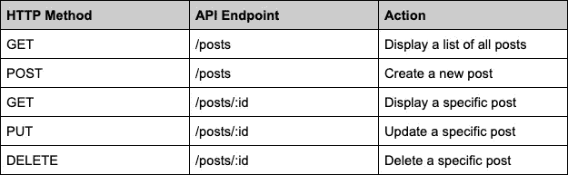

# 用 MongoDB 在 Node 中创建 REST API

> 原文：<https://javascript.plainenglish.io/creating-a-rest-api-in-node-with-mongodb-488915bf430?source=collection_archive---------13----------------------->

Source: [https://nordicapis.com/building-a-restful-api-using-node-js-and-mongodb/](https://nordicapis.com/building-a-restful-api-using-node-js-and-mongodb/)

在本教程中，我们将使用 Node.js、Express 和 Mongoose 构建一个具有完整 CRUD 功能的 REST API。首先，我们将从基本的 Express 服务器开始。接下来，我们将为 MongoDB 添加配置，用 Mongoose 创建一个模型，并构建具有完整 CRUD 功能的控制器。最后，我们将定义处理传入请求的 RESTful 路由，并将它们路由到适当的控制器动作。

# 入门指南

我们将从安装以下 npm 包开始: **express** ，**mongose，dotenv & nodemon** 作为 DevDependency。

接下来，我们将设置初始的 express 服务器，并创建一个简单的测试路由。

# **设置猫鼬**

Mongoose 是 Node.js 最受欢迎的 MongoDB 包装器。它允许我们轻松地与 MongoDB 数据库进行交互。我们可以开始将服务器连接到我们的 MongoDB 数据库。(关于设置数据库的详细信息，请点击这里查看 MongoDB 文档

为了连接到数据库，我们利用了 Mongoose 内置的 ***connect*** 方法，并从环境变量传入了我们的 mongodb 连接 URI。

随着我们的数据库连接的建立，我们可以转移到模型上。

# 创建模型

在 NoSQL 环境中，每一条数据都存储在一个文档中。同一类型的多个文档一起存储在一个集合中。模型是一个类，它让我们与数据库中的特定集合进行交互。

定义一个模型也需要我们定义一个模式。我们的模式定义了文档的外观。尽管在 NoSQL 数据库中，文档模式是完全灵活的，但 mongoose 帮助我们保持数据更加一致。

假设我们正在创建一个博客 API，它需要有一个 Post 模型。我们的 Post 模型需要一个模式，其中包含可以添加到单个文档中的字段。对于这个例子，我们将保持简单，只有一个标题，内容和日期字段。

在这里，我们向我们的项目添加了一个名为 ***models*** 的新目录，并创建了一个名为 ***Post.js*** 的文件来存放我们的 mongose**模式** & **model** 。我们定义字段和它们对应的数据类型，然后根据我们概述的模式导出新创建的模型。

# 创建控制器

有了我们的模型集，我们现在可以继续控制器逻辑。谢天谢地，mongoose 提供了大量的方法来简化我们的 CRUD 动作:

*   创建一个新帖子: **Post.create(data)**
*   通过 id 查找帖子: **findById(id)**
*   查找所有帖子: **find()**
*   更新一个帖子: **findByIdAndUpdate(id，data)**
*   删除一个帖子: **findByIdAndDelete(id)**

**创建**

**改为**

**更新**

**删除**

完成控制器逻辑后，我们可以继续定义路线。

# 定义路线

按照 RESTful 模式，我们将构建以下路线:

在新的 **routes** 目录中，我们将创建一个 **posts.routes.js** 文件，并设置 Express router 来处理上述路由，并将它们路由到适当的控制器动作。

最后，我们导出我们的 posts 路由器，我们需要将它包含在我们的 app.js 文件中，并通过添加行: **app.use('/posts '，postRouter)** 将所有指向'/posts '的请求指向路由器

至此，我们的 REST API 就完成了！

**进一步阅读/文献:**

 [## 猫鼬

### 让我们面对现实吧，编写 MongoDB 验证、造型和业务逻辑样板文件是一件很麻烦的事情。这就是为什么我们写了…

mongoosejs.com](https://mongoosejs.com/)  [## Express - Node.js web 应用程序框架

### Express 是一个最小且灵活的 Node.js web 应用程序框架，它为 web 和…

expressjs.com](https://expressjs.com/)  [## 开始使用 Atlas - MongoDB Atlas

### MongoDB Atlas 提供了一种在云中托管和管理数据的简单方法。本教程将指导您创建…

docs.atlas.mongodb.com](https://docs.atlas.mongodb.com/getting-started/)