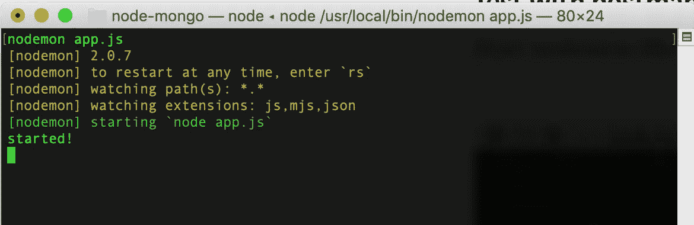

# 用 Node.js、Express 和 MongoDB (Atlas cloud)创建 RESTful API

> 原文：<https://javascript.plainenglish.io/creating-a-restful-api-with-node-js-express-and-mongodb-atlas-cloud-fdb8459f1c7?source=collection_archive---------12----------------------->

Photo by [Scott Graham](https://unsplash.com/@sctgrhm?utm_source=medium&utm_medium=referral) on [Unsplash](https://unsplash.com?utm_source=medium&utm_medium=referral)

在当今的软件开发中，RESTful APIs 几乎无处不在。作为一名程序员，几乎不可能不知道它或者没有使用过它。

本文解释了如何创建和服务 RESTful API。

API — Tech Stack

## 定义

应用程序编程接口。REST=表征状态转移。([维基百科](https://en.wikipedia.org/wiki/Representational_state_transfer))

RESTful web 服务最常见的实现是 JSON API。JSON= JavaScript 对象符号。

## 开发堆栈及其原因:

1.  [MongoDB](https://www.mongodb.com/try) : MongoDB 也被称为“NoSQL”数据库。它可以以 JSON 格式存储文档。你可以开始在亚马逊云上免费使用 MongoDB Atlas。这意味着你不需要在电脑上安装任何东西。
2.  [Node.js](https://nodejs.org/en/) :虽然 javascript 在互联网早期主要用于在你的网络浏览器中制作网站动画，但它现在已经发展成为一种主要的后端和前端编程语言。Nodejs 是用于开发 web 应用程序的 javascript 运行时环境。
3.  Express 是一个用于 Nodejs 的极简后端 web 应用框架。它非常适合服务 web APIs。

我们还将使用 [nodemon](https://nodemon.io/) 和 [postman](https://www.postman.com/) 。Nodemon 将监视源代码中的任何变化，并自动重启服务器。非常适合开发，并能立即看到您的变化。Postman 是一个可以用于 API 开发和测试的平台。

## 如何使用 MongoDB Atlas

[我在 AWS 上注册了一个免费的云共享集群](https://www.mongodb.com/try)，不过你也可以选择 Google Cloud 或者 Azure。

AWS Cloud example

我创建了一个零项目:

Cluster main screen setup example

*   数据库访问:创建一个用户+密码
*   网络访问:可以选择 0.0.0.0/0 作为 IP 地址。这样，当您的 IP 地址改变时(当您使用 DHCP 或通过调制解调器和路由器连接时)，您也可以从任何地方连接。
*   连接:如果您选择“连接您的应用程序”，您可以从那里复制粘贴您的连接代码。

Choose ‘Connect your application’

Copy + Paste connection string to your code

然后点击 Collections 并创建一个 test.projects

db= test , collection= projects

## 接下来是安装 Node.js、Express 和 nodemon

下载并安装 [Node.js](https://nodejs.org/en/)

通过检查节点版本来检查是否一切安装正常:

The version numbers on your computer might be different but that’s okay

在您的计算机上创建一个子目录，例如“node-mongo”。

mkdir 节点-mongo，cd 节点-mongo

在此目录中键入:

*   npm init —是(在“是”之前有 2 个破折号)
*   npm install express
*   npm 安装 mongodb
*   npm 安装 nodemon

注意:我不得不这样强制安装我的 nodemon:

在你的“node-mongo”目录中创建一个文件 [app.js](https://bitbucket.org/mxm304/node-mongo/src/master/app.js)

This is all the code you need to get started (source: Caleb Curry)

该代码的作用是:

*   第 2 行:它使用了 Express 框架。
*   第 3 到 6 行:它定义了与 MongoDB 的连接。请确保用您的连接代码和密码替换它(如上面关于如何使用 MongoDB 的部分所述)。
*   第 7 行:它创建了快速应用程序。
*   第 8 行:这对于让 JSON 的一切工作都很重要。
*   第 39 到 40 行:它启动在端口 3000 监听的应用程序。
*   第 10 到 12 行:当您在网络浏览器中键入“localhost:3000”时，它会发送一个“我听到了”字符串。
*   第 14 到 25 行和第 27 到 37 行:这两行都是 GET 和 POST 操作的回调函数。代码与数据库&集合连接，如果出了问题就会抛出一个错误。POST 将把 JSON 字符串发送到数据库，GET 将从数据库中检索 JSON 数据，并在浏览器中显示。此简短示例中未定义的其他操作是用于更新的 PUT 和用于删除的 DELETE。在这个简短的示例中，GET 检索并显示了所有存储的数据，但是也可以找到一个特定的集合，但是它不在这个小代码示例的范围之内。

## 与邮递员一起测试

像这样启动 node mon:node mon app . js

在[邮差](https://www.postman.com/)中，你可以将一个 JSON 字符串发布到应用程序中。

POST - localhost:3000/api/projects

键入与上述示例类似的正文，确保所有内容都设置为 JSON 并发送。

转到您的浏览器并键入“http://localhost:3000/API/projects”

## 文档版本:

2021 年 2 月 1 日:初稿

## 关于我:

[领英](https://www.linkedin.com/in/patrick-swiggers/)

如果有任何问题，请随时与我联系或向我发送反馈。