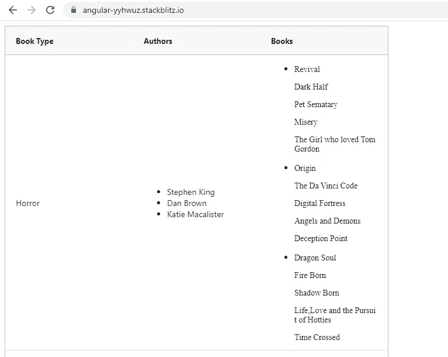
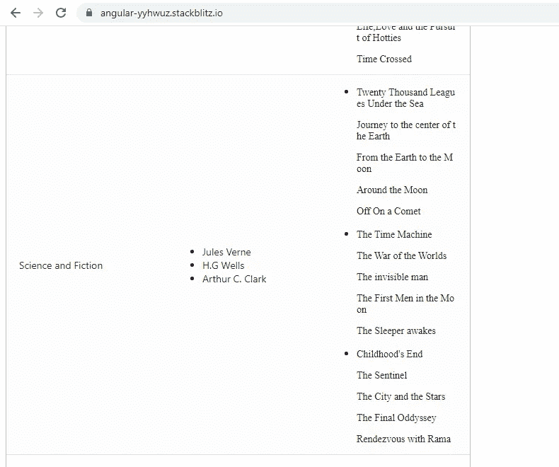
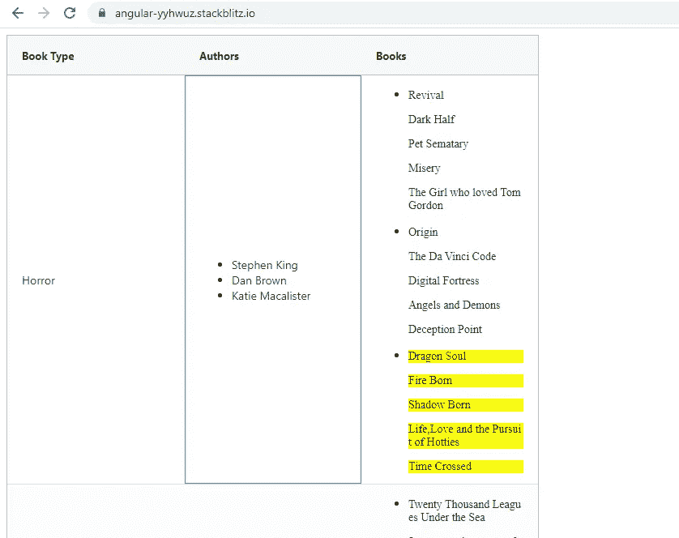
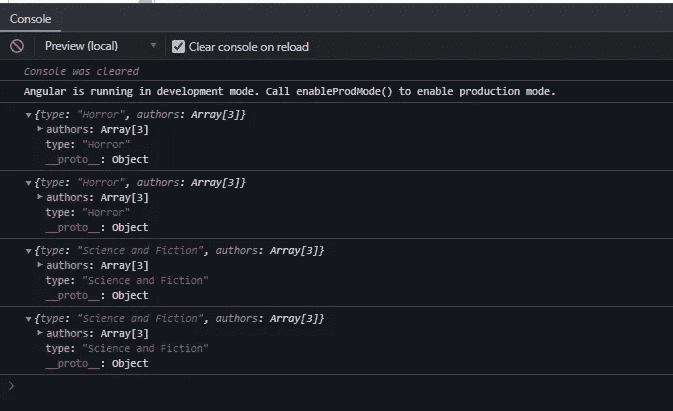

# Angular:如何创建一个在 Ag-Grid 表格中使用模板的可重用组件

> 原文：<https://javascript.plainenglish.io/creating-a-reusable-component-for-using-templates-in-ag-grid-tables-6d9a8dfc88e3?source=collection_archive---------4----------------------->


Photo by [Firos nv](https://unsplash.com/@firosnv?utm_source=medium&utm_medium=referral) on [Unsplash](https://unsplash.com?utm_source=medium&utm_medium=referral)

如果您希望表格能够与表格所在组件的属性和方法进行交互，那么在 Ag-Grid 表格中插入模板非常有用。

例如，如果您想要一个引导下拉列表或表格单元格中的一个按钮，使用< ng-template >创建一个 **TemplateRef** 并将其传递给表格进行渲染会更容易。

我举了一个非常简单的例子，在 Ag-Grid 表中显示作者列表和这些作者写的书。

下面是我们将要使用的数据。这是一个从 **books.ts** 导出的对象数组

```
**//books.ts**
export const **books**={“**books**”:[{
“**type**”:”Horror”,”**authors**”:[{“**name**”:”Stephen King”,”**books**”:[“Revival”,”Dark Half”,”Pet Sematary”,”Misery”,”The Girl who loved Tom Gordon”]},{“name”:”Dan Brown”,”books”:[“Origin”,”The Da Vinci Code”,”Digital Fortress”,”Angels and Demons”,”Deception Point”]},{“name”:”Katie Macalister”,”books”:[“Dragon Soul”,”Fire Born”,”Shadow Born”,”Life,Love and the Pursuit of Hotties”,”Time Crossed”]}
]
},
{
“**type**”:”Science and Fiction”,”**authors**”:[{“**name**”:”Jules Verne”,”**books**”:[“Twenty Thousand Leagues Under the Sea”,”Journey to the center of the Earth”,”From the Earth to the Moon”,”Around the Moon”,”Off On a Comet”]},{“name”:”H.G Wells”,”books”:[“The Time Machine”,”The War of the Worlds”,”The invisible man”,”The First Men in the Moon”,”The Sleeper awakes”]},{“name”:”Arthur C. Clark”,”books”:[“Childhood’s End”,”The Sentinel”,”The City and the Stars”,”The Final Oddyssey”,”Rendezvous with Rama”]}
]
}]}
```

每个对象描述了书的类型，写了该类型的书的几个作者，以及他们写的书。

我们的目标如下:

1.  将上述数据填入 Ag-Grid 表，如下所示:



Horror Genre



Science and Fiction Genre

2.为了演示 Ag-Grid 表、组件和指令之间的**通信，我添加了一个小功能:当用户点击任何作者时，他/她写的书将以黄色突出显示。**

例如，当我点击作者卡莉·麦卡利斯特时，她写的书会如下突出显示:



现在让我们来看看组件模板:

```
<ng-template **let-row=”rowInfo” #authorList**>
<ul *ngIf=”row”>
<li *ngFor=”let author of row.rowData.authors” **(click)=”showBook(author)”**>{{ author.name }}</li>
</ul>
</ng-template><ng-template **let-row=”rowInfo” #booksList**>
<ul *ngIf=”row”>
<li *ngFor=”let author of row.rowData.authors”>
<ng-container *ngFor=”let book of author.books”>
<p **appBookHighlighter [selectedBooks]=”selectedBooks” [targetBook]=”book”**>{{ book }}</p>
</ng-container>
</li>
</ul>
</ng-template>**<ag-grid-angular** [columnDefs]=”columnDefs” [defaultColDef]=”defaultColDef” class=”ag-theme-alpine” [rowData]=”rowData” (gridReady)=”onGridReady($event)”
(firstDataRendered)=”dataRendered($event)”
style=”width:100vh;height:100vw”>
**</ag-grid-angular>**
```

我们定义了 2 个标签<ng-template>，引用**book list**和 **authorList** 。它们将构成表格中**书籍**和**作者**栏的模板。我们稍后会谈到这一点。</ng-template>

**组件类别:**

```
export class **AppComponent** {@ViewChild(‘**authorList**’, { static: true }) authorList: TemplateRef<any>;
@ViewChild(‘**booksList**’, { static: true }) booksList: TemplateRef<any>;public **rowData** = [];
public **gridApi**: any;
public **columnDefs** = [];
public **selectedBooks**:string[]=[];
public **defaultColDef**={**autoHeight:** true**,resizable**: true}ngOnInit() {
this.**rowData** = books.books;
this.**columnDefs** = [
{
headerName: ‘**Book Type**’,
field: ‘type’,
},
{
headerName: ‘**Authors**’,
cellRendererFramework: **ReusableGridTemplateComponent**,
cellRendererParams: {
ngTemplate: **this.authorList**,
}
},
{
headerName: ‘**Books**’,
cellRendererFramework: **ReusableGridTemplateComponent**,
cellRendererParams: {
ngTemplate: **this.booksList**,
}
}
];
}**showBook(author){**
this.selectedBooks=author.books;
}**onGridReady(params) {**
this.gridApi = params.api;
}**dataRendered(params)** {
params.api.sizeColumnsToFit();
}}
```

当组件加载时，在 ngOnInit 生命周期钩子中，我们正在初始化表的 **rowData** 和 **columnDefs** (列定义)。

**rowData** 用从 books.ts 导出的数组 **books** 初始化

在 **columnDefs、**中，我们定义了 3 列:**图书类型、作者和图书**。

如你所知，数组**书籍**中的每个对象都有 2 个属性:**类型**和**作者**。**图书类型**列从属性**类型中获取其值。**

```
{
headerName: ‘**Book Type**’,
field: ‘type’,
},
```

**Authors** 列通过引用 **authorList** 从模板中获取其内容。

```
{
headerName: ‘**Authors**’,
cellRendererFramework: **ReusableGridTemplateComponent**,
cellRendererParams: {
ngTemplate: **this.authorList**,
}
}
```

我们已经创建了一个新组件:**ReusableGridTemplateComponent**，其中将显示引用 **authorList** 的< ng-template >中定义的模板。

**ReusableGridTemplateComponent 模板:**

```
<ng-container **[ngTemplateOutlet]=”template” [ngTemplateOutletContext]=”context”**
></ng-container>
```

**变量 template(传递给 ngTemplateOutlet)** 将包含从 ColumnDefs 传递过来的 TemplateRef ( **authorList 和 book list**)。

为了理解变量**上下文(传递给 ngTemplateOutletContext)** 包含什么，让我们检查一下这个类。

```
export class **ReusableGridTemplateComponent** implements OnInit {
constructor() {}**public template: TemplateRef<any>;
public context: any = {};**ngOnInit() {}
// gets called once before the renderer is used
**agInit(params: ICellRendererParams)** {
this.setTemplateAndParams(params);
}// gets called whenever the cell refreshes
**refresh(params: ICellRendererParams)** {
this.setTemplateAndParams(params);
}**setTemplateAndParams(params)** {
this.template = params[‘**ngTemplate**’];
this.context = {
rowInfo: {
rowData: params.data,
rowId:params.node.id
}};
}
}
```

正如前面在 **columnDefs** 中看到的，模板引用被传递给了 **cellRendererParams** 对象中的属性 **ngTemplate** 。

```
{
headerName: ‘**Authors**’,
cellRendererFramework: **ReusableGridTemplateComponent**,
cellRendererParams: {
ngTemplate: **this.authorList**,
}
}
```

因此在 **setTemplateAndParams** ()中，变量模板**(传递给 ngtemplateeoutlet)**定义如下。它从 params 的 **ngTemplate 属性**中获取其值。

```
this.template = params[‘**ngTemplate**’];
this.context = {
rowInfo: {
rowData: params.data,
rowId:params.node.id
}};
```

**变量 context(传递给 ngTemplateOutletContext)** 是一个包含属性 **rowInfo 的对象。**这个属性 **rowInfo** 又是另一个具有两个属性 **rowData** 和 **rowId** 的对象。根据您在< ng-template >中需要的行信息，您可以传递更多的属性。

我们现在将回到<ng-template>来理解如何使用上述属性。</ng-template>

```
<ng-template **let-row=”rowInfo” #authorList**>
<ul *ngIf=”row”>
<li *ngFor=”let author of row.rowData.authors” **(click)=”showBook(author)”**>{{ author.name }}</li>
</ul>
</ng-template>
```

**行**包含**上下文对象**的**行信息**属性。 **rowInfo** 对象的 **rowData** 属性如下所示。它包含每一行的数据。我们需要做的就是遍历 **rowData** 的 **authors 属性**来显示作者姓名。



rowData property

当我们点击任何作者时， **showBook()** 被调用，将该特定作者的对象(包含 **name** 属性和 **books** 属性)作为参数传递。

例如，如果我单击**斯蒂芬·金**，那么下面的对象将作为参数传递给 **showBook()** 。

```
{“**name**”:”Stephen King”,”**books**”:[“Revival”,”Dark Half”,”Pet Sematary”,”Misery”,”The Girl who loved Tom Gordon”]}
```

在这个方法中，我们将对象的 **books** 属性赋给变量 **selectedBooks** 。这将有助于我们在图书栏中用黄色突出显示作者所写的图书。

```
**showBook(author){**
this.selectedBooks=author.books;
}
```

为了理解 highlight 函数是如何工作的，让我们检查一下**图书**列是如何定义的。它与 Authors 列非常相似，但是唯一的区别是传递给**ReusableGridTemplateComponent**的 TemplateRef。

```
{
headerName: ‘**Books**’,
cellRendererFramework: **ReusableGridTemplateComponent**,
cellRendererParams: {
ngTemplate: **this.booksList**,
}
}
```

查看图书栏的<ng-template>。</ng-template>

```
<ng-template **let-row=”rowInfo” #booksList**>
<ul *ngIf=”row”>
<li *ngFor=”let author of row.rowData.authors”>
<ng-container *ngFor=”let book of author.books”>
<p **appBookHighlighter [selectedBooks]=”selectedBooks” [targetBook]=”book”**>{{ book }}</p>
</ng-container>
</li>
</ul>
</ng-template>
```

我们首先遍历**行数据**对象的属性**作者**。在第一次迭代中，我们进行另一次迭代:迭代每个作者的**书籍**属性。

这样，我们就可以以列表的形式显示图书名称。我们已经将**bookhighlight read active**应用于正在显示的图书名称。该指令接受 **selectedBooks** 变量和书籍名称作为@Input()。

```
<p **appBookHighlighter [selectedBooks]=”selectedBooks” [targetBook]=”book”**>{{ book }}</p>
```

当我们点击一个作者时，所选择的**书籍**被设置为作者所写的书籍名称的数组(包含在**书籍属性**中)。此步骤由前面已经讨论过的 **showBook()** 完成。

```
export class **BookHighlighterDirective** {
constructor() {}**@Input(‘selectedBooks’) selectedBooks: any;
@Input(‘targetBook’) targetBook: string;
@HostBinding(‘style.backgroundColor’) bgColor: string;****ngOnChanges() {**
this.bgColor = this.selectedBooks.includes(this.targetBook)? 'yellow': 'transparent';
}
}
```

如果图书名称在**选择的图书**列表中，则该特定图书名称将以黄色突出显示。

为了实现所有表格单元格的**文本环绕**，需要两个步骤:

1.  在组件中应用下面的 CSS。

```
**::ng-deep .ag-theme-alpine .ag-cell** {word-break: break-all !important;
white-space: normal !important;
line-height: unset !important;
}
```

2.将所有列的**自动高度属性设置为真**。

```
public **defaultColDef**={**autoHeight:** true**,resizable**: true}
```

这确保了表格单元格可以很容易地容纳任意数量的文本，而不会切断文本。

最后，在我结束这个故事之前，我想分享一点信息。

在**重用 leGridTemplateComponent 中，**我做了一个小的修改:上下文对象修改如下，即 **rowInfo** 属性被 **$implicit** 属性替换。

```
this.context = {
**$implicit**: {
rowData: params.data,
rowId: params.node.id,
}
};
```

影响是什么？Angular 识别出**$隐式键**，并将**自动将$隐式键的值绑定到< ng-template >** 中定义的字母行。因此**行**不需要初始化为任何值。它可以简单地如下所示。这将使代码更简单一点。

```
<ng-template **let-row #authorList**>
<ul *ngIf=”row”>
<li *ngFor=”let author of row.rowData.authors” **(click)=”showBook(author)”**>{{ author.name }}</li>
</ul>
</ng-template><ng-template **let-row #booksList**>
<ul *ngIf=”row”>
<li *ngFor=”let author of row.rowData.authors”>
<ng-container *ngFor=”let book of author.books”>
<p **appBookHighlighter [selectedBooks]=”selectedBooks” [targetBook]=”book”**>{{ book }}</p>
</ng-container>
</li>
</ul>
</ng-template>
```

您可以在以下链接查看完整代码:

[](https://stackblitz.com/edit/angular-yyhwuz?file=src/app/app.component.html) [## 角形(叉形)- StackBlitz

### 编辑描述

stackblitz.com](https://stackblitz.com/edit/angular-yyhwuz?file=src/app/app.component.html) 

*多内容见于* [***中***](http://plainenglish.io/)