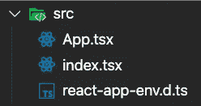
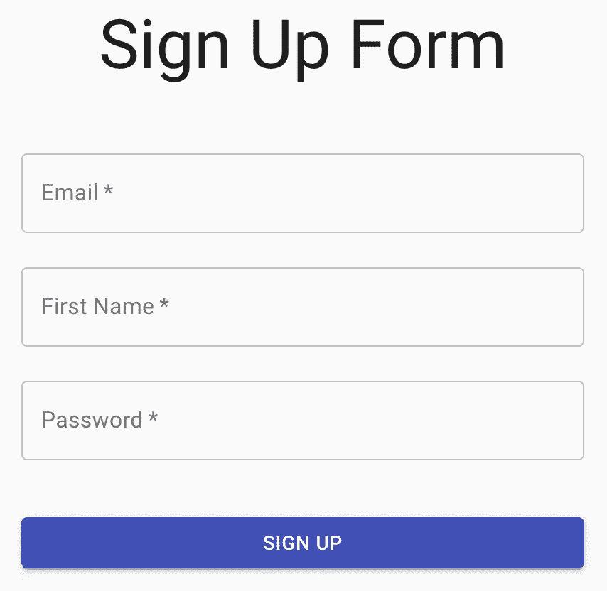
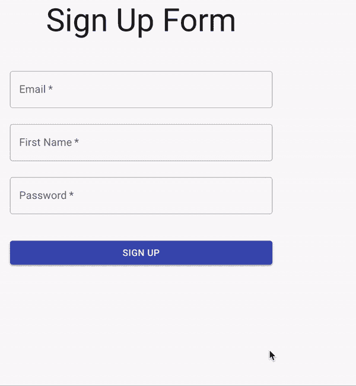

# 如何在 React with TypeScript 中创建注册表单

> 原文：<https://javascript.plainenglish.io/creating-a-sign-up-form-in-react-with-typescript-516b1a172913?source=collection_archive---------2----------------------->

## 如何使用 **React 钩子表单**、 **Material-UI** 和 **Yup** 在 React 中创建一个注册表单


在本教程中，我们将利用名为 **React Hook Form** 的库的能力，这将使在 React 中处理表单逻辑变得轻而易举。表单几乎是任何网站必不可少的一部分，希望到此结束时，每个人都能在 React 中轻松制作自己的表单。

# 先决条件

对于本教程，我们不需要太多。以下是您需要的先验知识和工具列表。

*   已安装节点和 NPM(节点程序包管理器)
*   React 的初级知识
*   理解 TypeScript 是一个好处(虽然在本教程中不会大量使用)
*   初级命令行体验。(知道 *cd* 是做什么的，也就这些了)

事不宜迟，我们开始吧！

# 项目设置

对于这个项目来说，项目设置将非常容易。我们需要做的第一件事是打开终端/powershell(取决于操作系统)并导航到您选择的目录。当您到达您希望项目所在的位置后，运行以下命令。

```
npx create-react-app sign-up-form-demo --template typescript
```

*如果你想跟随纱线，请随意，但是从现在开始命令将使用 NPM。*

随着新项目的创建，我们可以运行下面的命令在命令行中导航到它。

```
cd sign-up-form-demo
```

现在我们已经导航到我们的项目，我们可以通过运行这个命令来安装本教程所需的包。

```
npm i @material-ui/core react-hook-form @hookform/resolvers yup
```

下面是对我们项目中每个包的用途的简要说明。

*   @ material-ui/core**将用于我们应用程序的用户界面和外观。**
*   **react-hook-form** 将用于处理各种表单状态，在本例中，是我们表单的提交和错误状态。
*   **@hookform/resolvers** 将为 **yup** 提供一个实现，这将允许 react-hook-form 和 **yup** 很好地相互配合(您将在后面的代码中看到这是如何工作的)。
*   **是**将验证我们的表单输入，以确保我们向他们提供了正确的信息。

安装好包后，我们可以继续在我们选择的代码编辑器中打开项目。我将使用 VS 代码，如果你还没有(它是免费的)，强烈推荐你尝试一下。如果你想在你的机器上安装它，下面是一个链接。

[](https://code.visualstudio.com/) [## Visual Studio 代码-代码编辑。重新定义的

### Visual Studio Code 是一个重新定义和优化的代码编辑器，用于构建和调试现代 web 和云…

code.visualstudio.com](https://code.visualstudio.com/) 

现在我们已经在代码编辑器中打开了项目，我们需要删除 **src** 文件夹中的一些文件。下面是完成后 **src** 文件夹的截图(只有这三个文件会保留在 **src** 文件夹中)。



随着我们的项目清理完毕并准备就绪，是时候开始编码了！

# 让我们开始编码吧

*在我们开始之前，如果你在任何一点上卡住了，并且有兴趣看到完整的解决方案，我将在底部有我完成的项目的 Github 链接。*

## 起始代码

我们需要做的第一件事是用下面的代码替换 **index.tsx** 文件。

我们在这里做的唯一值得注意的事情是在**第 9 行，**添加了一个名为 *CssBaseline，*的新组件，它只是 **Material-UI** 中的一个组件，用于将一些有用的 CSS 重置放置到位。在我们的 **index.tsx** 文件中准备好起始代码后，让我们开始编写 UI 代码。

## 我们注册表单的用户界面

对于本教程来说，我们的用户界面是非常基本的。我们将有一些标题文本、三个文本输入(电子邮件、名字和密码)、一个注册按钮和一些文本，这些文本将有条件地显示通常从表单提交发送到服务器/API 的数据。

关于上面的代码，有一些事情需要注意。

首先，从第**行的第 10** 行开始，你会看到一个名为 *useStyles* 的变量，这是 **Material-UI 的**实现如何定制他们的各种组件的风格。你会注意到我的风格非常简单，我基本上只是添加了一些空白和居中文本。在第**行第 13** 和第**行第 16** 行，我们使用了一个名为主题的变量，这将允许我们使用 **Material-UI 的**默认主题(我们可以自定义这些值，但在本教程中不会这么做)。间距只是主题中的一个常量，我们可以用它来在我们的应用程序中保持一致的 UI 间距。设置好我们的样式后，你会看到我们将在第 21 行使用它。我们将获取我们在这里设置的两个类。现在这两个变量已经从我们的对象中析构了，我们可以将它们传递给任何一个 **Material-UI** 组件的 className 属性。您可能会想，要获得一个类名需要做大量的工作，但是这里发生的事情比看起来要多。类名实际上正在生成，并被赋予一个惟一的名称，以避免与其他样式冲突。

我想谈的第二件事也是最后一件事是第 62–70 行。我们这里的东西是专门用来演示的。在一个真实的应用程序中，你可以把我们有条件地渲染到屏幕上的 JSON 发送给一个服务器/API。

现在我们的 UI 代码已经写好了，您可以继续运行应用程序，您应该会看到一个类似这样的页面。

*要运行这个应用程序，你可以使用这个命令。*

```
npm start
```



现在已经为我们的应用程序设置好了 UI，是时候引入 **React Hook Form** 了。

## 在我们的应用程序中实现 React Hook 表单

在 React 中处理表单可能需要很多努力，但是多亏了像 **React Hook Form、**这样的库，现在处理表单变得轻而易举，正如您将在下面的代码中看到的。

我们在 App.tsx 文件中添加了一些东西，现在让我们回顾一下我们做了什么。

在**第 11 行，**我们添加了一个接口，它将通知 TypeScript 我们的表单输入的类型。

在**第 28–31 行，**你会注意到我们使用了一个由 **React Hook Form** 引入的钩子。这里有几点需要注意。首先，我们将帮助打出脚本，并给 **React Hook Form** 我们在**第 11 行**创建的类型。这将有助于代码编辑器中的错误处理和自动完成。第二件要注意的事情是我们将从钩子中使用的函数( *register* 和 *handleSubmit* )。*注册*功能将用于“注册”不同的输入，我们将使用 **React hook Form** (更多信息见下文)。另一个函数 *handleSubmit* 将用于控制我们在 **React Hook Form** 中的表单提交，而不是使用表单提交的默认浏览器实现。

在**第 37 行，**我们有一个处理表单提交的函数。在这种情况下，我们所做的就是将 JSON 变量的状态设置为提交的值。通常这是我们调用服务器/API 的地方(传递 JSON 给它)。

在**第 46 行，**你会看到我们在使用上面讨论过的函数 *handleSubmit* 。如前所述，这将阻止浏览器处理表单提交的默认实现，并允许 **React Hook Form** 处理它。你还会注意到，我们在表单上将 noValidate 设置为 true，这将在以后发挥作用，但我不希望浏览器显示错误消息，因为我将使用 **Material-UI** 和 **Yup** 来处理必填字段等。

在**第 48、56 和 64 行**处，将使用我们的寄存器方法。您会注意到，我们在这里使用了扩展语法(**……**)，这是因为*文本字段*上有几个属性将被设置，这些属性将被调用的方法抽象。

就这样。我们现在已经将 **React Hook Form** 添加到我们的应用程序中，使得在 React 中处理表单提交变得更加容易。对于那些没有在 React 中处理过表单的人来说，相信我，这是一个非常手工和乏味的过程，并且 **React Hook Form** 为我们节省了大量的样板代码。

现在只有最后一件事要做，那就是验证我们的输入，因为我们不希望我们的用户只是向我们的表单发送任何数据。

## 用“是”验证我们的表单并将其反映在我们的用户界面中

对于不知道的人来说,**是**是一个模式验证器，它允许我们定义一个模式来与我们提交的表单进行比较，确保它是有效的。下面是实现**是**并在界面显示错误信息的代码。

在上面的代码中，您可能会注意到没有什么变化。我们所要做的就是定义一个**是的**验证模式，然后在我们的 useForm 钩子中将该模式传递给 yupResolver。我们现在还确保在表单输入(文本框)中显示错误状态。让我们深入研究一下这段代码。

在**第 19-23 行**中，我们定义了我们的**是的**模式，并利用所谓的方法链接来描述每个字段应该是什么样子。例如，我们希望我们的密码是必需的，并且最少允许 8 个字符，最多允许 120 个字符，所以我们通过编写下面的代码来做到这一点(我非常喜欢编写这个语法，因为我觉得它可以自我记录我们正在做的事情)。

```
yup.string().required().min(8).max(120)
```

在第 39 行上，我们从 useForm 钩子中获取了一个新的属性，允许我们访问每个注册字段的错误值。我们将利用这一点，使用 **Material-UI** 的一些内置细节，在我们的使用界面中智能地显示错误消息。

在**第 41 行**中，我们将我们定义的模式传递给解析器，并使用 *yupResolver* 方法，这是一种由于我们安装了一个名为**@ hook form/resolver**的包而可用的方法。这允许**在表单提交前将我们的文本字段数据传递给**YY**(模式验证器)，以确保我们的输入数据符合 YY 模式中定义的要求。**

在第 63、64、73、74、83、84 行上，我们使用了**材质的两个属性——UI***TextField*组件(helperText 和 error)。这些属性相互结合，将允许我们在文本字段上显示错误消息。 *helperText* 是显示在组件上的文本，它将解释用户需要做什么。而 *error* 是一个布尔值，它确定帮助文本是否应该显示得像一个错误。

添加了我们刚刚浏览过的代码后，我们就有了一个功能完整的注册表单。



GitHub 的完整代码在下面的链接中:

[](https://github.com/13bfrancis/react-hook-form-demo-1/blob/master/README.md) [## 13b Francis/react-hook-form-demo-1

### 这个项目是用 Create React App 引导的。在项目目录中，您可以运行:在…中运行应用程序

github.com](https://github.com/13bfrancis/react-hook-form-demo-1/blob/master/README.md) 

参考资料和文档:

[](https://react-hook-form.com/) [## 主页

### 直观、功能完整的 API，在构建表单时为开发人员提供无缝体验。利用现有的…

react-hook-form.com](https://react-hook-form.com/) [](https://material-ui.com/) [## Material-UI:一个流行的 React UI 框架

### React 组件使 web 开发更快更容易。建立自己的设计体系，或者从材料设计开始。

material-ui.com](https://material-ui.com/) [](https://www.npmjs.com/package/yup) [## 是的

### 死简单对象模式验证

www.npmjs.com](https://www.npmjs.com/package/yup) 

# 结论

希望在本教程中，您可以更轻松地使用 React 中的表单。在 React 中处理表单可能有点吓人，因为没有一成不变的方法，但是在我看来， **React Hook Form，**提供了一种优雅且易于使用的方法。

*更多内容请看*[***plain English . io***](https://plainenglish.io/)