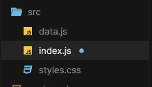

# 使用 React 创建简单的图像滑块

> 原文：<https://javascript.plainenglish.io/creating-a-simple-image-slider-using-react-73a0874119f1?source=collection_archive---------6----------------------->

## 让我们使用 React 制作一个简单的图像滑块。


Photo by [Danial Igdery](https://unsplash.com/@ricaros?utm_source=medium&utm_medium=referral) on [Unsplash](https://unsplash.com?utm_source=medium&utm_medium=referral)

# 介绍

React 是用于构建用户界面的流行 JavaScript 库之一。它使创建交互式 UI 变得更加容易，因为它是一个基于组件的库，并且具有许多有用的特性，使开发人员的生活更加轻松。好的一面是它并不难学，你可以通过阅读官方文档中的基础知识来开始使用它。然而，你需要一直坚持练习，因为这是变得更好的唯一方法。

这就是为什么在本文中，我们将使用一点点 React magic 来创建一个简单的图像滑块。让我们开始吧。

# 项目演示

Image slider demo.

正如你所看到的，这个项目非常简单。它只是在我们点击按钮时更新图像和文本。我们将详细介绍所有这些内容，请跟我联系。

# 创建新项目

我们将使用命令行在桌面上创建一个新项目。如果您的机器上安装了 Git，那么您可以使用 Git Bash。确保使用 Create React App 创建一个新项目，然后使用`npm start`启动一个本地服务器，以便能够看到您的更改。

看看下面的例子:

```
npx create-react-app image-slider
cd image-slider
npm start
```

之后，您需要打开您的文本编辑器，删除`src`文件夹中所有不必要的文件，创建三个文件(`data.js`、`index.js`和`styles.css`)。



Our files.

# 编写代码

首先，我们将访问我们的文件`data.js`，并将我们所有的数据作为一个包含我们需要的所有图像和文本的对象数组放在那里。只需确保使用`export`导出数组，因为我们需要将它导入到文件`index.js`中。

下面是代码示例:

```
export const arr = [
  {
    id: 1,
    name: "susan smith",
    job: "web developer",
    image:
      "https://res.cloudinary.com/diqqf3eq2/image/upload/v1586883334/person-1_rfzshl.jpg",
    text:
      "I'm baby meggings twee health goth +1\. Bicycle rights tumeric chartreuse before they sold out chambray pop-up. Shaman humblebrag pickled coloring book salvia hoodie, cold-pressed four dollar toast everyday carry"
  },
  {
    id: 2,
    name: "anna johnson",
    job: "web designer",
    image:
      "https://res.cloudinary.com/diqqf3eq2/image/upload/v1586883409/person-2_np9x5l.jpg"
  },
  {
    id: 3,
    name: "peter jones",
    job: "intern",
    image:
      "https://res.cloudinary.com/diqqf3eq2/image/upload/v1586883417/person-3_ipa0mj.jpg"
  },
  {
    id: 4,
    name: "bill anderson",
    job: "the boss",
    image:
      "https://res.cloudinary.com/diqqf3eq2/image/upload/v1586883423/person-4_t9nxjt.jpg"
  }
];
```

然后，我们将进入主文件`index.js`，导入我们需要的所有内容。

```
// Importing React and the useState hook.
 **import React , { useState } from 'react';**// Importing React DOM.
 **import ReactDOM from 'react-dom';**// importing React icons.
 **import { BsArrowRightShort } from "react-icons/bs";
 import { BsArrowLeft } from "react-icons/bs";**// importing the CSS file.
**import './styles.css';**// importing the array of objects which contains data in data.js
 **import { arr } from './data';**
```

在同一个文件`index.js`中，我们将创建一个功能组件`App`，在点击按钮后，我们将使用 UseState 钩子来改变数据(文本和图像)。

```
// creating a component which uses useState and contains our UI.
const App = () =>{
  // UseState with a default value of 0.
  const [**value, setValue**] = **useState(0)**;

  return(
  <>
  <div className="container">
    
    <h2>{**arr[value].name**}</h2>
    <h3>{**arr[value].job**}</h3>
    <div>
    <button type="button" **onClick={() => value === 0 ? setValue(3) : setValue(value - 1)}**><BsArrowLeft /></button>
    <button type="button" **onClick={() => value === 3 ? setValue(0) : setValue(value + 1)}**><BsArrowRightShort /></button>

    </div>
  </div>
  </>
  );}// Rendering the component with the render method.
ReactDOM.render(
  <App />,
  document.getElementById('root')
);
```

如您所见，点击按钮后，挂钩`useState`允许我们更改数值，从而更改从`arr`导入的数据。因此，它会在单击按钮后更改图像和文本。

如果你对 React 中的钩子`useState`不熟悉，可以查看我下面的文章:

[](/react-usestate-explained-with-examples-13d6c17b4b61) [## 反应使用状态举例说明

### 通过实例了解 React UseState

javascript.plainenglish.io](/react-usestate-explained-with-examples-13d6c17b4b61) 

# 设计用户界面

现在，我们需要做的就是转到文件`styles.css`并使用 CSS 样式化我们的 UI。

下面是代码示例:

```
* {
  margin: 0;
  padding: 0;
  box-sizing: border-box;
  font-family: sans-serif;
}
body {
  display: flex;
  align-items: center;
  justify-content: center;
  height: 100vh;
}
.container {
  width: 500px;
  max-width: 500px;
  height: 350px;
  background: rgb(29, 28, 28);
  color: white;
  padding: 10px;
  display: flex;
  flex-direction: column;
  border-radius: 5px;
  justify-content: center;
  align-items: center;
}
.container img {
  width: 200px;
  height: 190px;
  object-fit: cover;
  border-radius: 50%;
}
h2 {
  text-transform: capitalize;
  margin-top: 10px;
  font-weight: 800;
}
h3 {
  text-transform: capitalize;
  color: rgb(197, 194, 194);
}
.container div {
  margin-top: 15px;
}
.container div button {
  cursor: pointer;
  margin: 0 10px;
  padding: 8px 10px;
  border-radius: 50%;
  font-weight: 800;
  font-size: 19px;
  border: none;
  outline: none;
  text-align: center;
}
button:active {
  transform: scale(1.03);
}
```

最后，只需使用 Git Bash 中的命令`npm run build`来构建生产文件。

# 结论

正如你所看到的，这个项目非常简单。然而，我们练习了一点 React 和 UseState。成为一名优秀的开发人员的最好方法是练习你的东西。

感谢您阅读这篇文章。希望你觉得有用。

## 更多阅读

[](/6-unpopular-and-powerful-html-features-that-you-should-know-a0c3d62f1294) [## 你应该知道的 6 个冷门而强大的 HTML 特性

### 让你的生活更轻松的 HTML 特性。

javascript.plainenglish.io](/6-unpopular-and-powerful-html-features-that-you-should-know-a0c3d62f1294) 

*如果你对 JavaScript 和 web 开发相关的更有用的内容感兴趣，也可以* [*订阅*](https://mehdiouss.ck.page/) *我的快讯。*