# 使用 Express.js + MongoDB 创建简单的 REST API

> 原文：<https://javascript.plainenglish.io/creating-a-simple-rest-api-using-express-js-mongodb-c7f53d145e4d?source=collection_archive---------8----------------------->

本教程将向您展示如何使用 **Express.js** 和 **MongoDB** 开发一个简单的 **REST API** 。最后，我上一篇文章中的 **React 应用程序**将会用到 **REST API** :

*   [使用 API 显示大量猫的基本 React 组件和道具😻](https://karnyong.medium.com/basic-react-components-and-props-for-showing-lots-of-cats-d41bf67cc26)

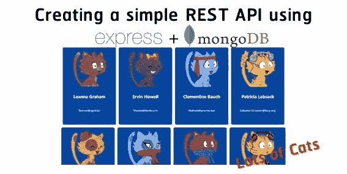

# 软件安装

*   **node . js**https://nodejs.org
*   **MongoDB 社区**[https://www.mongodb.com/try/download/community](https://www.mongodb.com/try/download/community)

# 在 MongoDB 中创建用户

编辑系统环境变量(仅适用于 Windows)。

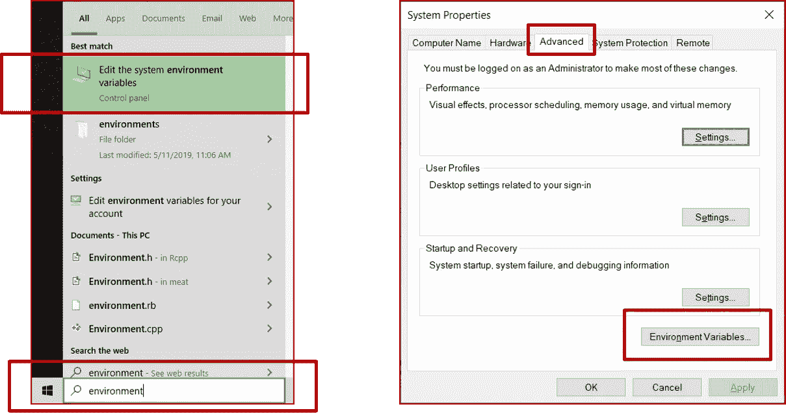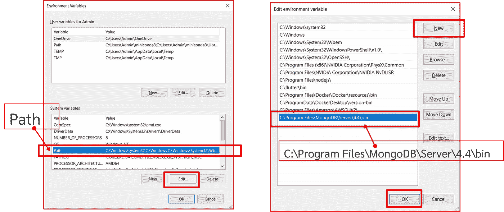

使用命令提示符/终端，用 **mongo** 命令启动 **MongoDB shell** 。

```
mongo --host localhost --port 27017
```

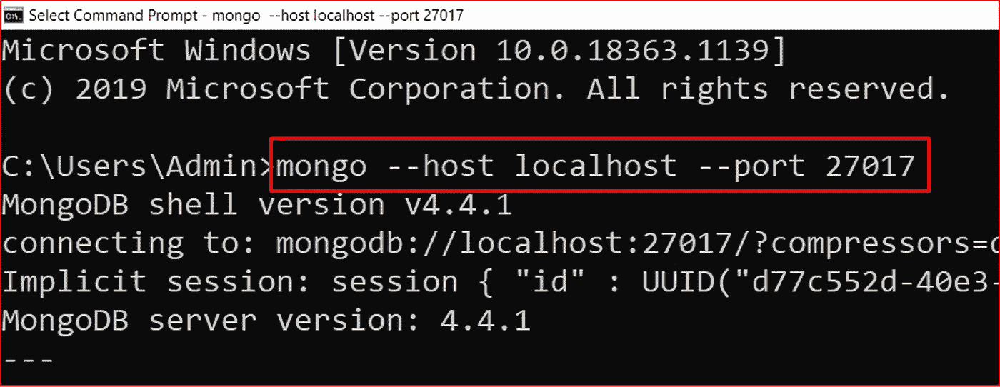

使用以下命令创建新用户 **myUserAdmin** ，密码为 **myUserAdmin** 。

```
use admindb.createUser({user: "myUserAdmin", pwd: "myUserAdmin", roles: [{role: "userAdminAnyDatabase", db: "admin"}, "readWriteAnyDatabase"]})
```

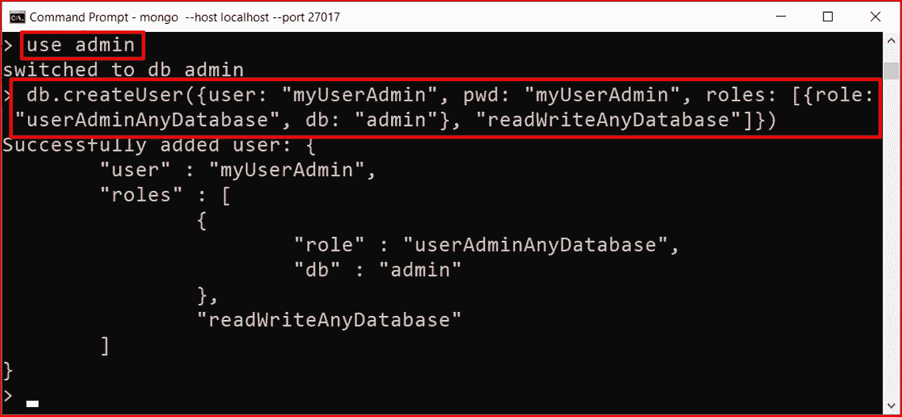

验证创建的用户。

```
db.getUsers()
```

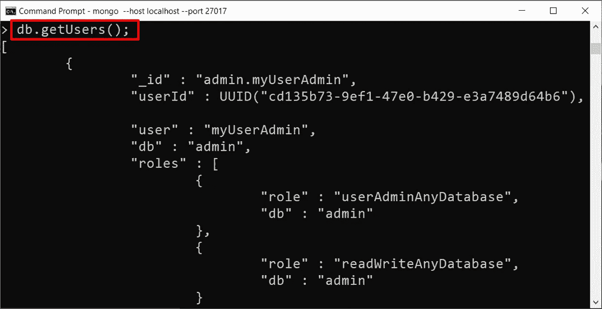

# 在 MongoDB 中创建集合

使用 **MongoDB Compass** 连接 MongoDB，导入一些数据。

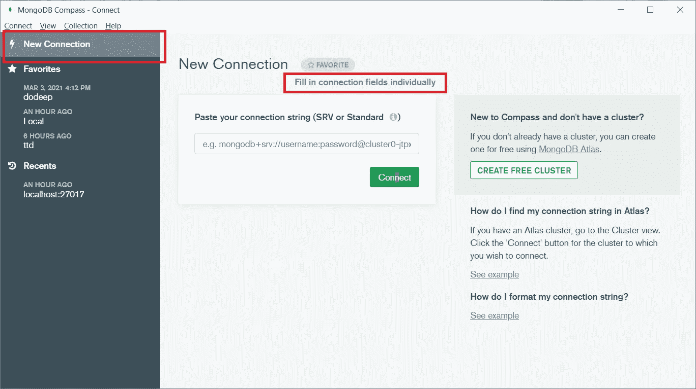

输入上一步的用户名和密码。

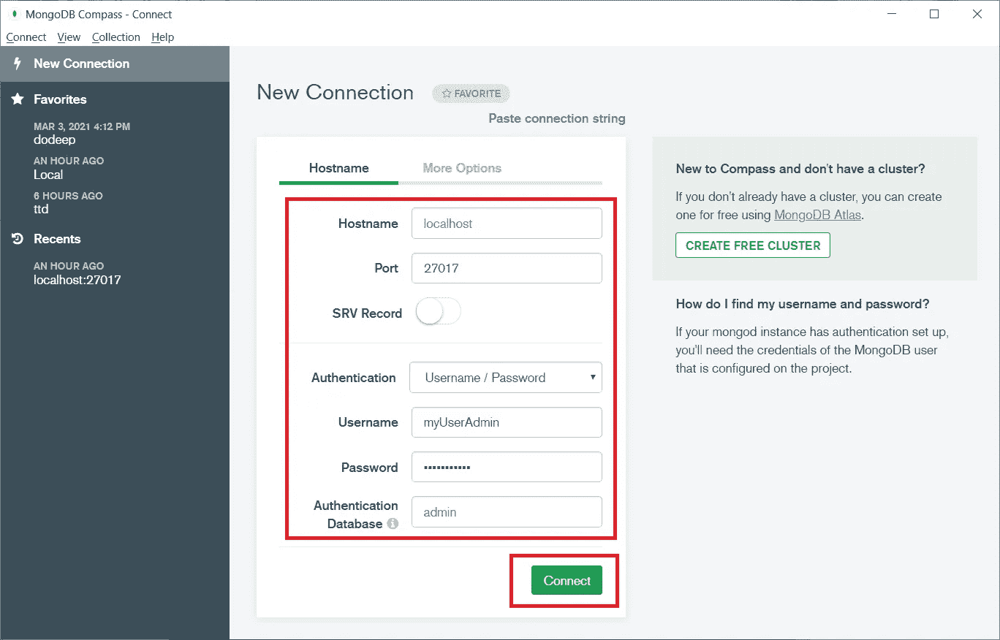

创建包含集合的数据库。

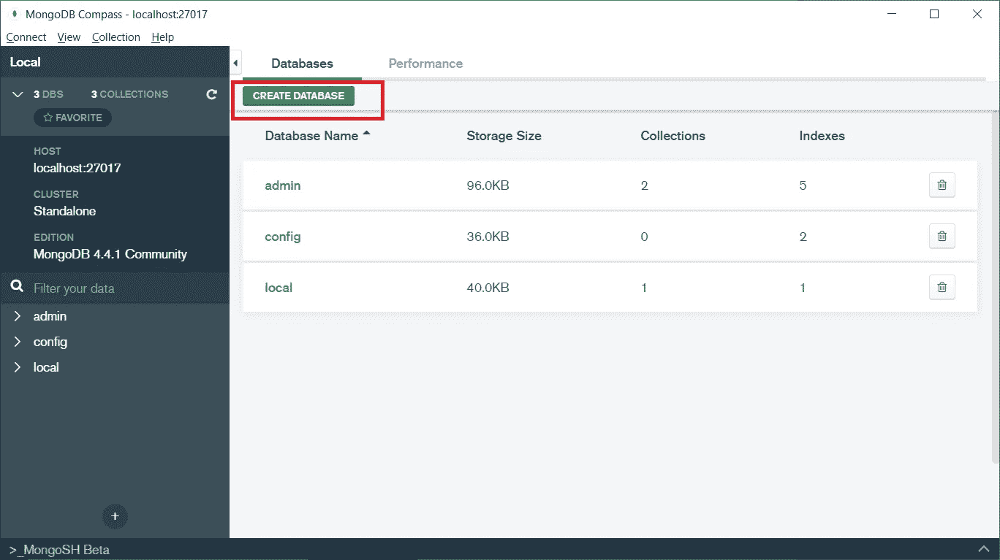

将数据导入集合。

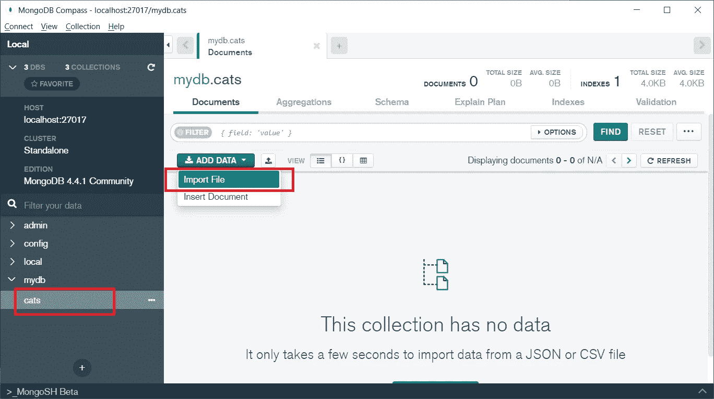

**cats.json** 。

导入 **cats.json** 。

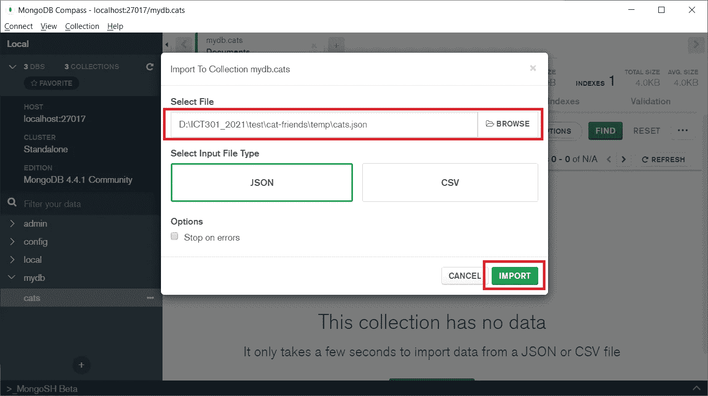

数据被导入。

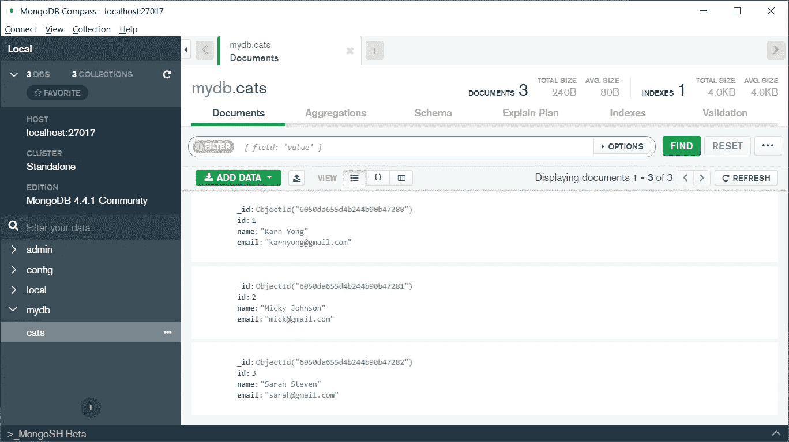

尝试过滤 **MongoDB Compass** 中的数据。您可以从[https://docs.mongodb.com/manual/tutorial/query-documents/](https://docs.mongodb.com/manual/tutorial/query-documents/)了解更多关于如何查询数据的信息。

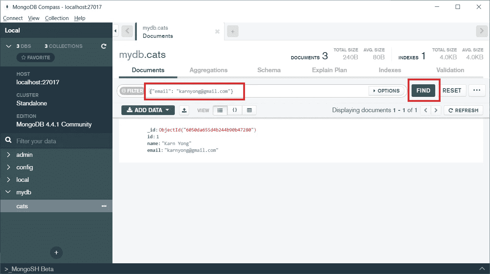

# 用 Express.js 创建一个 REST API

**REST API**
**REST**(具象状态转移)
**API** (应用程序接口)

使用 **REST API** ，我们可以在客户端和数据库之间建立一个接口。

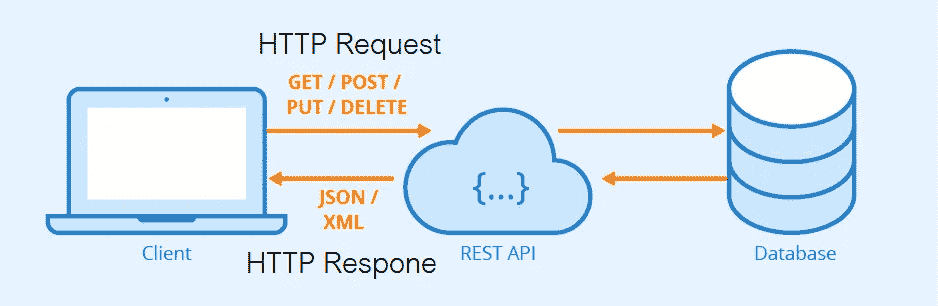

[https://www.seobility.net/en/wiki/REST_API](https://www.seobility.net/en/wiki/REST_API)

首先，创建一个文件夹。

```
mkdir cat-api
cd cat-api
```

使用**纱线**创建一个 **node.js** 应用程序。在应用程序中添加 **express** 、 **cors** 和 **mongodb** 模块。

```
yarn init
yarn add express cors mongodb
```

创建 **server.js** 来创建一个初始 **API** 。

启动您的 **API** :

```
node server.js
```

在 web 浏览器上测试初始的**API(**[http://localhost:8081/](http://localhost:8081/))。


编辑 **server.js** 添加一个 **API** ，用于从 **MongoDB** 中检索 cat 数据。

在 web 浏览器上测试 cat 数据 API([http://localhost:8081/cats/read](http://localhost:8081/cats/read))。

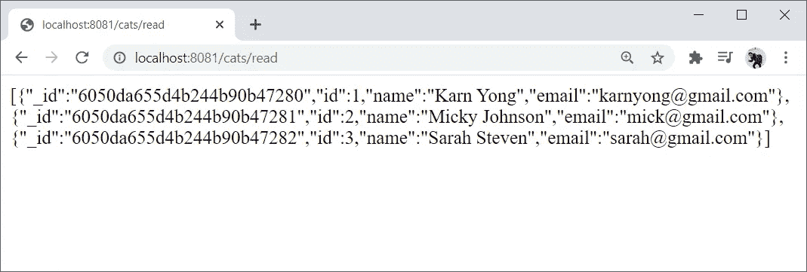

# 在 React 应用程序中使用这个 API

基于我以前的文章[使用 API 显示大量猫的基本反应组件和道具😻](https://karnyong.medium.com/basic-react-components-and-props-for-showing-lots-of-cats-d41bf67cc26)，我们可以在这个 **React** 应用程序中使用 **API** 。

***如果你已经有了上一篇文章的代码，你可以跳过这些**

```
git clone [https://github.com/KarnYong/cat-friends-react](https://github.com/KarnYong/cat-friends-react)
cd cat-friends-react
yarn install
yarn start
```

编辑 **src/CardList.js** 以使用 API[http://localhost:8081/cats/read](http://localhost:8081/cats/read)

在 web 浏览器上测试 React 应用程序。

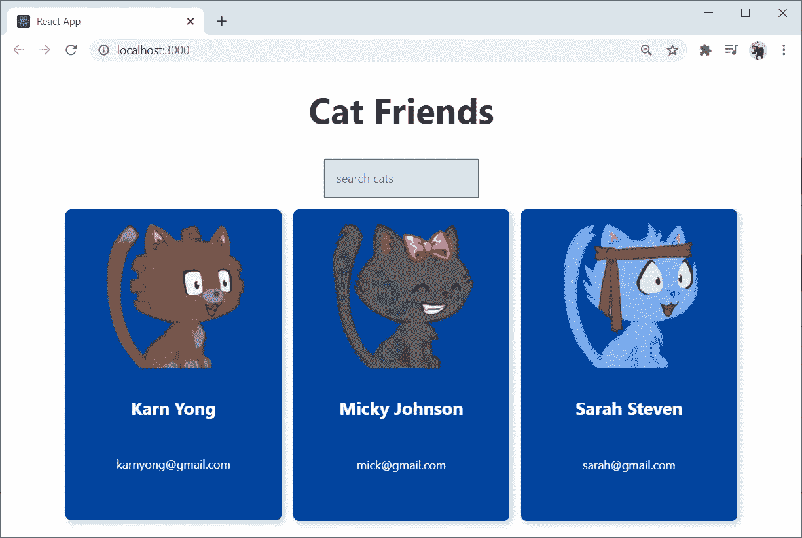

*文章作者 Karn Yongsiriwit 博士
兰西大学数字创新技术学院*