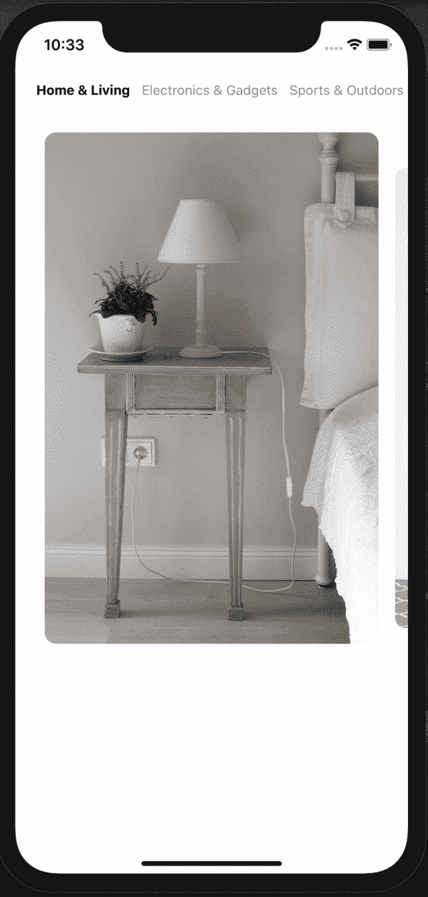

# 在 React Native 中创建选项卡式转盘

> 原文：<https://javascript.plainenglish.io/creating-a-tabbed-carousel-in-react-native-335acd4e3ca0?source=collection_archive---------9----------------------->

为了理解我想要构建什么，首先，让我们来看看演示:

正如您从 gif 中看到的，我们有两个部分来构建这个组件:

*   选项卡(您可以在顶部看到)
*   旋转木马

我们需要确保选项卡和轮播项目是同步的。这意味着，如果我们在项目中滑动并找到不同类别的项目，我们还需要激活与项目类别匹配的选项卡。让我们开始构建这个组件。

对于顶部的选项卡，我只是使用水平平面列表，对于转盘，我使用[react-native-snap-carouse](https://github.com/meliorence/react-native-snap-carousel)l 包。让我们看看我是如何解决这个问题的。

因此，有了这个 init，我们无需任何同步就可以获得标签和转盘。

如果我们检查下面的 gif，我们会看到，当我们更改转盘的索引并转到不同类别的产品时，我们也会通过更改不透明度来激活相同的类别选项卡，同时，您会注意到选项卡在我们的水平列表中居中。因为如果我们不使它居中，在屏幕宽度之外的标签就不会进入我们的屏幕，用户也不会注意到活动的标签。

我正在粘贴做这项工作的片段

好了，到目前为止，我们已经看到了当我们在传送带上滑动我们的项目时如何改变标签。现在让我们看看，当用户按下标签时，我们如何滚动到正确的项目。

原来如此！我们需要跟踪我们的活动标签，并同步标签和传送带在一起。