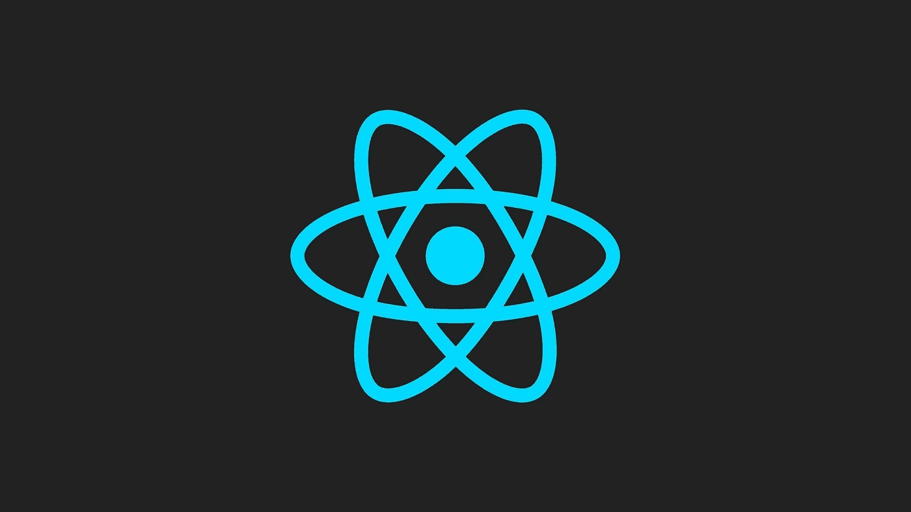
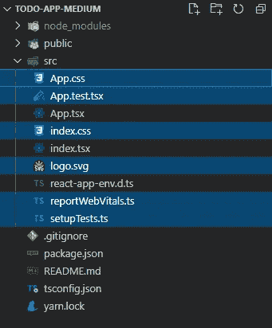
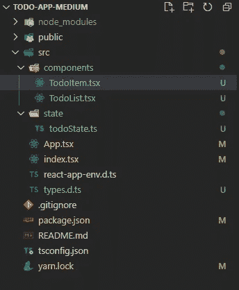

# 用 React、反冲和打字稿创建一个待办事项应用程序

> 原文：<https://javascript.plainenglish.io/creating-a-todo-app-using-recoil-and-typescript-25ca5e1b7669?source=collection_archive---------0----------------------->



# 首先，关于后座力

反冲是一个由脸书开发的状态管理库，最初由脸书自己使用，但现在开放源代码。根据它的官方网站，[recoiljs.org](https://recoiljs.org/)，这是它的 3 个显著特点:

1.  *最小和反应式*:使用灵活的、共享的类似反应式的状态。
2.  *数据流图*:“纯函数和高效订阅驯服了派生数据和异步查询。”
3.  *跨应用观察*:“在不影响代码拆分的情况下，通过观察应用的所有状态变化，实现持久性、路由、时间旅行调试或撤销。”

你可以在这里看一下它的文档[。](https://recoiljs.org/docs/introduction/getting-started)

# 给我看看代码！

让我们开始构建应用程序。我们将使用`create-react-app`。如果已经安装了节点模块，请在终端中运行以下命令:

`create-react-app todo-with-recoil --template typescript`

或者，如果您希望它在您自己的项目目录中，运行:

`create-react-app . --template typescript`

如果没有，使用`npx`:

`npx create-react-app todo-with-recoil --template typescript`

如果我们没有错误，我们就可以走了。首先，我们必须删除所有不必要的文件和文件夹。应该删除选定的文件(不要忘记也删除它们的导入！):



Files to delete (optional)

现在，是时候安装后坐力了。

在您的终端中，如果您喜欢使用纱线，运行`npm i --save recoil`或`yarn add recoil`。

# 创建组件

首先，从`App.tsx`组件中删除`return`语句，并将其替换为`return null`。我们一会儿将使用这个组件。

在 Typescript 中有一种常见的做法，即您必须先定义自己的类型，然后才能开始处理真正的应用程序。为此，在您的`src`目录中创建一个`types.d.ts`文件。从填这个开始:

```
// types.d.tsexport interface TodoContent {
    id: string;
    title: string;
    description: string;
}
```

现在在`src`目录下创建一个名为“components”的新文件夹。这里是创建所有 Todo 组件的地方。在这个文件夹中创建一个名为`TodoItem.tsx`的新文件。我们将像这样初始化它:

```
// TodoItem.tsximport { TodoContent } from "../types";export function TodoItem(props: TodoContent) {
    return <div></div>;
}
```

在同一个文件夹中创建另一个名为`TodoList.tsx`的文件，并将其初始化如下:

```
export function TodoList() {
    return <div></div>;
}
```

是我们开始创造反冲状态的时候了。

# 最后，一些国家

转到你的`index.tsx`文件，将你的`App`组件包装在`RecoilRoot`组件中。

```
import ReactDOM from "react-dom";
import App from "./App";
import { RecoilRoot } from "recoil";ReactDOM.render(
    <React.StrictMode>
        **<RecoilRoot>**
            <App />
        **</RecoilRoot>**
    </React.StrictMode>,
    document.getElementById("root")
);
```

在您的`src`目录中，创建一个新的文件夹“state”并添加一个新文件`todoState.ts`。

在反冲中，我们使用一个叫做`atom`的函数来定义状态。它是这样的:

```
// todoState.tsimport { atom } from "recoil";
import { TodoContent } from "../types";export const todoContentState = atom<TodoContent[]>({
    key: "todoContents",
    default: [],
});
```

`key`是`todoContentState` 的唯一标识符，默认只是默认状态。使用 TypeScript，您还可以在尖括号之间添加状态类型。

继续并添加以下内容:

```
// todoState.ts...export const todoCompleteState = atomFamily<boolean, string>({
    key: "todoCompleteState",
    default: false,
});
```

`atomFamily`返回一个函数，向该函数传递一个唯一的标识，为您的组件启用一个唯一的状态。

这部分状态是针对每个单独的 Todo 项目的；它不需要通过传递道具来喂养或更新，所以通过防止不必要的重新渲染来显著提高性能。我们存储静态数据(不太可能在单一状态下发生变化的数据，如`todoContentState`)。让我们通过编辑我们的`TodoItem`组件来看看这个动作。

```
// TodoItem.tsximport { useRecoilState, useSetRecoilState } from "recoil";
import { todoCompleteState, todoContentState } from "../state/todoState";
import { TodoContent } from "../types";export function TodoItem(props: TodoContent) {
    const { description, title, id } = props;
    const [isComplete, setIsComplete] =
        useRecoilState(todoCompleteState(props.id));
    const setTodos = useSetRecoilState(todoContentState); const toggleComplete = () => setIsComplete(prevState =>
        !prevState); const deleteTodo = () => setTodos(todos => todos.filter(todo =>
        todo.id !== id)); return (
        <div>
            <h2>{title}</h2>
            {description && <p>{description}</p>}
            <div>
                <button onClick={toggleComplete}>
                   {isComplete ? "Not complete" : "Complete"}
                </button>
                <button onClick={deleteTodo}>Delete</button>
            </div>
       </div>
    );
}
```

注意使用钩子`useRecoilState`获取该 ID 特有的状态**。所以，当我们改变反冲状态时，这只会导致**这个组件**重新渲染。出现这种情况的另一个原因是，子组件的状态没有存储在父组件的状态中。**

**在我们继续之前，您的项目目录应该如下所示:**

****

**Updated project directory**

**我们现在可以将反冲状态添加到我们的`TodoList`组件中，这将渲染所有的待办事项。**

```
// TodoList.tsximport { useRecoilValue } from "recoil";
import { todoContentState } from "../state/todoState";
import { TodoItem } from "./TodoItem";export function TodoList() {
    const todos = useRecoilValue(todoContentState); return (
        <div>
            {todos.map(todoProps => (
                <TodoItem {...todoProps}
                 key={todoProps.id}
                />
            ))}
        </div>
    );
}
```

**现在，客户端需要一个组件来实际添加待办事项。我们在名为`AddTodo.tsx`的文件中创建了一个名为`AddTodo`的新组件。在此之前，我们必须安装一个名为`nanoid`的 JS 模块来帮助为每个任务生成唯一的 id。**

**`npm i nanoid`或`yarn add nanoid`。**

**您的组件应该是这样的:**

```
import { 
    ChangeEventHandler, 
    FormEventHandler, 
    useState 
} from "react";
import { useSetRecoilState } from "recoil";
import { todoContentState } from "../state/todoState";
import { nanoid } from "nanoid";
import { TodoContent } from "../types";export function AddTodo() {
    const [content, setContent] = useState<Omit<TodoContent, "id">>
        ({ description: "", title: "" }); const handleChange: ChangeEventHandler<HTMLInputElement> = e =>
        setContent(prev => ({ ...prev, [e.target.id]: e.target.value 
    })); const setTodos = useSetRecoilState(todoContentState); const addTodo: FormEventHandler<HTMLFormElement> = e => {
        e.preventDefault();
        setTodos(todos => [...todos, { ...content, id: nanoid() }]);
}; return (
        <form onSubmit={addTodo}>
            <input onChange={handleChange} value={content.title} 
            id="title" required />
            <input onChange={handleChange}
            value={content.description} id="description" />
            <button type="submit" disabled={!content.title}>
                Add Todo
            </button>
        </form>
    );
}
```

# **最终汇编**

**所有必需的组件现在都已构建完毕。是时候将它们添加到`App`组件中了。**

```
// App.tsximport { AddTodo } from "./components/AddTodo";
import { TodoList } from "./components/TodoList";const App = () => {
    return (
        <div>
            <AddTodo />
            <TodoList />
        </div>
     );
};export default App;
```

**应用程序已完成。耶！**

**很快，我也会在更新中添加 GitHub repo 链接。**

***GitHub Repo:*[*https://github.com/krishna-kapoor/todo-app-medium-1.git*](https://github.com/theruler007/todo-app-medium-1.git)**

**谢谢你阅读这篇文章。**