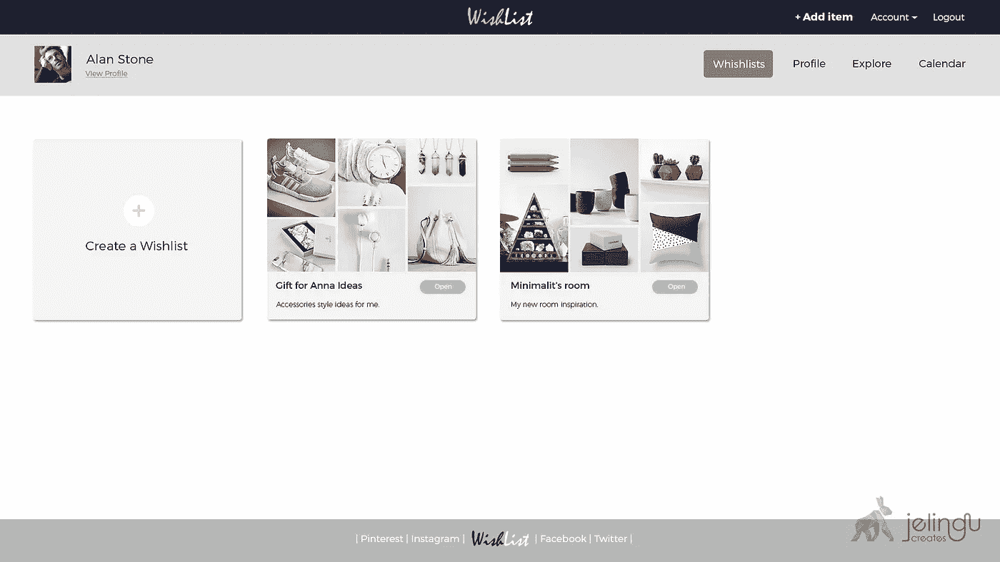
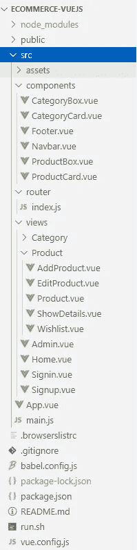
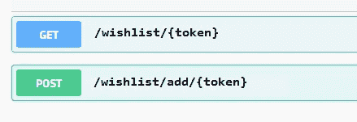
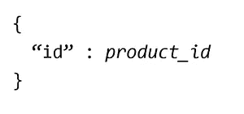
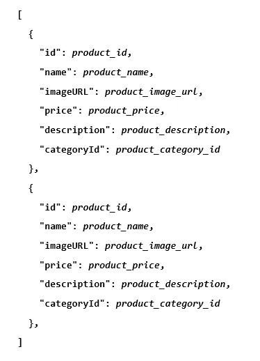
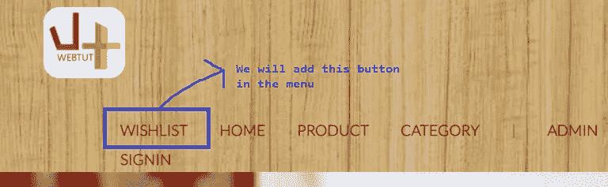
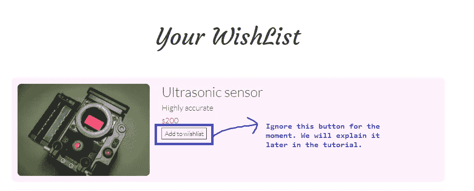
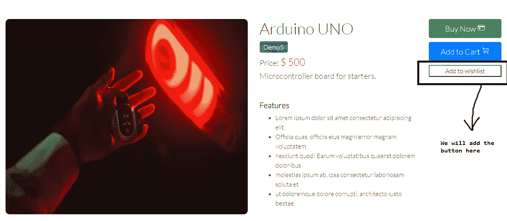
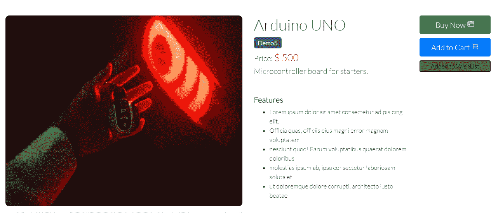
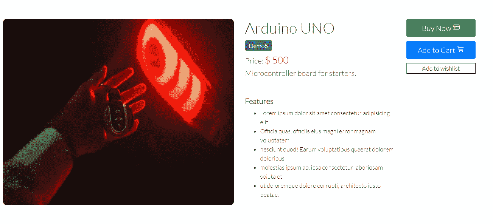

# 用 Vue.js 创建电子商务前端

> 原文：<https://javascript.plainenglish.io/creating-an-ecommerce-frontend-with-vue-js-71d7fc1ee756?source=collection_archive---------7----------------------->

## 第 3 部分:为电子商务应用程序创建愿望列表特性

在[之前的教程](https://nilmadhab.medium.com/1402c0b6f1e8)中，我们将 Wishlist API 添加到了我们的 Spring Boot 后端。现在，让我们学习如何在我们的前端使用这个 API。

# 现场演示

可以看到 Wishlist API(集成了 Vue。Js) **直播**在下面提到的链接。点击主菜单中的愿望列表选项后，您将能够体验此功能。

 [## Webtutsplus 电子商务应用程序

作者:remotedevs.org](http://remotedevs.org:8000/Signin) 

# 先决条件

1.  关于 Vue 的知识。Js & Vue。Js CLI
2.  Java Script 语言
3.  代码编辑器(类似于 Microsoft 可视代码)
4.  一个好的浏览器(比如谷歌浏览器)

本教程是我们与 Vue.js/Javascript**的 [**前端系列的一部分。**我们将**扩展我们在本系列之前的教程**中开发的代码。因此，如果您对我们之前开发的任何东西有任何疑问，您可以在本系列的相应教程中阅读。](https://nilmadhab.medium.com/)**

# 项目结构

如果您还没有阅读我们的**Vue 前端中的先前教程。Js** 系列，不用担心。这部分是专门为你准备的。由于我们将使用我们在之前的教程中创建的项目结构，因此我们打算在开始使用意愿列表功能之前在这里描述该结构。这将有助于你更好地理解代码。

以下是项目结构:

Project Structure

我们现在将描述以下目录:-

*   **public** —包含我们项目的主 HTML 文件
*   **src/assets** —存储图像、徽标等媒体文件。
*   **src/components** —存储我们项目的所有可重用组件。这些组件并不是某些特定路线所独有的。
*   **src/router** —包含 index.js 文件，该文件记录了所有的路由
*   **src/views** —存储所有路由器组件。这些是按照当前路线渲染的组件。

除此之外，我们还有一些重要的文件

*   App.vue 是我们项目的根组件
*   这是我们项目的起点。这里我们导入我们的根组件 **App.vue** ，我们的路由器文件 **index.js，**和 **createApp** 方法。之后，我们使用下面的语句将根组件挂载到 DOM:

# API 设计

在[之前的教程](https://nilmadhab.medium.com/1402c0b6f1e8)中，我们为我们的后端设计了愿望列表 API。您可以使用下面的 Swagger 链接来尝试这个 API。

 [## Swagger UI

### 意愿列表 API

remotedevs.org](http://remotedevs.org:8080/api/swagger-ui.html#/wish-list-controller) 

如果你没有读过前面的教程，不要担心。我们现在将描述这个 API，这样当我们在前端使用这个 API 时，您会感觉很舒服。

以下是 API 端点

1.  获取愿望清单
2.  将产品添加到愿望清单

**注意:**要使用 API，我们必须传递一个**令牌，而不是用户 Id** 。这是因为我们在电子商务应用程序中集成了基于令牌的身份验证。用户一登录，令牌就会自动创建并发送到前端。

此外，在 POST 方法的主体中，我们必须发送产品的 id，以便给定的产品可以添加到相应用户的愿望列表中。因此，POST 请求的主体应该如下所示

Body of POST Request

现在，POST 请求的响应应该发送 wishlist 中所有产品的**列表以及必要的详细信息。因此，响应应该如下所示**

Response of the POST request

# 前端设计

在我们开始写代码之前，对我们要做的事情有一个清晰的认识是非常重要的。所以，我们来讨论一下这个。

让我们首先讨论**访问愿望列表。**

*   我们将在主页上添加一个愿望列表按钮，这样每个人都可以方便地访问愿望列表

Home Page

*   如果用户尚未登录，那么点击**愿望列表按钮**会将他们带到**登录**页面。
*   如果用户已经登录，那么点击意愿列表按钮会将用户重定向到用户可以看到意愿列表的页面。

Wish List page

现在，让我们讨论将产品添加到愿望清单中

*   当用户打开**产品页面时，**用户可以看到所有的产品。现在，如果用户点击产品，就会出现一个产品描述页面。在本页中，我们将在`Add to Cart`按钮下方添加**添加至愿望列表**按钮。

*   当用户点击**添加到意愿列表**按钮时，该按钮应使**变成绿色**并显示**已添加到意愿列表**

**注意:-** 为了简单起见，我们不打算处理以下问题:-

1.  在用户点击上面显示的产品详情页面上的**添加到意愿列表按钮**后，该特定产品被添加到意愿列表中，按钮变为绿色。这没问题。
2.  但现在如果用户重新加载页面，**绿色按钮会变回原来的按钮。这是因为我们无法知道该产品是否已经出现在愿望清单中。**

如果你不明白上述问题，不要担心。等你开始用前端的时候就明白了。

# 让我们编码

我们现在将开始编写代码。

# 创建愿望列表页面

让我们从创建愿望列表页面开始，用户可以在其中看到添加到他的愿望列表中的所有产品。很简单。

*   在`views/Product`目录下创建一个名为`Wishlist.vue`的新文件。
*   我们已经在`views/Product`目录中有了`Products.vue`，展示了所有的产品。因为，在本系列的上一个教程中，我们已经学习了如何开发这个页面，所以我们将使用这个页面的代码，并对其进行一些更改。所以复制&粘贴完整代码`Products.vue`并粘贴到`Wishist.vue`
*   将`products`从`props`数组中移除，因为我们将使用 Wishlist API 获取产品。在数据方法中定义变量`products : null`。在我们从 API 中获取产品后，我们将把它存储在这个变量中
*   要使用 API，我们首先需要在登录期间将令牌发放给用户并存储在本地存储中(我们在本系列的早期教程中实现了该功能)。我们可以使用`mounted()`方法从本地存储器中获取令牌。另外，在数据方法中创建一个变量`token:null`。我们将把令牌存储在这个变量中
*   `Wishlist.vue`至本阶段代码如下。

*   最后一步—现在是从 API 获取产品的时候了。我们将使用`axios`库向 API 发送请求。我们将创建一个名为 fetchWishlist()的方法，并在挂载的()方法中调用它，这样一旦页面被加载，产品就会被自动获取。
*   以下是 Wishlist.vue 的完整代码

# **在首页**增加 `**WishList**` **按钮**

现在让我们将愿望列表按钮添加到导航栏的菜单中。

在此之前，我们先创建一条通往愿望列表页面的路线。从`router/`目录打开`index.js`文件。将`Wishlist.vue`导入为`Wishlist`，然后创建一条到达终点愿望列表的路线。以下是添加 Wishlist 路由后 index.js 的代码

现在，让我们将愿望列表按钮添加到导航栏菜单中。为此，我们将使用 Vue.Js 的`<router-link>`元素。我们将对`components`目录中的文件`Navbar.vue`进行修改。

正如我们之前所讨论的，如果用户没有登录，点击菜单中的愿望列表选项时，他应该被重定向到登录页面。

以下是添加愿望列表按钮后`Navbar.vue`的代码。

您现在应该会看到下面的导航栏。

# **添加至心愿单**按钮

现在，让我们为每个产品添加`Add to Wishlist`按钮。此外，如果产品已成功添加至愿望清单，此按钮将变为绿色并显示`Added to Wishlist`。

我们将修改`views/product`目录中的`ShowDetails.vue`文件。

*   我们将用属性`background-color:green`创建一个 CSS 类。我们还将定义一个布尔变量`isAddedToWishlist`并使用这个变量改变颜色。
*   我们将在数据属性中定义一个新变量`wishlistString:”Add to wishlist”`
*   我们将在 methods 属性中定义一个新方法`addToWishList(product.id)`,向 API 发送 POST 请求，将产品添加到用户的愿望列表中。当用户单击按钮时，将调用此方法。
*   我们将用以下属性在模板中定义一个按钮`:class=”{product_added_wishlist: isAddedToWishlist}”`、`@click=”addToWishList(product.id)”`。我们将在按钮中显示由变量`{{wishlistString}}`定义的字符串
*   以下是`ShowDetails.vue`的完整代码

以下内容将出现在产品详情页面上。您将在“添加到购物车”按钮下方看到“添加到愿望清单”按钮。

# **恭喜**

现在，您已经成功地在 Vue 中添加了愿望列表功能。Js 前端

# 通过贡献学习

如果你想为我们的电子商务做出贡献。Js 前端，你克隆 [**这个**](https://github.com/webtutsplus/ecommerce-vuejs) Github 库，并处理以下与 wishlist 相关的特性

*   目前，如果用户在将产品添加到意愿列表后重新加载页面，绿色按钮消失，灰色的`Add to Wishlist`按钮再次出现。尝试解决这个问题，即使在重新加载页面后，按钮仍然保持绿色，表明该产品已经在愿望清单上。

在您实现该功能后，请发送给我们一份 PR。我们将审查并将其合并到我们的主分支中