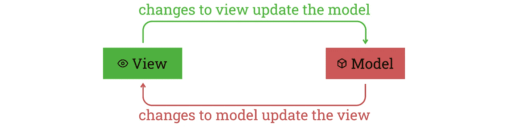

# 用 Vue.js 创建电子商务前端

> 原文：<https://javascript.plainenglish.io/creating-an-ecommerce-frontend-with-vue-js-c64481a65941?source=collection_archive---------5----------------------->

## 第 2 部分:电子商务应用程序的注册和登录

我们现在将使用 Vue 在每个电子商务网站中创建一个非常重要的功能的前端— **登录&注册**。射流研究…


Photo by [Micah Williams](https://unsplash.com/@mr_williams_photography?utm_source=medium&utm_medium=referral) on [Unsplash](https://unsplash.com?utm_source=medium&utm_medium=referral)

在[之前的教程](https://medium.com/javarevisited/a-simple-user-authentication-api-made-with-spring-boot-4a7135ff1eca)中，我们将&注册 API 添加到我们的 Spring Boot 后端。现在，让我们学习如何在我们的前端使用这个 API。

# 现场演示

您可以看到登录和注册 API(与 Vue 集成。Js) **直播**在下面提到的链接。如果您点击按钮— **登录或注册**，您将能够体验这一功能。

 [## Webtutsplus 电子商务应用程序

作者:remotedevs.org](http://remotedevs.org:8000/Signin) 

# **后端教程**

[](https://medium.com/javarevisited/lets-build-signup-signin-and-role-based-access-in-our-e-commerce-app-f499a4b71f48) [## 让我们在电子商务应用程序中构建注册、登录和基于角色的访问

### 在本文中，我们将实现基本的注册和登录功能。

medium.com](https://medium.com/javarevisited/lets-build-signup-signin-and-role-based-access-in-our-e-commerce-app-f499a4b71f48) 

# 先决条件

1.  关于 Vue 的知识。Js & Vue。Js CLI
2.  Java Script 语言
3.  代码编辑器(类似于带有 [Veture](https://marketplace.visualstudio.com/items?itemName=octref.vetur) 扩展的微软可视代码)
4.  一个好的浏览器(比如谷歌浏览器)

本教程是我们系列的一部分——[**前端与 Vue.js/Javascript**](https://nilmadhab.medium.com/)**。**我们将**扩展我们在本系列之前的教程**中开发的代码。因此，如果您对我们之前开发的任何东西有任何疑问，您可以在本系列的相应教程中阅读。

[](https://medium.com/javarevisited/lets-develop-an-ecommerce-application-from-scratch-using-java-and-spring-6dfac6ce5a9f) [## 让我们使用 Java 和 Spring 从头开始开发一个电子商务应用程序

### 我们将使用 Java、Spring backend 从头开始构建一个电子商务应用程序，在 Vue.js 中构建 web UI，以及…

medium.com](https://medium.com/javarevisited/lets-develop-an-ecommerce-application-from-scratch-using-java-and-spring-6dfac6ce5a9f) 

由于本教程是基于我们到目前为止所做的工作，建议也浏览下面的教程。

[](https://medium.com/javascript-in-plain-english/lets-create-vue-js-frontend-for-products-in-our-e-commerce-app-14cc8c3459c8) [## 让我们用 Vue 为我们的电子商务应用程序添加产品。射流研究…

### 我们正在从头开始构建一个完整的电子商务应用程序。今天，我们将添加产品功能。

medium.com](https://medium.com/javascript-in-plain-english/lets-create-vue-js-frontend-for-products-in-our-e-commerce-app-14cc8c3459c8) [](https://medium.com/javascript-in-plain-english/lets-link-product-with-category-for-our-ecommerce-app-28100657a848) [## 让我们将电子商务应用程序的产品与类别联系起来

### 我们将创建一个 Vue.js 应用程序来显示我们的产品和类别。

medium.com](https://medium.com/javascript-in-plain-english/lets-link-product-with-category-for-our-ecommerce-app-28100657a848) 

# 项目结构

产品和类别页面已经在我们的电子商务前端使用`Vue.Js 3`框架开发。到目前为止，我们有以下项目结构和前端设计。


Project structure and frontend design so far

我们现在将描述以下目录:-

*   **public**——包含我们项目的主 HTML 文件
*   **src/assets** —存储图像、徽标等媒体文件。
*   **src/components** —存储我们项目的所有可重用组件。这些组件并不是某些特定路线所独有的。
*   **src/router** —包含 index.js 文件，该文件记录了所有的路由
*   **src/views** —存储所有路由器组件。这些是按照当前路线渲染的组件。

除此之外，我们还有一些重要的文件

*   App.vue —它是我们项目的根组件
*   **main.js** —是我们项目的起点。这里我们导入我们的根组件 **App.vue** ，我们的路由器文件 **index.js** 和 **createApp** 方法。之后，我们使用下面的语句将根组件挂载到 DOM:

# API 设计

在之前的教程中，我们为我们的后端设计了愿望列表 API。您可以使用下面的 Swagger 链接来尝试这个 API。

 [## Swagger UI

### 意愿列表 API

remotedevs.org](http://remotedevs.org:8080/api/swagger-ui.html#/wish-list-controller) 

如果你没有读过前面的教程，不要担心。我们现在将描述这个 API，这样当我们在前端使用这个 API 时，您会感觉很舒服。

以下是 API 端点

1.  获取所有用户的列表
2.  使用用户名和密码登录
3.  注册并创建用户名和密码


我们将只为我们的应用程序使用登录和注册 API。现在让我们讨论两个 POST 请求的主体和响应:-

# **张贴签到**

车身 **:**


Body of SIGN IN API

回复:


Response of SIGN IN API

*   请注意，响应返回一个令牌。我们必须将这个令牌保存到一个 gobal 对象中，因为其他 API 端点(如 Wishlist API 端点)可能会使用这个令牌来识别用户。

# **岗位报名**

正文:


Body of Sign Up API

回应:


Response of Sign Up API

# 前端设计

在我们开始写代码之前，对我们要做的事情有一个清晰的认识是非常重要的。所以，我们来讨论一下这个。

*   我们将创建单独的注册、登录和管理页面。
*   管理页面将仅限于登录的用户。如果有人试图在未登录系统的情况下访问管理页面，他/她将被重定向回登录页面。
*   为了方便访问管理和登录页面，我们将在顶部导航栏中放置两个链接。


NavBar

*   此外，我们将通过在每个页面的底部放置一个链接来将登录和注册页面相互链接起来。


Sign In Page


Sign Up Page

# 让我们编码

我们现在将开始编写代码。

# 让我们创建所需的组件

即使我们可以手动创建 Vue.js 组件，使用组件生成器也很容易。我们将使用名为`vue-generate-component`的包来生成 Vue.js 组件。用下面的命令安装`vue-generate-component`包。

```
npm install -g vue-generate-component
```

安装完`vue-generate-component`包后，生成注册、登录和管理页面的三个组件。我们将使用带有`-s`标志的`vgc`命令来生成 Vue 单文件组件(SFC)。

```
cd src/views
vgc -s Admin
vgc -s Signup
vgc -s Signin
```

现在，您将在`views`文件夹下获得三个空白的 Vue 组件文件，其中包含类似如下的代码块。

# 让他们容易接近！

一旦我们创建了组件，您需要通过为每个组件创建路由来使它们可访问。打开`src/router/index.js`文件，在`routes`数组下添加以下路线。

通过从项目文件夹的根目录执行下面的命令或者点击`NPM SCRIPTS`下`serve`命令前面的小运行按钮来启动开发服务器。

```
npm run serve
```


Run npm scripts from the VS Code GUI

现在，您应该能够使用以下 URL 导航到我们在上一步中创建的组件。

```
[http://localhost:8080/signin](http://localhost:8080/signin)
[http://localhost:8080/signup](http://localhost:8080/signup)
[http://localhost:8080/admin](http://localhost:8080/admin)
```

# 允许用户通过注册表单自行注册

让我们先从报名表开始。现在我们每个页面都有空白组件。让我们首先设计我们的注册页面。它将包含一个用户注册的必填字段的表单。按照下面的代码块修改您的`Signup.vue`组件。

由于我们在应用程序中使用了[引导](https://getbootstrap.com/)，这将使用默认的引导样式进行渲染。每个表单元素中的`required`属性将在提交表单之前触发 HTML5 表单验证。

注意，我们已经在组件中定义了数据，并使用`v-model`指令将每个表单字段链接到相应的数据字段。`v-model`指令用于创建双向数据绑定。

## 哦，等等，什么是双向数据绑定？

*   这意味着视图元素(如输入框、文本区域和复选框)中的任何数据更改都应该立即反映在底层模型中(一个带有数据字段的普通 JavaScript 对象，您也可以将其视为一个变量)。
*   反之亦然，即模型中的任何数据更改都会立即传播到匹配的视图中。
*   简而言之，每当应用程序数据改变时，UI 也会改变，反之亦然。



Two-way data binding in Vue.js

好了，我们回到教程。现在，如果我们运行应用程序并导航到[http://localhost:8080/sign up](http://localhost:8080/signup)，您将会看到一个类似于下面的 UI。


Signup page UI design

既然我们已经制作了表单，我们需要将它的数据提交给服务器。为此，我们必须调用`/user/signup`后端 API，将数据填入 UI。当用户点击“注册”按钮时，我们将调用 API(即提交表单)。

在用户点击注册按钮后，它将使用确认密码字段验证密码，如果值相等，则继续 API 调用。注册成功后，页面将被重定向到`Home`页面，并显示一条成功消息。

让我们添加一个单独的调用 API 的方法。如下修改`<script>`标签下的`methods`部分。

请注意以下几点:-

*   我们使用`axios`库来进行 API 调用。
*   `swal`是一个类似 JavaScript 的`alert`函数的函数。
*   调用`e.preventDefault()`函数是为了避免默认行为，即当用户点击“提交”按钮时提交表单并刷新页面。

现在，每当用户提交表单时，无论是通过单击“提交”按钮还是按“Enter”键，我们都必须调用这个函数。这可以通过向表单元素添加`v-on:submit`指令来实现，如下所示。

## **你说我们就用** `**v-on:submit**` **。不是吗？**

是的，当然。`@submit`是`v-on:submit`的简写。虽然`v-`前缀在我们的模板中为 Vue.js 特定的属性提供了一个可视的提示，但是对于一些常用的指令来说，它可能是冗长的。因此，Vue 为`v-on`和`v-bind`指令提供了特殊的快捷键，因为这些是最常用的指令。`@`代表`v-on`，而`:`代表`v-bind`。

现在我们可以填写表单并成功注册用户。但是正如你所看到的,`[http://remotedevs.org:8080/api/](http://remotedevs.org:8080/api/)`URL 的一部分被硬编码在组件中，并且可能在许多其他组件中重复出现。作为一个最佳实践，我们将把这个基本 URL 移动到一个公共的地方，这样就很容易修改它，以防将来 API 主机发生变化。

由于`App.vue`组件是所有其他组件的基础组件，让我们在该文件中定义我们的基础 URL。将下面的代码块添加到`App.vue`组件中，如果它还不存在的话。

然后我们可以将这个值绑定到`<router-view>`元素的一个属性。正如我们在前面的教程中提到的，根据路由器定义，这个`<router-view>`元素将被替换为相关的组件。因此，这个`baseURL`属性将在任何将被路由器替换的组件中可用。请注意，我们使用了`:`简写，而不是之前解释过的`v-bind`。

现在我们可以在我们的`Signup.vue`组件中使用这个属性。定义`Signup.vue`组件中的`props`以匹配上一步中的绑定值，并修改 URL 以使用该值。

现在我们的注册页面已经完成。让我们设计并实现登录功能。

# 允许用户登录应用程序

现在我们的注册页面已经启动并运行，让我们开始实现应用程序的登录页面。登录页面应该包含两个用于输入电子邮件和密码的输入字段。要创建 HTML 模板，请打开`Signin.vue`组件，并将其修改为以下代码块。

现在运行应用程序并导航到`[http://localhost:8080/signin](http://localhost:8080/signin)`。然后你会看到一个类似如下的 UI。


Signin page UI design

我们现在已经创建了用于登录的表单。现在，当用户点击“登录”按钮时，我们必须用登录数据调用`user/signIn`后端 API。如下修改`<script>`标签下的`method`部分，为其添加一个单独的方法。

注意:-

*   如果你不明白`localStorage.setItem()`的目的，不要担心。我们将在文章的后面解释它。

现在，每当用户提交表单时，都应该调用这个`sigin`函数。这可以通过向表单元素添加`v-on:submit`指令来实现，如下所示。现在，如果您在表单中填写正确的登录信息并点击“登录”按钮，您将会看到一个成功提示。

现在，如果您查看 signin API 调用响应主体，您将看到为每个成功的登录会话颁发了一个唯一的令牌。我们必须在后续调用中使用这个令牌来访问安全的 API 资源。这意味着我们必须将这个令牌存储在应用程序中的某个地方，以备后用。于是，这里就出现了**本地存储**的使用。

## 等等，什么是本地存储？

JavaScript 中有一个名为`localStorage`的实现，它允许 web 应用程序在 web 浏览器中保存数据，而没有任何过期时间。这意味着即使你关闭了浏览器，数据也不会被删除。`localStorage`是一个类似 map 的实现，允许保存键值对。

## 好了，让我们回到教程

一旦我们从 API 收到令牌，我们将使用`localStorage.setItem()`方法将它存储在`localStorage`中。然后用户应该被重定向回先前的路由器位置。这可以通过用下面的代码块替换登录成功警报来实现。

现在尝试从 UI 登录并检查 web 浏览器开发人员控制台的“应用程序”选项卡。你可以看到我们的`token`被保存到本地存储器。


Browse localStorage on browser developer console

登录页面现已基本完成。让我们再添加一个元素，一个装载旋转器！我们将添加一个旋转图标，它将在点击“登录”按钮时显示，并将在收到后端服务器的登录响应后消失。

修改“登录”按钮 HTML 代码、`signin`方法、`mounted()`函数和`style`部分如下。

当加载微调器开始调用后端 API 时，它的可见性将被设置为`true`。请注意，我们使用了`finally()`块来停止微调器，使用了`mounted()`方法来指定载入页面时微调器的默认行为。

# 我们做个禁区吧！—管理页面

现在，我们将添加一个管理页面，并将其仅限于登录的用户。使用以下代码块修改您的`Admin.vue`组件，以

在`mounted()`函数中，我们检查了登录时存储在`localStorage`中的`token`的值。现在，如果您试图在没有登录的情况下访问管理页面，您将被重定向到登录页面。使用`$router.push()`命令而不是`$router.replace()`方法将用户导航到登录页面。这将允许用户在登录系统后重定向回同一页面。

# 添加导航链接

我们几乎已经完成了电子商务应用程序中的注册和登录功能。让我们将导航链接添加到屏幕顶部的导航栏中。打开您的`Navbar.vue`文件并修改`template`，如下所示。

这将在顶部导航栏中添加“管理”和“登录”导航链接，如下所示。


Navigation links at the top navigation bar

# 让我们添加注销功能

好的，如你所见，我们的应用程序还缺少一个重要的特性。应该有登录后退出的方法。此外，登出链接应该只出现在登录后，并在同一时间登录链接应该隐藏。这可以通过在渲染`Navbar.vue`组件时检查`token`的存在来完成。

注意，我们已经定义了一个`signout()`方法，并将其绑定到“SIGNOUT”导航链接。我们正在从`localStorage`中移除`token`，这样用户将不再登录。

现在，尝试注销并重新登录。你会注意到那里有一个小 bug。登录系统后,“登录”链接不会立即被“注销”链接替换。您必须手动刷新页面。让我们来解决这个问题！。打开`App.vue`组件，修改如下代码块。

我们已经向导航组件添加了一个组件`key`，并定义了一个名为`refreshNav()`的方法来更改这个`key`。诀窍是改变组件的属性，以便在运行时重新加载组件。然后，一旦用户登录，就使用`Signin.vue`组件中的`signin()`方法调用该方法，如下面的代码块所示。

# 在注册和登录页面之间添加链接

现在，让我们在注册和登录页面中添加相互链接，以便用户可以轻松地在这些组件之间导航。为此，修改每页的`template`,如下所示。

上述代码将导致 UI 发生以下变化。


SignUp Page

# 恭喜

现在，您已经成功地在 Vue 中添加了愿望列表功能。Js 前端。这真是一项漫长而富有挑战性的任务。祝贺您完成教程。

完整的代码可以在这个 [*GitHub 资源库*](https://github.com/webtutsplus/ecommerce-vuejs/tree/master/src/views) 中找到