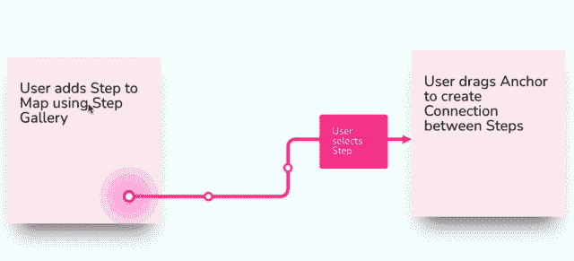

# 使用 React 在 Konva 中创建一个可编辑、可调整大小的文本标签

> 原文：<https://javascript.plainenglish.io/creating-an-editable-resizable-text-label-in-konva-with-react-8ab3a6b11dfb?source=collection_archive---------4----------------------->

An example of sticky notes and connection labels in Reciprocal.dev using the techniques to create editable and resizable text in Konva

在开发 [Reciprocal.dev](https://reciprocal.dev) 的过程中，很明显，对于大多数用户来说，用户旅程地图的构建模块不是一个屏幕模型，而是一个简单的便笺。

这种便笺允许用户快速记下用户旅程中的一个步骤，并将其移动到多个上下文区域，直到它适合正确的位置。一个模型需要更多的努力，有时必须做出重大改变，以适应着陆区域的其余步骤。

向应用程序添加一个便笺组件非常简单，它只是一个带有一些文本的矩形，但棘手的部分是如何使用户能够快速编辑文本，而不必填写表单来查看文本的更改。

允许编辑便笺的解决方案还需要扩展到其他组件，如连接标签，以便为编辑画布上的文本组件提供一致的 UX。

幸运的是 [Konva 文档中有一个演示，演示了如何创建可编辑和可调整大小的文本](https://konvajs.org/docs/sandbox/Editable_Text.html)，所以我不得不修改这些以在 react-konva 中工作，并将这两种方法合并到一个组件中。

## 使文本可编辑

制作可编辑文本的技巧是使用放置在画布文本上的 HTML 输入，然后从输入中删除样式，这样当用户键入时，就好像他们在直接更新画布文本一样。

`react-konva-utils`库有一个`Html`组件，允许在 Konva 画布上呈现 HTML，如果你在画布上提供它需要呈现的 X 和 Y 坐标。

在 HTML 中，我们可以呈现一个类似于 Konva docs 中的可编辑文本演示的`textarea`，但是为了让它看起来好像`textarea`实际上是画布上的文本，我们需要应用样式来隐藏默认的 UI 元素，这些元素泄露了它是一个`textarea`的事实。

我们还需要一种方法，允许用户退出编辑模式，回到画布上查看编辑文本。我的实现以两种方式做到了这一点；第一个是按照 konva 示例监听 return 和 escape 键，但是我还在舞台上设置了一个 onClick 事件，以便在文本区域之外单击会重置状态以显示不可编辑的文本。

The isEditing flag controls if the user sees the canvas Text or the textarea HTML input. When the stage is clicked the isEditing flag is set to false allowing the user to end editing by clicking outside the sticky note

## 调整文本大小

要实现的第二个行为是能够在文本没有被编辑时调整其大小。如果文本很长，这将允许用户改变文本的宽度，以便使其适合较小的空间。

这是通过使用一个`Transformer`组件实现的，该组件被配置为转换`Text`组件，但是被锁定为只允许在 X 轴上调整大小。

然后，转换器的回调在更高的组件级别更新文本的宽度和高度，以便画布文本、文本输入和可调整大小的文本获得新的尺寸。

The transformer is only applied when the text transform has been activated. This state is set at the higher component level and will become useful later

# 将两个动作合并成一个组件

我希望可编辑文本组件的 UX 是，单击可以调整文本的大小，双击可以编辑文本。

为了实现这一点，我创建了一个组件，它包装了上面详述的 *EditableTextInput* 和 *ResizableText* 组件，并根据用户执行的操作，使用状态来显示适当的组件。

非活动状态将显示作为 *ResizableText* 组件的一部分呈现的画布文本，因此单击只是切换该组件上的转换器。双击会将 *ResizableText* 组件换成 *EditableTextInpu* t 组件。

为了使包装器组件可重用，状态将不会在包装器内被跟踪，而是在父组件外部被跟踪，这样当状态改变时，它就可以控制如何呈现自己。

The wrapper component. It takes two flags; isEditing and isTransforming which are used to show the text input and transformer. These flags are tracked and updated in the parent component

使用 EditableText 包装器组件的组件需要跟踪编辑和转换状态，但也需要在点击阶段时更新这些状态，因此需要添加一个`useEffect`挂钩，以便在发生这种情况时更新这些标志。

An implementation of the EditableText within a component. The useEffect hook listens for changes to the selected flag and resets the editing/transforming state when the flag is set to false by a click on the stage

# 演示

您可以在我创建的允许编辑便笺的演示应用程序中找到可编辑&可调整大小文本的[示例实现。](https://codesandbox.io/s/react-konva-editable-resizable-text-55kyv?file=/src/StickyNote.jsx)

A demo of an editable and resizable text block. Illustrated using a sticky note-like component

# 结论

通过让用户在画布中编辑文本和调整文本大小，你可以给他们更多的交互体验，并且更好地控制他们正在编辑的文本元素如何适应他们正在工作的整个画布。

这种方法可以进一步发展，将用于可编辑文本的基本`textinput`替换为功能更丰富的编辑小部件，因为编辑功能是在画布上呈现的 HTML 块中呈现的。

*更多内容请看*[***plain English . io***](http://plainenglish.io)