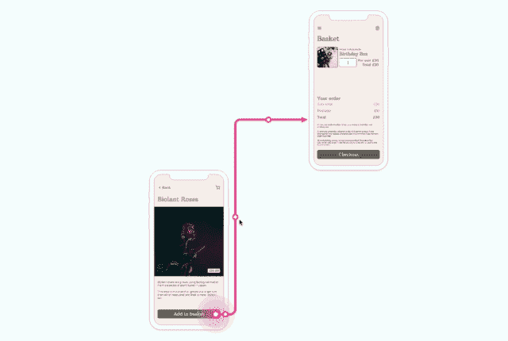
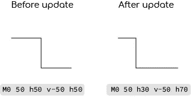
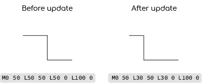

# 用 Konva 创建一个可编辑的 SVG 路径

> 原文：<https://javascript.plainenglish.io/creating-an-editable-svg-path-with-konva-db8adaa7bd71?source=collection_archive---------10----------------------->



An editable connection in Reciprocal.dev

我正在做的应用 [(Reciprocal.dev)](https://reciprocal.dev) 为用户提供了一个交互式的用户旅程地图，它本质上包含了许多由线条连接在一起的用户旅程步骤，类似于一个流程图。

在我的上一篇文章中，我提到了我是如何实现用户使用锚点和连接线预览将连接线从一个用户旅程步骤拖动到另一个步骤的功能的。如果你没有看过这篇文章，你可以在下面找到它:

[](/creating-connections-between-objects-with-konva-react-34eebb7c50a) [## 使用 Konva 和 React 创建对象之间的连接

### 在构建 Reciprocal.dev 时，我必须弄清楚如何允许用户通过拖动一个…

javascript.plainenglish.io](/creating-connections-between-objects-with-konva-react-34eebb7c50a) 

虽然用户旅程步骤之间的基本链接对于用户构建地图来说已经足够，但是某些旅程需要一种方法来创建可以在地图上的其他对象周围绘制的自定义线。

就像连接线预览受到 Miro 的启发一样，我对这个问题的解决方案也是如此，即 Miro 的阶梯线以及它如何具有控制点，这些控制点允许线的线段(我喜欢称这些为“边”)移动，并且可以通过移动线的起点和终点的控制来创建新的线段。

在研究如何实现这样一条线的时候，我真的很难找到任何关于如何创建一条阶梯线的资源，甚至是基于线的边缘而不是单个点来更新 SVG 路径的资源。既然如此，我希望这篇文章能帮助那些想做类似事情的人。

# 关于 SVG 路径

在深入介绍如何构建可编辑的步进线之前，我想先描述一下 SVG 路径是如何创建的，以及在找到适合我的技术之前我采用的不同方法。

SVG 路径是使用一系列命令创建的，这些命令告诉“笔”从哪里开始，移动到哪里以及如何结束画线。如果你像我一样 30 多岁，这有点类似于你在学校可能用过的海龟标志编程工具。

下面是不同命令的简短运行。值得注意的是，这些命令的小写和大写版本的行为不同，小写表示相对于当前位置执行命令，大写表示在绝对位置执行命令。

例如，命令`h50`将在当前位置右侧 50 像素处画一条线，但`H50`将在 X 轴上 50 处画一条线。

*   m-将笔移动到指定点
*   l-绘制一条到指定点的直线
*   h-水平绘制一条线
*   v-垂直绘制直线
*   c-绘制到特定点的曲线
*   s-绘制到特定点的“平滑”曲线
*   q-绘制到特定点的二次贝塞尔曲线
*   t-绘制到特定点的“平滑”二次贝塞尔曲线
*   a-绘制椭圆弧
*   z-通过返回到第一点来闭合路径

每个命令都有一组附加在命令后面的参数，比如`M10 10 h50 v50 h-50 Z`会画一个正方形。其中最复杂的是曲线命令(C，S，Q，T ),因为它们有许多参数。我发现关于 SVG 路径的 [MDN 教程是理解这些的救命稻草。](https://developer.mozilla.org/en-US/docs/Web/SVG/Tutorial/Paths)

## 犯了错误

我实现可编辑 SVG 路径的第一种方法是使用相对的水平线和垂直线，用二次贝塞尔曲线来画圆角。

我的想法是，因为我的线是“步进”的，所以没有对角线，所以当我移动一条边时，H 和 V 命令会更容易处理，我只需要获得移动的增量，并将其应用到相对轴的相邻线。



A before and after of how moving the middle edge of the line works when using horizontal and vertical path commands. Notice how the change needs to be removed from the one point and added to the other

虽然这对于移动线中的现有边很有效，但当我引入新边时，事情变得有点复杂，因为这实质上是将每条线翻转到另一个轴上以迎合新边。

## 线来救援

我将构建可编辑行的工作搁置了一段时间，以便给自己一些时间来进一步研究如何实现我的结果，正是在这段时间里，我找到了一个包含我想要的类似功能的工具，幸运的是，他们在 DOM 中使用了 SVG 而不是 canvas，所以我能够观察到 path 命令的更新，并看到哪些值发生了变化，因为我移动了一些东西并为我的解决方案调整了这种方法。

当我意识到使用绝对定位的 lineto ( `L`)命令意味着如果命令的来源改变了，线仍然会被画到那个特定的点时，这个重大突破就来了。这意味着我可以更新边，而不必重新计算所有相邻的点，只是那些直接连接到更新的边。



A before and after of how moving the middle edge of the line works when using line path commands. Notice how same value is used to update both points

因为路径是由线组成的，这意味着在线上创建新的边也很容易，因为它只需要在现有的点之间插入一个新的线命令。

# 使用边

当用户与线条交互时，他们不会移动单独的点，而是移动线条的边缘。因为它们与边缘相互作用，所以我们需要能够知道在我们的路径中有哪些边缘，以及这些边缘具有什么类型的行为。

在我的应用程序代码中，我使用了 SVG 路径命令的对象表示，所以我用一个对象代替了`L50 50`,它表示路径中的一个点，看起来像:

```
{
  command: 'L',
  x: 50,
  y: 50
}
```

然后我有一个这些对象的数组，允许我对路径进行计算。我仍然需要从这些数据中生成 SVG 路径数据字符串，以便呈现更新后的路径。

## 在线上寻找边缘

为了计算路径中的边，我们首先需要理解这些边是如何由一系列点形成的。因为我们正在创建一条阶梯线，这很容易计算，因为 X 轴或 Y 轴对于边来说是相同的，而另一个轴上是不同的。


Different edges of a line highlighted. The red and purple edges would have the behaviour to ‘extrude’ a new edge and the orange, yellow, green, azure and blue edges would update the position of the edge. The tips at either end would update the positions of the adjacent red and purple edges

为了计算不同的边，我们可以迭代并将点的列表缩减为存储轴(由点之间相同的 X 或 Y 值计算)和起点(当前索引处的点)和终点(列表中下一个索引处的点)的对象列表。

为了实现线的可挤出行为，我们需要检测不同类型的边缘。我们希望线条的第一个和最后一个边缘(我们称之为端点)的行为不同于那些在线条“内部”的边缘，因为拖动端点边缘应该创建一个新的边缘，而不仅仅是更新位置。

为了使代码更容易阅读，我为不同的点创建了两个单独的数组，但是你也可以使用一个带有附加属性的数组，该属性详细描述了拖动边缘应该具有的行为。

Calculating the draggable and extrudable edges along the path

## 向这些边添加控制点

现在我们知道了线条的边缘，我们需要给用户一些交互的东西(我称之为控制点),以便将线条更新为他们想要的任何形状。

一旦你有了一个边的数组，沿线添加控制点就相对容易了，因为你只需要知道边沿着哪个轴，并将控制点定位在该轴的中间(因为两点之间沿着另一个轴的位置是相同的)。

This function will put a control point in the middle of the edge

控制点就位后，我们需要确保用户只能沿着相反的轴拖动控制点(因此，如果边沿着 Y 轴，我们希望控制点沿着 X 轴移动)。这是使用拖动边界函数来完成的。

将拖动锁定到一个轴所需的`dragBoundFunc`类似于我在[上一篇文章中用于连接创建锚的。](/creating-connections-between-objects-with-konva-react-34eebb7c50a)对用户拖动的形状使用了一个`ref`，并使用`getAbsolutePosition`返回形状的位置，我们返回该位置以保持点的静态。然而，当我们想要沿着一个轴移动时，我们返回该轴的更新位置，并使用另一个轴的静态值。

This function will limit the dragging behaviour to only move along the axis opposite to the one that the edge is drawn along

为了在拖动时更新线条，我们向控制点添加了`onDragStart`、`onDragMove`和`onDragEnd`回调函数，其中`onDragMove`用于更新线条。

## 移动控制点时更新线

拖动控制点时，我们需要三种行为之一，具体取决于控制点沿线的位置:

*   如果控制点在线的末端，那么我们希望它更新它自身的位置和它相邻的点的位置，这样边就会移动，边的长度也会相应地改变
*   如果控制点在边的中间和线的末端，那么我们想要在尖端和这条边之间创建一条新的边，这样感觉就像拖动边已经“挤出”了一条新的边到线中
*   如果控制点在线的两端之间，那么我们希望它沿着相反的轴更新边缘的位置

以便确定`onDragMove`回调中控制点的行为。为了便于阅读，我绘制了四个带有回调的不同组件，但这可以用一个数组来完成，使用 edge 的 behaviour 属性来确定如何更新路径。

**更新移动尖端的末端边缘**

This function will find the point adjacent to the tip of the line and update it’s position as well as the tip itself

**挤压末端突起**

This function inserts the new edge into the path. It uses an activeDrag flag to track if the extrude has already happened as without this check a new edge would be created whenever the pointer moved

**更新中间边缘**

This function maps over the points in the line and updates the position of both points that make up the edge

一旦我们计算出新的路径，我们就在状态中更新路径，这将导致重新渲染点并更新用户看到的线。

# 演示

[我制作了一个小演示](https://codesandbox.io/s/magical-montalcini-7s553)，展示了我用来创建可编辑 SVG 路径的方法。拖动线上的一个控制点将允许您对其进行编辑。

Drag the control points on the line to update the path

# 结论

当球落到如何解决这个问题时，我真的很高兴，因为感觉上虽然有多个产品提供了这个功能，但几乎没有任何文档。

随着用户能够编辑 SVG 路径，使用 [Reciprocal.dev](https://reciprocal.dev) 创建的地图现在非常灵活，可以满足许多不同的地图需求，这使得 UX 改变路径变得简单易用。

*更多内容请看*[***plain English . io***](http://plainenglish.io)