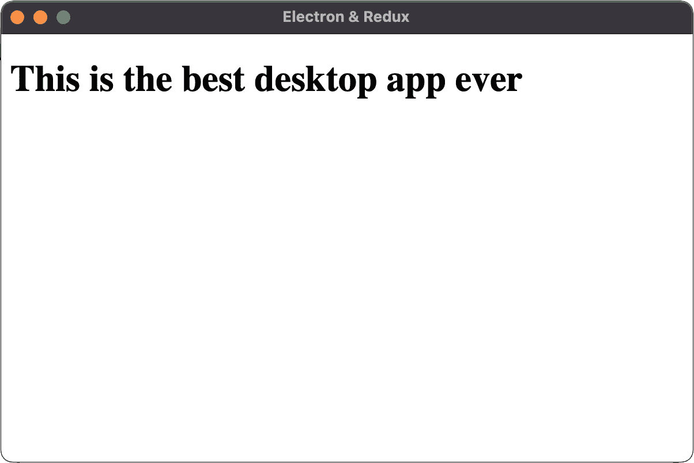
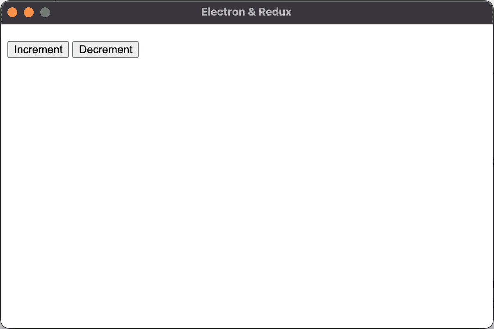
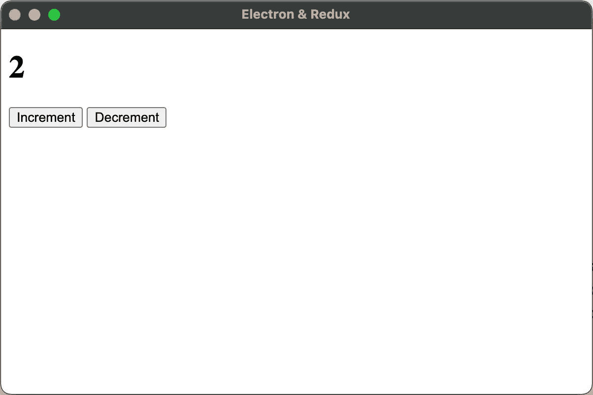

# 用 Redux Toolkit 创建电子应用程序

> 原文：<https://javascript.plainenglish.io/creating-an-electron-app-with-redux-toolkit-9f7e6a534aaa?source=collection_archive---------3----------------------->

## 在电子应用程序中创建 Redux 存储的简单指南


Photo by [Joshua Aragon](https://unsplash.com/@goshua13?utm_source=unsplash&utm_medium=referral&utm_content=creditCopyText) on [Unsplash](https://unsplash.com/s/photos/javascript?utm_source=unsplash&utm_medium=referral&utm_content=creditCopyText)

我一直在为我的顶点大学课程做最后的项目。我和我的团队决定使用 electronic 开发一个退休计划桌面应用程序。当我们开始处理不同的任务时，我们意识到我们没有适当的状态管理来处理不同的人和投资账户。对于这个任务，我们选择了 Redux

现在你可能会想，Redux 是不是有点大材小用了？嗯，这将是没有 Redux 工具包。vanilla Redux 所需的样板文件的数量可能使它不值得这样做。然而，在这个项目中使用它是一次很好的学习经历。Redux Toolkit 极大地简化了这个过程，使逻辑更容易理解。这也让我们专注于工具本身，而不是依赖于它。

事不宜迟，让我们看看如何在一个电子应用程序中实现 Redux Toolkit。

# 1.建立电子项目

您要做的第一件事是建立一个 Node.js 项目并安装 electronic。打开命令行并输入

```
npm init
```

完成设置过程以获得 package.json 文件设置，然后继续运行

```
npm install electron
```

在您最喜欢的代码编辑器中打开项目，我使用的是 Visual Studio 代码，并将 main.js 文件添加到您的根目录中。然后添加一个名为 src 的新文件夹。在里面创建一个名为 pages 的文件夹，并在其中创建 renderer.js 和 index.html。

# 创建电子窗口

我们要做的第一件事是打开 main.js。在这里，我们将定义我们的主要电子流程并创建一个窗口。将以下代码添加到 main.js 中

```
const { app, BrowserWindow } = require('electron')
const path = require('path')app.on('ready', () => {
  const window = new BrowserWindow({
    width: 600,
    height: 400,
    webPreferences: {
      nodeIntegration: true,
      contextIsolation: false
    }
  })
})
```

你可以随意改变窗口大小。您还需要注意 web 首选项部分。这对于让我们的 HTML 和 JavaScript 链接起来很重要。没有它，我们的渲染器文件将无法与 DOM 交互。

现在我们需要向 package.json 添加一个命令来启动我们的应用程序。打开来添加。

```
"start": "electron ."
```

脚本部分。现在，在命令行中运行`npm start`会给你一个空白窗口。

# 加载自定义 HTML 文件

让我们给我们的 index.html 添加一些代码，使我们的应用程序更令人兴奋。在本教程中，我们不会做任何花哨的 UI，所以我们的索引文件将非常简单。不过，我鼓励你添加一些样式，并对你的用户界面进行一些调整！

```
<!DOCTYPE html>
<html lang="en">
<head>
    <meta charset="UTF-8">
    <meta http-equiv="X-UA-Compatible" content="IE=edge">
    <meta name="viewport" content="width=device-width, initial-scale=1.0">
    <title>Electron & Redux</title>
</head>
<body>
    <h1>This is the best desktop app ever</h1>
</body>
</html>
```

为了让 Electron 使用我们的文件，我们需要在 main.js 文件中添加一点代码。在我们定义窗口的地方添加下面的代码块。

```
const index = path.join(__dirname, 'src/pages/index.html') window.loadFile(index)
    .then(() => {
      console.log('Window loaded successfully!')
    })
    .catch((e) => {
      console.error(`An error occurred! ${e}`)
    })
```

此时，运行 npm start 应该会显示我们的 H1 标记，如下图所示。



# 2.添加和配置 Redux 工具包

Redux Toolkit 消除了使用 Redux 的复杂性和样板文件。让我们继续将它添加到我们的项目中

```
npm install @reduxjs/toolkit
```

# 准备我们的用户界面

现在我们可以配置我们的商店了。我们将把它设置为一个简单的计数器应用程序。我们会在屏幕上显示一些数字，我们可以通过按键来增加或减少这些数字。

首先，让我们继续将这些控件添加到我们的 index.html 文件中。我们需要两个按钮和一些标题标签来保存我们的计数器值。

将以下内容添加到我们的 HTML 主体中

```
<body>
    <h1 id="counterValue"></h1>
    <button type="button" id="btnIncrement">Increment</button>
    <button type="button" id="btnDecrement">Decrement</button>
</body>
```

运行它，我们应该会看到这个屏幕



现在我们准备添加一些 Redux！

# 创建 Redux 工具包切片

在 src 文件夹中，创建一个名为 data 的新文件夹。在该目录下，创建一个名为 store.js 的文件和一个名为 slices 的新文件夹。在切片内，创建一个名为 counter.js 的文件。打开 counter.js 并添加以下代码:

```
const { createSlice } = require('@reduxjs/toolkit')const counter = createSlice({
  name: 'counter',
  initialState: {
    count: 0
  },
  reducers: {
    increment: (state) => {
      state.count += 1
    },
    decrement: (state) => { 
      state.count -= 1
    }
  }
})module.exports = counter
```

这里，我们创建了一个新的状态片，名为 counter，并将其初始状态设置为 count 值，我们将该值设置为 0。我们还声明了增量和减量减少器，它们将创建我们的新状态。

# 配置我们的商店

接下来，我们需要配置我们的商店。打开 store.js 并添加以下代码:

```
const { configureStore } = require('@reduxjs/toolkit')const counter = require('./slices/counter')const store = configureStore({
  reducer: {
    counter: counter.reducer
  }
})module.exports = store
```

在这里，我们将状态片添加到存储中。在这种情况下，Redux Toolkit 隐藏了我们动作的样板文件。在我们的计数器切片中，我们的动作是递增和递减。本质上，Redux Toolkit 为我们定义的 reducers 创建要调度的动作。

设置完成后，我们可以继续将新商店与我们的用户界面联系起来！

# 3.在我们的界面中使用我们的存储

我们需要在 HTML 页面中导入渲染器文件。为此，我们需要将以下代码添加到 index.html 文件的头部分，就在标题下面:

```
<script>require('./renderer.js')</script>
```

现在让我们打开 renderer.js，给它添加一些逻辑。我们需要将点击事件绑定到我们的按钮上，这样它们就可以分派相应的动作。我们还希望 h1 标签显示计数的当前状态。要做到这一点，我们需要导入商店并从我们的计数器片获取我们的操作。

```
const store = require('../data/store')
const counter = require('../data/slices/counter')const { increment, decrement } = counter.actions
```

有了这些，我们就可以为按钮点击添加逻辑了。

```
window.onload = () => {
  const counterValue = document.getElementById('counterValue')
  const btnIncrement = document.getElementById('btnIncrement')
  const btnDecrement = document.getElementById('btnDecrement') counterValue.innerHTML = store.getState().counter.count btnIncrement.addEventListener('click', e => {
    e.preventDefault()
    store.dispatch(
      increment()
    ) counterValue.innerHTML = store.getState().counter.count
  }) btnDecrement.addEventListener('click', e => {
    e.preventDefault()
    store.dispatch(
      decrement()
    ) counterValue.innerHTML = store.getState().counter.count
  })
}
```

在这里，当页面加载时，我们获取页面上的三个元素，并将 h1 标记设置为状态的当前值，当应用程序启动时，该值为 0。然后，我们将点击事件添加到我们的按钮中，每个按钮都分派它们相应的动作。然后，我们所做的就是再次将 h1 设置为状态的值，瞧！



一个电子 app 里的工作 Redux 商店！

# 结论

正如我在本文开头所说的，在我们的情况下使用 Redux 可能完全是矫枉过正。也就是说，在 React 的上下文之外选择使用它让我们专注于它背后的技术和推理，而不必担心任何与 React 相关的事情。在电子环境中使用它也很酷。

也就是说，我希望你能从这篇文章中学到一些东西。我鼓励你尝试一下，看看你还能用它做些什么。也许清理造型，添加更多的减速器，也许做一个成熟的计算器。作为一名开发人员，你有一种强大的能力，可以把什么都变成什么。

github:[https://github.com/BrockHerion/electron-redux/tree/master](https://github.com/BrockHerion/electron-redux/tree/master)

*更多内容尽在*[***plain English . io***](https://plainenglish.io/)