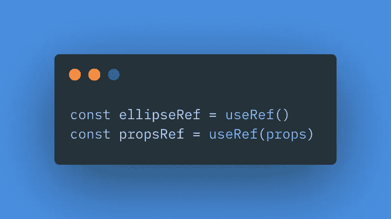

# 如何在 React-leaf v3 中用传单创建自定义图层组件？椭圆

> 原文：<https://javascript.plainenglish.io/creating-an-ellipse-in-react-leaflet-72e2c5beff03?source=collection_archive---------3----------------------->

如果您在地图应用程序中使用 [React-Leaflet](https://react-leaflet.js.org/) ，可能会有需要在地图上以[椭圆](http://wiki.gis.com/wiki/index.php/Ellipse)的形式显示数据的时候。 [Leaflet](https://leafletjs.com/index.html) 默认不提供椭圆标记，这意味着 React-Leaflet 也不提供。

在[传单文档](https://leafletjs.com/reference-1.7.1.html)的[传单插件章节](https://leafletjs.com/plugins.html)中，有一个插件叫做[传单。椭圆](https://github.com/jdfergason/Leaflet.Ellipse#leafletellipse)允许用户在普通传单应用程序中创建一个椭圆。但是，如何让这个插件与他们的 React-Leaflet 应用程序一起工作呢？答案是使用 [React 小叶核心 API](https://react-leaflet.js.org/docs/core-introduction) 。

核心 API 的目的是使 React-Leaflet 的内部逻辑可用，以便像我们这样的开发人员可以实现我们自己的自定义行为和第三方插件。为了更好地理解这个 API 是如何工作的，让我们通过创建我们自己的椭圆组件来扩展`Leaflet.Ellipse`以使用 React-Leaflet。

为了让事情变得简单，我在 Stack Blitz[上创建了一个 React-Leaflet 模板，这样你就不用担心设置问题了。如果你想在你的本地机器上编码，你可以按照 React-leaf](https://stackblitz.com/edit/devto-react-leaflet-ellipse?file=src/components/Map.jsx)[入门指南](https://react-leaflet.js.org/docs/start-introduction)开始。当你安装 React-Leaflet 时，也要安装`@react-leaflet/core`。

## 简单实现

现在，让我们把注意力集中在地图上的椭圆上。让我们在组件目录中创建一个名为`Ellipse.jsx`的新文件:

## Ellipse.jsx

首先，我们使用来自核心 API 的`[useLeafletContext](https://react-leaflet.js.org/docs/core-api#useleafletcontext)` [钩子](https://react-leaflet.js.org/docs/core-api#useleafletcontext)来访问由`Map.jsx`中的`[MapContainer](https://react-leaflet.js.org/docs/api-map#mapcontainer)` [组件](https://react-leaflet.js.org/docs/api-map#mapcontainer)创建的上下文。我们还将从 props 中析构必要的数据位:

接下来，我们使用 [React 的](https://reactjs.org/docs/hooks-effect.html) `[useEffect](https://reactjs.org/docs/hooks-effect.html)` [钩子](https://reactjs.org/docs/hooks-effect.html)来创建`L.Ellipse`实例，方法是将以下内容传递给`Ellipse` [构造函数](https://github.com/jdfergason/Leaflet.Ellipse#api):

*   **中心** —椭圆[lat，lng]中心的位置。
*   **半径** —长半轴和短半轴，单位为米
*   **倾斜** —椭圆从西方以度为单位的旋转
*   **选项** —传递给 L.Path 的选项字典

既然我们已经设置了 ellipse 实例，就需要将该层添加到通过上下文提供给我们的容器中。这将是一个父容器，如[图层组](https://react-leaflet.js.org/docs/api-components#layergroup)或地图实例:

在`useEffect`钩子的末尾，我们将返回一个[清理函数](https://reactjs.org/docs/hooks-effect.html#effects-with-cleanup)，它将把我们的椭圆从它的父容器中移除:

注意我们是如何在组件末尾返回一个`null`值的。从一个组件返回`null`只是意味着 React 将评估我们的组件，而不是呈现任何东西。通常，我们需要从组件中返回一个有效的 React 节点，但是因为 need 将执行渲染，所以我们只返回一个`null`值。我们现在可以将我们的`Ellipse`组件导入到我们的`Map`组件，并通过我们的城市数据将`.map`导入到我们的省略号中:

## 改进更新逻辑

到目前为止，我们构建的`Ellipse`组件在大多数简单的情况下都能很好地工作，但是有一个问题。随着组件的每一次渲染，`useEffect`回调函数将会运行，并在地图上添加/移除椭圆，即使道具没有改变。当使用 React 时，这不是预期的行为，因为虚拟 DOM 检查哪些更新是应用于 DOM 所必需的。因为我们使用 React-Leaflet，所以 [DOM 渲染由 Leaflet](https://react-leaflet.js.org/docs/start-introduction/#core-concepts) 执行，所以我们需要改进我们的更新逻辑，以避免对 DOM 进行不必要的更改:

这里，我们通过使用 [React 的](https://reactjs.org/docs/hooks-reference.html#useref) `[useRef](https://reactjs.org/docs/hooks-reference.html#useref)` [钩子](https://reactjs.org/docs/hooks-reference.html#useref)来创建对我们的传单椭圆实例及其道具的引用:

我们将把椭圆创建逻辑和更新逻辑分开，把它们放在单独的`useEffect`回调中。我们希望第一个`useEffect`回调只在安装和卸载椭圆组件时运行，所以我们将依赖数组设置为空数组:

每当道具的数据发生变化时，我们会调用第二个`useEffect`，这样小叶就可以有条件地对我们的椭圆层进行任何更新。这意味着我们只需将我们从道具中破坏的数据传递给第二个`useEffect`的依赖数组。我们可以通过查看从第 63 行开始的`[Leaflet.Ellipse](https://github.com/jdfergason/Leaflet.Ellipse/blob/master/l.ellipse.js)` [源文件](https://github.com/jdfergason/Leaflet.Ellipse/blob/master/l.ellipse.js)，找到需要调用什么方法来更新我们的椭圆:

## 元素挂钩厂

到目前为止，我们已经为我们的 reactor-小叶应用程序提供了一个功能齐全的`Ellipse`组件，但是 Core API 提供了类似于`[createElementHook](https://react-leaflet.js.org/docs/core-api/#createelementhook)` [工厂](https://react-leaflet.js.org/docs/core-api/#createelementhook)的功能，以使过程变得更简单，并删除一些重复的代码:

与其将我们的创建和更新逻辑保存在`useEffect`回调中，不如将它们提取到实现 `[createElementHook](https://react-leaflet.js.org/docs/core-api/#createelementhook)` [函数](https://react-leaflet.js.org/docs/core-api/#createelementhook)所期望的[接口的独立函数中:](https://react-leaflet.js.org/docs/core-api/#createelementhook)

然后，我们将这些创建和更新函数传递给`createElementHook`工厂函数:

这个钩子跟踪椭圆元素的实例和道具，这意味着我们只需要一个`useEffect`钩子就可以在地图上添加/移除椭圆图层:

## 层生命周期挂钩

核心 API 提供了用于处理特定逻辑的钩子，比如`[useLayerLifecycle](https://react-leaflet.js.org/docs/core-api/#uselayerlifecycle)` [钩子](https://react-leaflet.js.org/docs/core-api/#uselayerlifecycle)。此挂钩的全部目的是在父容器或地图中添加和移除指定的图层。让我们使用它并去掉当前处理添加/删除逻辑的`useEffect`钩子:

## 更高级别的 createPathHook

我们还可以通过核心 API 访问更高级别的工厂功能。这些更高级的工厂函数，像`[createPathHook](https://react-leaflet.js.org/docs/core-api/#createpathhook)` [函数](https://react-leaflet.js.org/docs/core-api/#createpathhook)，实现了由不同钩子共享的逻辑。如果我们想进一步简化我们的`Ellipse`组件，我们可以去掉`useLeafletContext`和`useLayerLifecycle`函数，只需在椭圆组件内调用我们用`createPathHook`创建的钩子:

## 组件工厂

现在，我们的`Ellipse`组件的所有逻辑都在我们创建的`useEllipse`钩子中实现了，组件变得非常简单。我们实际上可以使用我们的功能组件，并用`[createLeafComponent](https://react-leaflet.js.org/docs/core-api/#createleafcomponent)` [函数](https://react-leaflet.js.org/docs/core-api/#createleafcomponent)来替换它，这也允许我们现在通过以下方式访问我们的`Ellipse`实例:

## 支持子元素

我们的`Ellipse`组件工作得很好，我们所有的逻辑只用几行代码就实现了。我们的 ellipse 现在的问题是，它还不支持儿童，而这是 React-leaf 组件的一个相当常见的要求。由于我们的`Ellipse`是一个传单层，我们可以在`Ellipse`上附加弹出窗口和工具提示之类的覆盖层:

## Ellipse.jsx

## Map.jsx

为了支持这些覆盖，我们需要在我们的`createEllipse`函数中将创建的层设置为上下文的`overlayContainer`。记住，从`createEllipse`函数**返回的上下文对象必须是函数参数**中提供的上下文对象的副本，并且函数**不能改变所提供的上下文**:

然后，我们用`[createContainerComponent](https://react-leaflet.js.org/docs/core-api/#createcontainercomponent)` [工厂函数](https://react-leaflet.js.org/docs/core-api/#createcontainercomponent)替换组件工厂。`[createLeafComponent](https://react-leaflet.js.org/docs/core-api/#createleafcomponent)` [功能](https://react-leaflet.js.org/docs/core-api/#createleafcomponent)和`[createOverlayComponent](https://react-leaflet.js.org/docs/core-api/#createoverlaycomponent)` [功能](https://react-leaflet.js.org/docs/core-api/#createoverlaycomponent)也可用于创建覆盖图，如弹出窗口和工具提示:

## 更高级别的部件工厂

React Leaflet 的核心 API 提供了 React 组件，用于处理创建传单元素并与之交互的逻辑。API 公开的这些不同的钩子和工厂实现了各种逻辑，需要组合这些逻辑来创建组件。在某些情况下，相同系列的功能用于创建不同的组件。看看我们用来创建椭圆的函数:

我们可以使用这些函数来创建许多不同类型的层，因此 React-Leaflet 提供了更高级别的组件工厂，像`[createPathComponent](https://react-leaflet.js.org/docs/core-api/#createpathcomponent)` [函数](https://react-leaflet.js.org/docs/core-api/#createpathcomponent)，它结合了所有三者的逻辑。我们可以删除上面的函数，并将创建和更新函数直接传递给`createPathComponent`工厂，就像这样:

## Ellipse.jsx

我们的`Ellipse`组件现在完成了！我们只用了几行代码就完成了，多亏了 React-Leaflet 核心 API，我们有了一个完全交互式的传单层。关于核心 API，我们已经讨论了很多，但是还有很多。

我鼓励您尝试创建自己的自定义 React-Leaflet 元素，或者扩展第三方传单插件以在 React-Leaflet 应用程序中工作。如果你这样做了，写下你的博客并分享你的链接来帮助其他开发者！

如果您在这里发现任何错误或有任何建议，请随时告诉我。感谢阅读！

[*更多内容尽在 plainenglish.io*](http://plainenglish.io/)